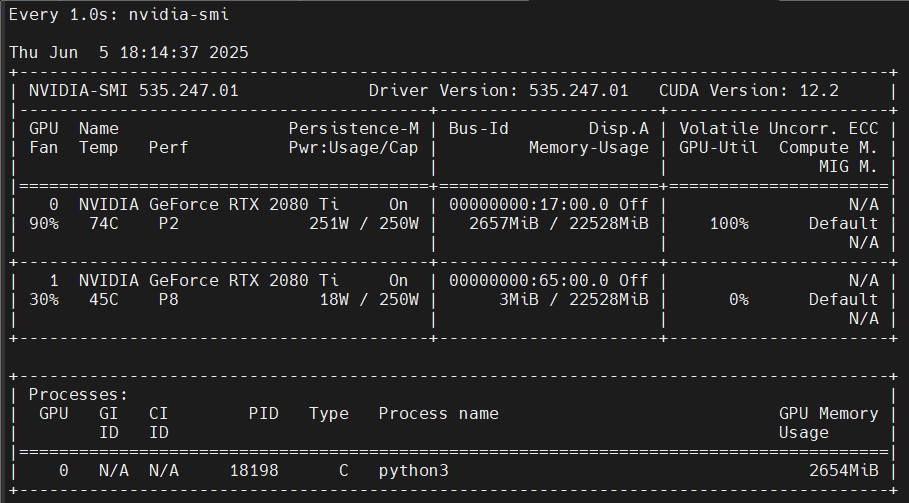
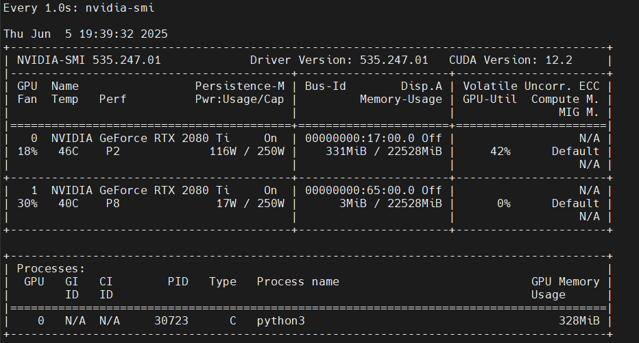

## 从零搭建并训练一个大语言模型

项目代码：[build_and_train_llm](https://github.com/Taot-chen/hand-craft-llm/tree/main/src/python/build_and_train_llm)


从零开始搭建并训练一个大语言模型主要工作：

* 训练分词器
* 数据预处理
* 训练模型
* 部署推理


### 1 训练 Tokenizer（分词器）

Tokenizer 的作用是做分词，将文本转换为数字序列，以便模型能够理解和处理。

训练 Tokenizer 使用的数据集是 [TinyStories](https://www.modelscope.cn/datasets/AI-ModelScope/TinyStories)，这是一个由GPT-3.5和GPT-4生成的小型故事数据集，包含简短的故事，且词汇量有限。

在这里，采用字符级Tokenizer，将文本中的每个字符映射为对应的数字。


#### 1.1 数据集获取

* 数据集下载：

`./download_dataset.sh`

或者直接运行命令：

```bash
modelscope download --dataset AI-ModelScope/TinyStories --local_dir ./TinyStories
```

* 解压数据集

```bash
cd TinyStories && tar -zxvf TinyStories_all_data.tar.gz
mkdir dataset
tar -zxvf TinyStories_all_data.tar.gz -C ./dataset/
```

由于 TinyStory 数据集较小，词汇量有限，将词表大小设置为 4,096。训练完成后，得到的 Tokenizer 能够将文本转换为数字序列，也可以将数字序列还原为文本。


#### 1.2 训练 Tokenizer

```bash
python3 train_tokenizer.py --vocab_size=4096 --dataset_dir=./TinyStories/TinyStories_all_data/
```

在这里，使用了 `SentencePiece` 库来训练自定义的 Tokenizer。首先，需要从 TinyStory 数据集中提取文本内容，作为训练的输入数据。SentencePiece 是一种基于子词单元的分词算法，能够有效处理不同语言中的词汇碎片化问题。

训练结束之后，会在当前路径下(`hand-craft-llm/scripts/build_and_train_llm/src`)生成`tok4096.model` 和 `tok4096.vocab`，其中 `tok4096.model`` 是训练好的模型文件。这个文件可以用于将文本数据转换为 Token 序列，也可以将 Token 序列还原为文本。


在 `tokenizer.py` 文件中定义了一个 Tokenizer 类。这个类封装了 Tokenizer 的常用操作，例如文本编码和解码功能，并支持加载训练好的模型文件。通过这个类，可以轻松地将文本转换为模型可接受的数字序列，或将预测结果转化为可读的文本。


在这个 Tokenizer 类中，首先初始化了一些特殊的 token ID，这些特殊 tokens 分别用于填充、处理未识别的词汇、表示句子的开头和结尾等。在模型训练和推理过程中，正确处理这些特殊 tokens 对于提升模型性能很重要。

定义了两个常用的方法：

* `encode` 方法：该方法负责将输入文本转换为 token ID 序列。通过加载预训练的 Tokenizer 模型，可以对文本进行分词，将其拆解为词或子词，并将其映射为相应的数字表示。这个数字序列可以被模型接受用于训练和推理。

* `decode` 方法：与 `encode` 方法相反，`decode` 方法用于将 token ID 序列还原为可读的文本。它将数字序列转换回对应的 tokens，并拼接成完整的文本，从而可以对模型的输出进行解释和展示。

测试 Tokenizer 的功能，验证其是否能够正确地将文本转换为数字序列，或者将数字序列还原为文本:

`test_tokenizer.py`

```python
from tokenizer import Tokenizer

def main():
    enc = Tokenizer('./tok4096.model')
    text = 'Hello, world!'
    print(enc.encode(text, bos=True, eos=True))
    print(enc.decode(enc.encode(text, bos=True, eos=True)))

if __name__ == "__main__":
    main()

# OUTPUT:
# [1, 346, 2233, 4010, 1475, 4021, 2]
# Hello, world!
```


### 2 数据预处理

在文件 `preprocess.py` 中定义了 `process_shard ` 函数，用于处理数据分片。该函数的主要功能是将文本数据分词后，转换为更高效的二进制文件格式，以便后续更快速地加载和处理数据。定义了 `pretokenize` 函数，用于批量处理多个数据分片。通过这一函数，所有数据可以并行处理，进一步加快预处理的速度。

设计了一个 `PretokDataset` 类，用于加载已预处理好的数据集。继承自 `torch.utils.data.IterableDataset` 来定义该数据集，这使得可以更灵活、高效地处理数据。在这个类中，核心是 `__iter__` 方法，它负责生成用于训练的数据批次。

最后，定义了一个 `Task` 类，专门用于迭代数据集，并生成模型所需的输入和目标输出。这一部分的设计确保了数据流的顺畅对接，为模型训练提供了标准化的数据输入。

数据预处理命令：

```bash
python3 preprocess.py --vocab_size=4096 --dataset_dir=./TinyStories/TinyStories_all_data/ --tokenizer_model_path=./tok4096.model
```

数据预处理完成之后，在`TinyStories/TinyStories_all_data/tok4096/`下面会有预处理完成的 `datann.bin`。


### 3 训练模型

在数据预处理完成后，就可以开始训练模型了。

使用的模型和 LLama2 结构相同， Decoder only Transformer 模型，使用 Pytorch 实现。建模代码在`modeling_tinyllm.py`中。在建模脚本中，`generate` 方法展示了模型如何基于已有的上下文生成后续 token 的机制。

```python
@torch.inference_mode()
    def generate(self, idx, max_new_tokens, temperature=1.0, top_k=None):
        """
        给定输入序列 idx（形状为 (bz,seq_len) 的长整型张量），通过多次生成新 token 来完成序列。
        在 model.eval() 模式下运行。效率较低的采样版本，没有使用 kv cache。
        """

        for _ in range(max_new_tokens):
            # 如果序列上下文过长，截断它到最大长度
            idx_cond = idx if idx.size(1) <= self.args.max_seq_len else idx[:, -self.args.max_seq_len:]

            # 前向传播获取序列中最后一个位置的 logits
            logits = self(idx_cond)
            logits = logits[:, -1, :] # 只保留最后一个时间步的输出

            if temperature == 0.0:
                # 选择最有可能的索引
                _, idx_next = torch.topk(logits, k=1, dim=-1)
            else:
                # 缩放 logits 并应用 softmax
                logits = logits / temperature
                if top_k is not None:
                    v, _ = torch.topk(logits, min(top_k, logits.size(-1)))
                    logits[logits < v[:, [-1]]] = -float('Inf')
                probs = F.softmax(logits, dim=-1)
                idx_next = torch.multinomial(probs, num_samples=1)

            # 将采样的索引添加到序列中并继续
            idx = torch.cat((idx, idx_next), dim=1)

        return idx
```

在 `generate` 方法中，首先获取序列中最后一个位置的 `logits`，然后基于这些 `logits` 生成新的 `token`。接着，生成的新 `token` 会被添加到序列中，模型随后会继续生成下一个 `token`。通过这种迭代过程，能够生成完整的文本。

`train_model.py` 中定义了很多超参数，包括但不限于模型的维度，层数，学习率等。`python3 train_model.py`命令即可开始训练模型。

```python
# -----------------------------------------------------------------------------
# I/O 配置，用于定义输出目录和训练时的日志记录与评估设置
out_dir = "./"  # 模型输出保存路径
eval_interval = 2000  # 评估间隔步数
log_interval = 1  # 日志记录间隔步数
eval_iters = 100  # 每次评估时迭代的步数
eval_only = False  # 如果为True，脚本在第一次评估后立即退出
always_save_checkpoint = False  # 如果为True，在每次评估后总是保存检查点
init_from = "scratch"  # 可以选择从头开始训练（'scratch'）或从已有的检查点恢复（'resume'）

# 数据配置
batch_size = 8  # 每个微批次的样本数量，如果使用梯度累积，实际批次大小将更大
max_seq_len = 256  # 最大序列长度
vocab_size = 4096  # 自定义词汇表大小

# 模型配置
dim = 288  # 模型的隐藏层维度
n_layers = 8  # Transformer的层数
n_heads = 8  # 注意力头的数量
n_kv_heads = 4  # 模型分组
multiple_of = 32  # 在某些层的维度必须是该数的倍数
dropout = 0.0  # Dropout概率

# AdamW优化器配置
gradient_accumulation_steps = 4  # 梯度累积步数，用于模拟更大的批次
learning_rate = 5e-4  # 最大学习率
max_iters = 100000  # 总的训练迭代次数
weight_decay = 1e-1  # 权重衰减系数
beta1 = 0.9  # AdamW优化器的β1参数
beta2 = 0.95  # AdamW优化器的β2参数
grad_clip = 1.0  # 梯度裁剪阈值，0表示不裁剪

# 学习率衰减配置
decay_lr = True  # 是否启用学习率衰减
warmup_iters = 1000  # 学习率预热的步数

# 系统设置
device = "cuda:0"  # 设备选择：'cpu'，'cuda'，'cuda:0'等
dtype = "bfloat16"  # 数据类型：'float32'，'bfloat16'，'float16'
```

训练过程中显存消耗在 3GB 以内：




### 4 模型推理

在模型训练完成后，会在当前目录下生成一个`ckpt.pt`文件，这个文件就是训练好的模型。可以使用以下命令生成文本。

```bash
python3 inference.py --prompt "One day, Lily met a"
```

在 `inference.py` 中，定义了一个`TextGenerator`类，用于生成文本。

```python
class TextGenerator:
    def __init__(
        self,
        checkpoint='./ckpt.pt',  # 模型检查点路径
        tokenizer_model_path='./tok4096.model',  # 分词器模型路径
        seed=1234,  # 随机种子，确保可重复性
        device=None,  # 设备，优先使用 CUDA，如果没有可用的 CUDA，则使用 CPU
        dtype="float32" # 数据类型，默认为 float32，可以选择 float16 或 bfloat16
    ):
        """
        初始化 TextGenerator 类，加载模型、设置设备和分词器等。
        """
        self.checkpoint = checkpoint  # 保存的模型检查点路径
        self.tokenizer_model_path = tokenizer_model_path  # 分词器模型文件路径
        self.seed = seed  # 随机数种子，用于生成的可重复性
        self.device = device or ('cuda' if torch.cuda.is_available() else 'cpu')  # 根据硬件条件选择设备
        self.dtype = dtype  # 模型的浮点数类型
        self.device_type = 'cuda' if 'cuda' in self.device else 'cpu'  # 判断当前设备是否为 CUDA

        # 设置随机种子，确保生成的可重复性
        torch.manual_seed(seed)  # 设置 CPU 随机种子
        torch.cuda.manual_seed(seed)  # 设置 CUDA 随机种子
        torch.backends.cuda.matmul.allow_tf32 = True  # 允许 CUDA 使用 TF32 精度进行矩阵乘法运算
        torch.backends.cudnn.allow_tf32 = True  # 允许 cuDNN 使用 TF32 精度加速

        # 根据 dtype 选择适当的自动混合精度上下文
        ptdtype = {'float32': torch.float32, 'bfloat16': torch.bfloat16, 'float16': torch.float16}[self.dtype]
        self.ctx = nullcontext() if self.device_type == 'cpu' else torch.amp.autocast(device_type=self.device_type, dtype=ptdtype)

        # 加载模型检查点文件
        checkpoint_dict = torch.load(self.checkpoint, map_location=self.device)  # 加载模型参数
        gptconf = ModelArgs(**checkpoint_dict['model_args'])  # 初始化模型参数
        self.model = Transformer(gptconf)  # 实例化 Transformer 模型
        state_dict = checkpoint_dict['model']  # 获取模型状态字典

        # 去除状态字典中的不必要前缀
        unwanted_prefix = '_orig_mod.'  # 这个前缀在保存时可能被添加，现在要去除它
        for k, v in list(state_dict.items()):
            if k.startswith(unwanted_prefix):
                state_dict[k[len(unwanted_prefix):]] = state_dict.pop(k)  # 去除不必要的前缀

        # 加载模型参数到模型中
        self.model.load_state_dict(state_dict, strict=False)
        # 计算模型参数量
        num_params = sum(p.numel() for p in self.model.parameters() if p.requires_grad)
        print(f"Model has {num_params} parameters.")

        # 设置模型为评估模式（evaluation mode），防止训练模式下的 dropout 等操作影响结果
        self.model.eval()
        self.model.to(self.device)
        # 初始化分词器
        self.tokenizer = Tokenizer(tokenizer_model=self.tokenizer_model_path)  # 根据指定的路径加载分词器

    def sample(
        self,
        start="Hello!",
        num_samples=3,
        max_new_tokens=256,
        temperature=1.0,  # 控制生成的随机性，1.0 为标准，值越大越随机
        top_k=300
    ):
        """
        根据给定的起始文本生成样本。
        :param start: 生成文本的起始提示词
        :param num_samples: 要生成的文本样本数
        :param max_new_tokens: 每个样本生成的最大 token 数
        :param temperature: 控制生成的随机性，值越小生成越确定，值越大生成越随机
        :param top_k: 限制生成时选择的 token 范围
        :return: 生成的文本样本列表
        """
        # 如果 start 是以 'FILE:' 开头，表示从文件中读取起始文本
        if start.startswith('FILE:'):
            with open(start[5:], 'r', encoding='utf-8') as f:
                start = f.read()  # 读取文件内容作为起始文本

        # 将起始文本编码为 token id 序列
        start_ids = self.tokenizer.encode(start, bos=True, eos=False)  # bos=True 表示加上句首标记，eos=False 表示不加句尾标记
        x = (torch.tensor(start_ids, dtype=torch.long, device=self.device)[None, ...])  # 将编码后的 token id 转为 PyTorch 张量

        generated_texts = []  # 用于保存生成的文本样本
        with torch.no_grad():  # 禁用梯度计算，提升效率
            with self.ctx:  # 进入自动混合精度的上下文（如果是 GPU 并使用 float16 时）
                for k in range(num_samples):  # 循环生成指定数量的样本
                    y = self.model.generate(x, max_new_tokens, temperature=temperature, top_k=top_k)  # 生成文本
                    generated_texts.append(self.tokenizer.decode(y[0].tolist()))  # 解码生成的 token 序列为可读文本

        return generated_texts  # 返回生成的文本样本
```


推理过程中显存消耗 300 多 MB：



推理输出如下：


----------

Reference：
* [tiny-universe](https://github.com/datawhalechina/tiny-universe/)
* [llama2.c](https://github.com/karpathy/llama2.c)
