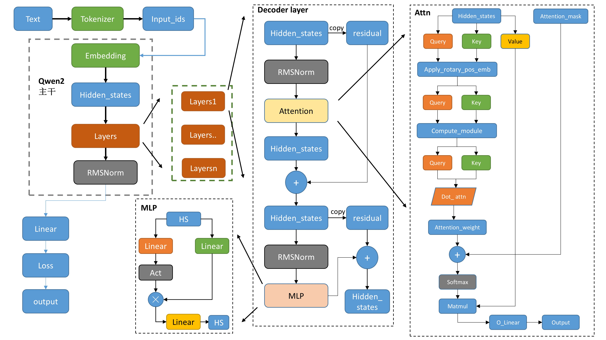
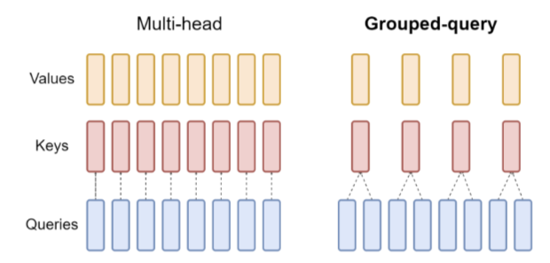

# Qwen2 modeling 源码

Qwen的整体架构与Llama2类似:



* `tokenizer`，分词器，将文本转换为词表里面的数值`input_ids`
* 数值`input_ids`经过`embedding`得到一一对应的词向量
* `attention_mask`，用来做掩码处理，padding_mask，causal_mask
* 各类下游任务，Causal，seqcls 等，基本都是基础模型 model 后面接对对应的 Linear 层，以及使用不同的损失函数


## 1 Qwen2

config，即`config.json`，里面包含一些自定义的超参数，例如：`vocab_size`,`hidden_size`,`num_hidden_layers`, `num_attention_heads`,`eos_token_id`等。使用`json`格式存储，在模型加载之后，可以通过 `model.config`来访问，类似 `dict`。


### 1.1 Qwen2Model

#### 1.1.1 初始化

```python
class Qwen2Model(Qwen2PreTrainedModel):
    def __init__(self, config: Qwen2Config):
        super().__init__(config)
        self.padding_idx = config.pad_token_id
        self.vocab_size = config.vocab_size

        self.embed_tokens = nn.Embedding(config.vocab_size, config.hidden_size, self.padding_idx)
        self.layers = nn.ModuleList(
            [Qwen2DecoderLayer(config, layer_idx) for layer_idx in range(config.num_hidden_layers)]
        )
        self.norm = Qwen2RMSNorm(config.hidden_size, eps=config.rms_norm_eps)

        self.gradient_checkpointing = False
        # Initialize weights and apply final processing
        self.post_init()
```

* 设置模型的两个属性:`padding_idx`（用于指定填充标记的索引），`vocab_size`（词汇表的大小）

* 初始化了模型的嵌入层、解码器层、归一化层
    * 嵌入层（`nn.Embedding`）：模型使用嵌入层将输入的标记映射成密集的向量表示。
    * 解码器层(`nn.ModuleList`)：模型包含多个解码器层，这些层都是由 `Qwen2DecoderLayer` 定义
    * 归一化层 `Qwen2RMSNorm`：归一化层使用的是 **Root Mean Square Layer Normalization**

* 设置是否使用 `gradient_checkpoint`：主要是用来节省显存

* 调用 `post_init()` 完成一些初始化和准备检查的代码
    `post_init`函数, 主要是对参数进行初始化，以及初始化梯度检查点作用

    ```python
    def post_init(self):
    """
    A method executed at the end of each Transformer model initialization, to execute code that needs the model's
    modules properly initialized (such as weight initialization).
    """
    self.init_weights()
    self._backward_compatibility_gradient_checkpointing()
    ```


#### 1.1.2 前向传播 Forward

```python
# embed positions
inputs_embeds = self.embed_tokens(input_ids)
hidden_states = inputs_embeds

# decoder layers
for idx, decoder_layer in enumerate(self.layers):
    # 将所有的hidden_states保存成tuple
    if output_hidden_states:
        all_hidden_states += (hidden_states,)

    # 将hs送入每一层decoder_layer
    layer_outputs = decoder_layer(
        hidden_states,
        attention_mask=attention_mask,
        position_ids=position_ids,
        past_key_value=past_key_value,
        output_attentions=output_attentions,
        use_cache=use_cache,
    )

    # 取出上一层decoder_输出的hs,传入下一个layer
    # 只要第一个,然后进入下一个Decoder layer
    # layer_outputs 的构成：
    '''
    outputs = (hidden_states,)

    if output_attentions:
        outputs += (self_attn_weights,)

    if use_cache:
        outputs += (present_key_value,)
    '''
    hidden_states = layer_outputs[0]

    
# 将最后layers输出后的hidden_states进行标准化  
hidden_states = self.norm(hidden_states)
    
# 加上最后一层的hidden_states
if output_hidden_states:
    all_hidden_states += (hidden_states,)
```

* 如果保存`output_hidden_states`的话，就是第一个为`input_ids`进行`emb`，然后保存到`n-1`层的`decoder_layer`的输出`hs`，再加上最后一层`layer`的输出`hs`进行过`norm`后的`hs`.
* 最后是以`BaseModelOutputWithPast`的形式输出。


### 1.2 Qwen2DecoderLayer


#### 1.2.1 初始化

`layer`三件套:`attn+MLP+norm`:

```python
QWEN2_ATTENTION_CLASSES = {
    "eager": Qwen2Attention,
    "flash_attention_2": Qwen2FlashAttention2,
    "sdpa": Qwen2SdpaAttention,
}

class Qwen2DecoderLayer(nn.Module):
    def __init__(self, config: Qwen2Config):
        super().__init__()
        self.hidden_size = config.hidden_size
        self.self_attn = QWEN2_ATTENTION_CLASSES[config._attn_implementation](config, layer_idx)

        self.mlp = Qwen2MLP(config)
        self.input_layernorm = Qwen2RMSNorm(config.hidden_size, eps=config.rms_norm_eps)
        self.post_attention_layernorm = Qwen2RMSNorm(config.hidden_size, eps=config.rms_norm_eps)
```

* 这里面的`input_layernorm`和`post_attention_layernorm`内容是一样的，只是应用的顺序不一样。
    * `input_layernorm`, 即 pre_layernorm，计算在 layernorm 之前
    * `post_attention_layernorm`，Attention 的计算在 layernorm 之后

* `QWEN2_ATTENTION_CLASSES`这里有三个不同的选项：`"eager": Qwen2Attention`,`"flash_attention_2": Qwen2FlashAttention2`,`"sdpa": Qwen2SdpaAttention`。
    * `"eager": Qwen2Attention`，这个就是最经典的 Multi-headed attention 的实现，来自 'Attention Is All You Need' 这篇论文
    $$
    \text{Attention}(Q, K, V) = \text{Softmax}\left(\frac{Q K^T}{\sqrt{d_k}}\right) V
    $$

    ```python
    attn_weights = torch.matmul(query_states, key_states.transpose(2, 3)) / math.sqrt(self.head_dim)
    attn_weights = attn_weights + attention_mask
    attn_weights = nn.functional.softmax(attn_weights, dim=-1, dtype=torch.float32).to(query_states.dtype)
    attn_weights = nn.functional.dropout(attn_weights, p=self.attention_dropout, training=self.training)
    attn_output = torch.matmul(attn_weights, value_states)
    ```

    * `"flash_attention_2": Qwen2FlashAttention2`，flash Attention，调用 flash-attn 的公共 API 进行 flash-attn 的计算

    ```python
    attn_output = self._flash_attention_forward(
        query_states,
        key_states,
        value_states,
        attention_mask,
        q_len,
        dropout=dropout_rate,
        use_sliding_windows=use_sliding_windows,
    )

    # def _flash_attention_forward，调用 Flash Attention 的前向传播方法，
    if attention_mask is not None:
        batch_size = query_states.shape[0]
        query_states, key_states, value_states, indices_q, cu_seq_lens, max_seq_lens = self._upad_input(
            query_states, key_states, value_states, attention_mask, query_length
        )

        cu_seqlens_q, cu_seqlens_k = cu_seq_lens
        max_seqlen_in_batch_q, max_seqlen_in_batch_k = max_seq_lens

        if not use_sliding_windows:
            attn_output_unpad = flash_attn_varlen_func(
                query_states,
                key_states,
                value_states,
                cu_seqlens_q=cu_seqlens_q,
                cu_seqlens_k=cu_seqlens_k,
                max_seqlen_q=max_seqlen_in_batch_q,
                max_seqlen_k=max_seqlen_in_batch_k,
                dropout_p=dropout,
                softmax_scale=softmax_scale,
                causal=causal,
            )
        else:
            attn_output_unpad = flash_attn_varlen_func(
                query_states,
                key_states,
                value_states,
                cu_seqlens_q=cu_seqlens_q,
                cu_seqlens_k=cu_seqlens_k,
                max_seqlen_q=max_seqlen_in_batch_q,
                max_seqlen_k=max_seqlen_in_batch_k,
                dropout_p=dropout,
                softmax_scale=softmax_scale,
                causal=causal,
                window_size=(self.config.sliding_window, self.config.sliding_window),
            )

        attn_output = pad_input(attn_output_unpad, indices_q, batch_size, query_length)
    else:
        if not use_sliding_windows:
            attn_output = flash_attn_func(
                query_states,
                key_states,
                value_states,
                dropout,
                softmax_scale=softmax_scale,
                causal=causal,
            )
        else:
            attn_output = flash_attn_func(
                query_states,
                key_states,
                value_states,
                dropout,
                softmax_scale=softmax_scale,
                causal=causal,
                window_size=(self.config.sliding_window, self.config.sliding_window),
            )
    ```

    * `"sdpa": Qwen2SdpaAttention`，使用 `torch.nn.functional.scaled_dot_product_attention`接口来计算Attention。

    ```python
    attn_output = torch.nn.functional.scaled_dot_product_attention(
        query_states,
        key_states,
        value_states,
        attn_mask=attention_mask,
        dropout_p=self.attention_dropout if self.training else 0.0,
        is_causal=self.is_causal and attention_mask is None and q_len > 1,
    )
    ```


#### 1.2.2 前向传播 Forward

```python
residual = hidden_states

#  标准化后送入attn
hidden_states = self.input_layernorm(hidden_states)  # RMSNorm标准化

# Self Attention
hidden_states, self_attn_weights, present_key_value = self.self_attn(  
    hidden_states=hidden_states,
    attention_mask=attention_mask,
    position_ids=position_ids,
    past_key_value=past_key_value,
    output_attentions=output_attentions,
    use_cache=use_cache,
    **kwargs,
)

# 残差与新的hidden_states相加
hidden_states = residual + hidden_states

# Fully Connected
residual = hidden_states

# 同样的RMSNorm标准化
hidden_states = self.post_attention_layernorm(hidden_states)
hidden_states = self.mlp(hidden_states)
hidden_states = residual + hidden_states

outputs = (hidden_states,)

return outputs
```


* 首先复制一份`hidden_states`作为`residual`,然后将`hidden_states`送入`Norm`(pre_norm),再送入`attn`模块。

* 得到`attn`的输出后，再复制一份作为`residual`，再将`hidden_states`送入`Norm`(post_norm)，`mlp`，再与`residual`进行相加。最后输出的就是这个`hidden_states`


### 1.3 Qwen2Attention

#### 1.3.1 初始化

```python
class Qwen2Attention(nn.Module):
    """Multi-headed attention from 'Attention Is All You Need' paper"""

    def __init__(self, config: Qwen2Config):
        super().__init__()
        self.config = config
        self.layer_idx = layer_idx
        self.hidden_size = config.hidden_size
        self.num_heads = config.num_attention_heads
        self.head_dim = self.hidden_size // self.num_heads
        self.num_key_value_heads = config.num_key_value_heads
        self.num_key_value_groups = self.num_heads // self.num_key_value_heads
        self.max_position_embeddings = config.max_position_embeddings
        self.rope_theta = config.rope_theta
        self.is_causal = True
        self.attention_dropout = config.attention_dropout

        if (self.head_dim * self.num_heads) != self.hidden_size:
            raise ValueError(
                f"hidden_size must be divisible by num_heads (got `hidden_size`: {self.hidden_size}"
                f" and `num_heads`: {self.num_heads})."
            )
        self.q_proj = nn.Linear(self.hidden_size, self.num_heads * self.head_dim, bias=config.attention_bias)
        self.k_proj = nn.Linear(self.hidden_size, self.num_key_value_heads * self.head_dim, bias=config.attention_bias)
        self.v_proj = nn.Linear(self.hidden_size, self.num_key_value_heads * self.head_dim, bias=config.attention_bias)
        self.o_proj = nn.Linear(self.num_heads * self.head_dim, self.hidden_size, bias=config.attention_bias)
        
        self.rotary_emb = Qwen2RotaryEmbedding(
            self.head_dim,
            max_position_embeddings=self.max_position_embeddings,
            base=self.rope_theta,
        )
```

* `num_key_value_heads`:表示键值对的头数
* `num_key_value_groups`:表示键值对的组数，计算为`num_heads // num_key_value_heads`，GQA的实现
* `q_proj`,`k_proj`,`v_proj`,`o_proj四`个`Linear`操作。后续`LoRa`也基本都对他动的刀子.


#### 1.3.2 前向传播 Forward

```python
# 获取形状信息,hidden_states输入的为(bs,seq_len,hidden_size)
bsz, q_len, _ = hidden_states.size()

# 对hidden_states进行Linear生成query、key、value, qkv gen
query_states = self.q_proj(hidden_states)
key_states = self.k_proj(hidden_states)
value_states = self.v_proj(hidden_states)

# reshape多头处理--分块--(bs,seq_len,heads,head_dim)
query_states = query_states.view(bsz, q_len, self.num_heads, self.head_dim).transpose(1, 2)
key_states = key_states.view(bsz, q_len, self.num_key_value_heads, self.head_dim).transpose(1, 2)
value_states = value_states.view(bsz, q_len, self.num_key_value_heads, self.head_dim).transpose(1, 2)

# 将旋转位置嵌入应用于查询和键张量。使用了旋转位置嵌入的余弦和正弦部分，将它们与查询和键张量相乘，并将结果相加，从而实现旋转位置嵌入的效果
# def apply_rotary_pos_emb
'''
cos = cos[position_ids].unsqueeze(unsqueeze_dim)
sin = sin[position_ids].unsqueeze(unsqueeze_dim)
q_embed = (q * cos) + (rotate_half(q) * sin)
k_embed = (k * cos) + (rotate_half(k) * sin)
'''
cos, sin = self.rotary_emb(value_states, seq_len=kv_seq_len)
query_states, key_states = apply_rotary_pos_emb(query_states, key_states, cos, sin, position_ids)

# 先将key_states和value_states重复了num_key_value_groups次
key_states = repeat_kv(key_states, self.num_key_value_groups)
value_states = repeat_kv(value_states, self.num_key_value_groups)

# 使用dot attn实现q*kT/hd_d^0.5
attn_weights = torch.matmul(query_states, key_states.transpose(2, 3)) / math.sqrt(self.head_dim)

# 然后 attn_weights 加上 attention_mask，实现读取顺序
attn_weights = attn_weights + attention_mask

# softmax + dropout + values_states相乘
attn_weights = nn.functional.softmax(attn_weights, dim=-1, dtype=torch.float32).to(query_states.dtype)
attn_weights = nn.functional.dropout(attn_weights, p=self.attention_dropout, training=self.training)
attn_output = torch.matmul(attn_weights, value_states)

# 转置，修改形状等reshape操作
attn_output = attn_output.transpose(1, 2).contiguous()
attn_output = attn_output.reshape(bsz, q_len, self.hidden_size)

# 最后在进行一次o_proj
attn_output = self.o_proj(attn_output)

# 返回结果
return attn_output, attn_weights, past_key_value
```

* 首先将`hidden_states`送入`Linear`中得到`query`、`key`与`value`。
* 使用旋转位置嵌入操作`rotary_emb`，使用了旋转位置嵌入的余弦和正弦部分，将他们与`query`和`key`相乘，并将结果相加，从而实现旋转位置嵌入的效果。
* 将`key_states`和`value_states`重复`group`次，再执行`dot attn`操作。
* 在`dot attn`操作后得到`attn_weights`,加上`attention_mask`从而实现读取掩盖操作，在经过`softmax`与`value_states`相乘。得到`attn_output`。
* 再将上述的`attn_output`进行`reshape`操作，送入`o_proj`，得到最终的输出。


## 2 GQA



GQA 相比于 MQA 不需要在推理的过程存储那么多的 kv cache, 那么 kv cache 占用的显存就变小。

gqa 的 kv 在 repeat 的时候，使用的是 `expand`，而不是 tensor 自带的`repeat`:

```python
hidden_states = hidden_states[:, :, None, :, :].expand(batch, num_key_value_heads, n_rep, slen, head_dim)
```

原因：

* `expand` 方法用于对张量进行扩展，但不实际分配新的内存。它返回的张量与原始张量共享相同的数据，没有真正 expand 占用的物理内存，只改变了 meta data

* `repeat`方法通过实际复制数据来扩展张量。它返回的新张量不与原始张量共享数据，扩展后的张量占用了更多的内存


## 3 apply_rotary_pos_emb

通过旋转编码，使得每个 token 既有相对位置信息，又有绝对位置信息。

代码实现：

```python
class Qwen2RotaryEmbedding(nn.Module):
    def __init__(self, dim, max_position_embeddings=2048, base=10000, device=None):
        super().__init__()
        # 定义初始值
        self.dim = dim
        self.max_position_embeddings = max_position_embeddings
        self.base = base

        # 定义旋转角
        inv_freq = 1.0 / (self.base ** (torch.arange(0, self.dim, 2, dtype=torch.int64).float().to(device) / self.dim))
        self.register_buffer("inv_freq", inv_freq, persistent=False)

        # Build here to make `torch.jit.trace` work.
        self._set_cos_sin_cache(
            seq_len=max_position_embeddings, device=self.inv_freq.device, dtype=torch.get_default_dtype()
        )
    # 为seq里面的每个token形成独一无二的旋转角嵌入(外积)
    def _set_cos_sin_cache(self, seq_len, device, dtype):
        self.max_seq_len_cached = seq_len
        t = torch.arange(self.max_seq_len_cached, device=device, dtype=torch.int64).type_as(self.inv_freq)

        freqs = torch.outer(t, self.inv_freq)
        # 生成角度信息(利用注册机制生成self.cos_cached与sin_cached
        emb = torch.cat((freqs, freqs), dim=-1)
        self.register_buffer("cos_cached", emb.cos().to(dtype), persistent=False)
        self.register_buffer("sin_cached", emb.sin().to(dtype), persistent=False)

    def forward(self, x, seq_len=None):
        # x: [bs, num_attention_heads, seq_len, head_size]
        if seq_len > self.max_seq_len_cached:
            self._set_cos_sin_cache(seq_len=seq_len, device=x.device, dtype=x.dtype)

        return (
            self.cos_cached[:seq_len].to(dtype=x.dtype),
            self.sin_cached[:seq_len].to(dtype=x.dtype),
        )
```

* 首先生成角度: 

$$
\theta = \left(\frac{1}{base^{2n/d}}\right)
$$

其中，n 表示维度数，其取值范围为`[0, 1, ..., d/2-1]`


* 然后将上述生成角度与每一个位置乘积，区分 seq 中各个词,等价于:

$$
\theta = \left(\frac{i}{base^{2n/d}}\right)
$$

其中，`i`为行数。


* emb 将二者 cat 起来，得到 dim 维度，每 dim/2 一循环


* 然后，取出位置编码信息`cos`与`sin`的时候，就是将`seq`的部分切出来，原先设置的 1024 是最大`pos`编码，每次用的时候只取当下`seq_len`的即可。在此之前之前求得外积`freqs = torch.outer(t, self.inv_freq)`，是为了保证 seq 里面得每一个词都能有不同的 1024 个位置编码。


* 进行旋转嵌入:

```python
# 后半部分和前半部分进行了交换，并且将后半部分的符号取反。
def rotate_half(x):
    """Rotates half the hidden dims of the input."""
    x1 = x[..., : x.shape[-1] // 2]
    x2 = x[..., x.shape[-1] // 2 :]
    return torch.cat((-x2, x1), dim=-1)

def apply_rotary_pos_emb(q, k, cos, sin, position_ids, unsqueeze_dim=1):
    """Applies Rotary Position Embedding to the query and key tensors.

    query and key tensors rotated using the Rotary Position Embedding.
    """
    cos = cos[position_ids].unsqueeze(unsqueeze_dim)
    sin = sin[position_ids].unsqueeze(unsqueeze_dim)
    q_embed = (q * cos) + (rotate_half(q) * sin)
    k_embed = (k * cos) + (rotate_half(k) * sin)
    return q_embed, k_embed
```


## 4 Attention mask

attention mask 是一个下三角矩阵，主对角线上方的是负无穷，主对角线及下面都是 0，在和 atten_weights 相加之后（`attn_weights = attn_weights + attention_mask`），可以把 attn_weights 矩阵里面当前 token 之后为位置的值都设置成负无穷。

经过softmax，对应负无穷的位置权重为0，从而实现只能从左往右，在推理当前 token 的时候，只能看当当前 token 之前的信息，保证因果关系。

* `attn`形状为`(bs,heads,T,T)`,`values`的形状为`(bs,heads,T,hd)`

* `value`里面每一个词有 head_dim 个维度来描述，对于第一个词，由于`attn`为下三角，所以**每一个维度都只有第一个非零元素1进行相乘，其他的都是`×0`**。

* 对于第二行，则是前两个有不同的权值，让`value`的 head_dim 个维度分别依据这两个的权重，在 head_dim 个维度上根据前两行，计算得出 output 的第二个词(第二步或者第二行)的 head_dim 个维度.... 这种加权，体现出考虑前词关系, 即 Causal。

* 第 n 步则对应有 n 个权重，用来描述从 1 到 n 个步之间的各个关系，进而计算出各个维度。

* 每一个矩阵乘法的结果相当于是下一个词的 dim，那么 score 则是根据 mask 来判断，能通过前几个词对应 dim 的值从而进行加权，进而得到下一个词的该 dim 上的值。


* 在推理过程中，对于 query 不一样长的情况，因为所有的权重都是 `dim-dim`，得到的 attention_score 是一个 `seq,seq` 的，权重跟 seq 的大小没关系。其都是后面的 dim 维度的参数。 

* 推理过程的 attention_mask 可有可无，是一个一个吐，循环 cat 到下一个，每一次都取最后一个，代表着预测的是下一个token。
    * 但是可以用来作为因果约束，并且能够通过 KV缓存（Key-Value Cache）来优化推理，加速推理。
    * 对于批量推理的情况，Padding Mask仍需屏蔽无效位置


## 5 Qwen2 MLP

```python
class Qwen2MLP(nn.Module):
    def __init__(self, config):
        super().__init__()
        self.config = config
        self.hidden_size = config.hidden_size
        self.intermediate_size = config.intermediate_size

        # 三个全连接层
        self.gate_proj = nn.Linear(self.hidden_size, self.intermediate_size, bias=False)
        self.up_proj = nn.Linear(self.hidden_size, self.intermediate_size, bias=False)
        self.down_proj = nn.Linear(self.intermediate_size, self.hidden_size, bias=False)
        self.act_fn = ACT2FN[config.hidden_act]

    def forward(self, x):
        down_proj = self.down_proj(self.act_fn(self.gate_proj(x)) * self.up_proj(x))
        return down_proj
```

输入`hidden_state`并行送入两个`Linear`层，其中一个激活一下，再与另一个相乘，最终再经过一个`Linear`，输出最终结果。


## 6 Qwen2RMSNorm


$$
RMSNorm(x) = \frac{x}{\sqrt{\frac{1}{n} \sum _{i = 1} ^n \omega _i ^2 + \epsilon}}
$$

其中:

* x 是层的输入的`hidden_state`
* $\omega _i$ 表示的是`hidden_state`的最后一个维度的值
* n 表示上面输入的最后一个维度的数量。
* $\epsilon$ 表示是很小的数，防止除 0。

```python
class Qwen2RMSNorm(nn.Module):  # 标准化层
    def __init__(self, hidden_size, eps=1e-6):
        """
        Qwen2RMSNorm is equivalent to T5LayerNorm
        """
        super().__init__()
        self.weight = nn.Parameter(torch.ones(hidden_size))
        self.variance_epsilon = eps

    def forward(self, hidden_states):
        input_dtype = hidden_states.dtype
        hidden_states = hidden_states.to(torch.float32)
        variance = hidden_states.pow(2).mean(-1, keepdim=True)
        hidden_states = hidden_states * torch.rsqrt(variance + self.variance_epsilon)
        return self.weight * hidden_states.to(input_dtype)
```

* `.pow(2).mean(-1, keepdim=True)`表示对最后一个维度平方并取均值


----------

Reference:

* [tiny-universe](https://github.com/datawhalechina/tiny-universe)

