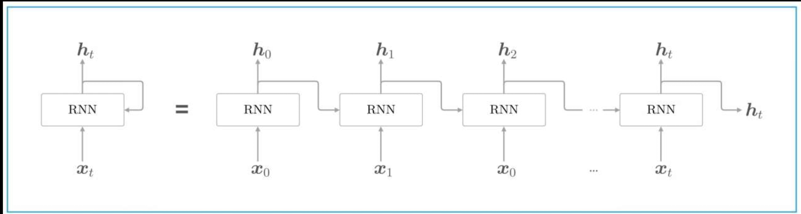

项目代码：[build_and_train_rnn](https://github.com/Taot-chen/hand-craft-llm/tree/main/src/python/RNN)


## 1 循环神经网络模型 RNN

循环神经网络（RNN）是一种神经网络类型，其神经元的输出在下一个时间步会反馈作为输入，使网络具有处理序列数据的能力。

RNN 能够处理变长序列，擅长挖掘数据中的时序信息。但是存在长期以来问题，难以处理长序列中相距较远的信息关联。RNN与普通神经网络的主要区别在于其具有记忆功能，神经元的输出能作为下一步输入，可处理序列数据，且输入和输出长度不固定。

在传统的前馈神经网络（Feedforward Neural Network）中，数据是从输入层流向输出层的，而在 RNN 中，数据不仅沿着网络层级流动，还会在每个时间步骤上传播到当前的隐层状态，从而将之前的信息传递到下一个时间步骤。

**隐状态（hidden state）**：RNN 通过隐状态来记住序列中的信息。隐状态通过上一时间步的隐状态和当前输入共同计算得到。

RNN 在自然语言处理方面，可用于语言模型来预测下一个单词的概率，还能完成机器翻译、文本生成任务；在语音识别领域，能够处理语音这种时间序列信号，提高识别准确率；在时间序列预测中，像股票价格预测、天气预测等，RNN 通过学习历史数据模式预测未来值；在视频分析中，可以处理视频帧序列，进行动作识别等操作。


RNN 网络结构图：




RNN 公式：

$$
[h_t = f (h_{t-1}W_{hh} + x_tW_{xh} + b_h)]
$$

注：

* $h_t$：当前时刻的隐状态
* $h_{t-s}$：前一时刻的隐状态
* $x_t$：当前时刻的输入
* $W_{hh}, W_{xh}$：权重矩阵
* $b$：偏置项
* $f$：激活函数，例如 tanh，ReLU

**输出（Output）**：RNN 的输出不仅依赖当前的输入，还依赖于隐状态的历史信息

公式：

$$
y_t = W_{hy} h_t + b_y
$$

* $y_t$：在时间步 t 的输出向量（可选，取决于具体任务）。
* $W_{hy}$：是隐藏状态到输出的权重矩阵


## 2 RNN 处理序列数据的过程

循环神经网络（RNN）在处理序列数据时的展开（unfold）视图如下：


RNN 是一种处理序列数据的神经网络，通过循环连接来处理序列中的每个元素，并在每个时间步传递信息，以下是图中各部分的说明：

* 输入序列`（Xt, Xt-1, Xt+1, ...）`：图中的粉色圆圈代表输入序列中的各个元素，如`Xt`表示当前时间步的输入，`Xt-1`表示前一个时间步的输入，以此类推。

* 隐藏状态`（ht, ht-1, ht+1, ...）`：绿色矩形代表 RNN 的隐藏状态，它在每个时间步存储有关序列的信息。`ht`是当前时间步的隐藏状态，`ht-1`是前一个时间步的隐藏状态。

* 权重矩阵（U, W, V）：
    * `U`：输入到隐藏状态的权重矩阵，用于将输入`Xt`转换为隐藏状态的一部分。
    * `W`：隐藏状态到隐藏状态的权重矩阵，用于将前一时间步的隐藏状态`ht-1`转换为当前时间步隐藏状态的一部分。
    * `V`：隐藏状态到输出的权重矩阵，用于将隐藏状态`ht`转换为输出`Yt`。

* 输出序列`（Yt, Yt-1, Yt+1, ...）`：蓝色圆圈代表 RNN 在每个时间步的输出，如`Yt`是当前时间步的输出。

* 循环连接：RNN 的特点是隐藏状态的循环连接，这允许网络在处理当前时间步的输入时考虑到之前时间步的信息。

* 展开（Unfold）：图中展示了 RNN 在序列上的展开过程，这有助于理解 RNN 如何在时间上处理序列数据。**在实际的 RNN 实现中，这些步骤是并行处理的**，但在概念上，我们可以将其展开来理解信息是如何流动的。

* 信息流动：信息从输入序列通过权重矩阵`U`传递到隐藏状态，然后通过权重矩阵`W`在时间步之间传递，最后通过权重矩阵`V`从隐藏状态传递到输出序列。


## 3 构建 RNN 网络


### 3.1 基于`torch.nn.RNN`构建 RNN 网络


在 PyTorch 中，RNN 可以用于构建复杂的序列模型。

PyTorch 提供了几种 RNN 模块，包括：

* `torch.nn.RNN`：基本的 RNN 单元。
* `torch.nn.LSTM`：长短期记忆单元，能够学习长期依赖关系。
* `torch.nn.GRU`：门控循环单元，是 LSTM 的简化版本，但通常更容易训练。

使用 RNN 类时，需要指定输入的维度、隐藏层的维度以及其他一些超参数。

使用 pytorch 的`torch.nn.RNN`来构建 RNN 网络：

```python
class SimpleRNN(nn.Module):
    def __init__(self, input_size, hidden_size, output_size):
        super(SimpleRNN, self).__init__()
        # 定义 RNN 层
        # batch_first=True表示输入数据的维度为[batch_size, seq_len, input_szie]
        self.rnn = nn.RNN(input_size, hidden_size, batch_first=True)
        """
            多种单层的 RNN 层
            单向、单层rnn, 1个时间步
                single_rnn = nn.RNN(input_size=4, hidden_size=3, num_layers=1, batch_first=True)
                input = torch.randn(1, 1, 4)    # 输入数据维度为[batch_size, time_steps_num, input_size], time_steps_num 实际上就是 input sequence length
                output, h_n = single_rnn(input) # output维度为[batch_size, time_steps_num, hidden_size=3]，h_n维度为[num_layers=1, batch_size, hidden_size=3]

            单向、单层rnn, 2个时间步
                single_rnn = nn.RNN(input_size=4, hidden_size=3, num_layers=1, batch_first=True)
                input = torch.randn(1, 2, 4) # 输入数据维度为[batch_size, time_steps_num, input_size]
                output, h_n = single_rnn(input) # output维度为[batch_size, time_steps_num, hidden_size=3]，h_n维度为[num_layers=1, batch_size, hidden_size=3]

            双向、单层rnn
                bi_rnn = nn.RNN(input_size=4, hidden_size=3, num_layers=1, batch_first=True, bidirectional=True)
                bi_output, bi_h_n = bi_rnn(input)
        """

        # 定义全连接层
        self.fc = nn.Linear(hidden_size, output_size)

    def forward(self, x):
        # x: (batch_size, seq_len, input_size)
        out, _ = self.rnn(x)  # out: (batch_size, seq_len, hidden_size)

        # 取序列最后一个时间步的输出作为模型的输出
        out = out[:, -1, :]  # (batch_size, hidden_size)

        out = self.fc(out)  # 全连接层
        return out
```


### 3.2 基于 pytorch 手搓 RNN

激活函数使用 $\tanh$，那么 RNN 的公式变成：


$$
[h_t = \tanh (h_{t-1}W_{hh} + x_tW_{xh} + b_h)]
$$

```python
class RNNLayer(nn.Module):
    def __init__(self, input_size, hidden_size, num_layers=1, batch_first=True):
        super().__init__()
        self.hidden_size = hidden_size
        self.num_layers = num_layers
        self.input_size = input_size
        self.bidirectional = False
        self.W_hh = nn.Parmater(torch.rand(self.hidden_size, self.hidden_size))
        self.W_ih = nn.Parmater(torch.rand(self.input_size, self.hidden_size))
        self.b_ih = nn.Parmater(torch.zeros(self.hidden_size))
        self.b_hh = nn.Parmater(torch.zeros(self.hidden_size))

    def forward(self, x_t, h_prev=None):
        """
            1: torch.matmul(x_t, self.W_ih)
                x_t包含多个时间步，形状为[batch_size, time_steps_num, input_size]   # input_size 实际上就是 input 的维度 input_dim
                W_ih形状为[input_size, hidden_size]
                torch.matmul(x_t, self.W_ih) 输出矩阵形状为[batch_size, time_steps_num, hidden_size]

            2: torch.matmul(h_prev, self.W_hh)
                h_prev 形状为[batch_size, time_steps_num, hidden_size]
                W_hh形状为[hidden_size, hidden_size]
                torch.matmul(h_prev, self.W_hh) 输出矩阵形状为[batch_size, time_steps_num, hidden_size]
        """
        if h_prev == None:
            h_prev = torch.zeros( x_t.size(0), self.hidden_size)
        output = torch.matmul(x_t, self.W_ih) + self.W_ih + torch.matmul(h_prev, self.W_hh) + self.b_hh
        output = torch.tanh(output)
        return output, output[:, -1, :].unsqueeze(0)
```


## 4 训练并测试模型


### 4.1 创建数据集

为了训练 RNN，我们生成一些随机的序列数据。这里的目标是将每个序列的最后一个值作为分类的目标。

```python
# 生成一些随机序列数据
num_samples = 100000
seq_len = 100
input_size = 10
output_size = 2  # 假设二分类问题

# 随机生成输入数据 (batch_size, seq_len, input_size)
X = torch.randn(num_samples, seq_len, input_size)
# 随机生成目标标签 (batch_size, output_size)
Y = torch.randint(0, output_size, (num_samples,))

# 创建数据加载器
dataset = TensorDataset(X, Y)
train_loader = DataLoader(dataset, batch_size=64, shuffle=True)
```


### 4.2 定义损失函数与优化器

```python
# 定义损失函数和优化器
criterion = nn.CrossEntropyLoss()  # 多分类交叉熵损失
optimizer = optim.Adam(model.parameters(), lr=0.001)
```


### 4.3 训练模型

```python
num_epochs = 25
model.train()  # 设置模型为训练模式

for epoch in range(num_epochs):
    total_loss = 0
    correct = 0
    total = 0

    for inputs, labels in train_loader:
        # 前向传播
        outputs = model(inputs)
        loss = criterion(outputs, labels)

        # 反向传播和优化
        optimizer.zero_grad()
        loss.backward()
        optimizer.step()

        # loss
        total_loss += loss.item()

        # 计算准确率
        _, predicted = torch.max(outputs, 1)
        total += labels.size(0)
        correct += (predicted == labels).sum().item()

    accuracy = 100 * correct / total
    print(f"Epoch [{epoch+1}/{num_epochs}], Loss: {total_loss / len(train_loader):.4f}, Accuracy: {accuracy:.2f}%")
```


### 4.4 测试模型

```python
model.eval()  # 设置模型为评估模式

with torch.no_grad():
    total = 0
    correct = 0
    for inputs, labels in train_loader:
        outputs = model(inputs)
        _, predicted = torch.max(outputs, 1)
        total += labels.size(0)
        correct += (predicted == labels).sum().item()

    accuracy = 100 * correct / total
    print(f"Test Accuracy: {accuracy:.2f}%")
```


### 4.5 模型训练评估完整代码

```python
import torch
import torch.nn as nn
import torch.optim as optim
import matplotlib.pyplot as plt
import numpy as np
from modeling_rnn_torch_nn_rnn import SimpleRNN
from modeling_rnn_craft import CustomRNN


def plot_loss(loss, pic_path = './loss_curve.png'):
    plt.figure(figsize=(10, 6))
    plt.plot(
        loss,
        color='red',
        linestyle='-',
        # marker='o',
        linewidth=1,
        label='Training Loss'
    )
    plt.ylim(0, max(loss)*1.1)
    plt.xlabel('epoch_num', fontsize=12)
    plt.ylabel('loss', fontsize=12)
    plt.title('Loss Curve', fontsize=14)
    plt.grid(True, linestyle='--', alpha=0.6)
    plt.legend()
    plt.savefig(pic_path)

# --------------------------------------------------------------------------------
# 数据集：字符序列预测（Hello -> Elloh）
char_set = list("hello")
char_to_idx = {c: i for i, c in enumerate(char_set)}
idx_to_char = {i: c for i, c in enumerate(char_set)}

input_str = "hello"
target_str = "elloh"
input_data = [char_to_idx[c] for c in input_str]
target_data = [char_to_idx[c] for c in target_str]

# 转换为独热编码
input_one_hot = np.eye(len(char_set))[input_data]

# 转换为 PyTorch Tensor
inputs = torch.tensor(input_one_hot, dtype=torch.float32)
targets = torch.tensor(target_data, dtype=torch.long)


# --------------------------------------------------------------------------------
# 超参
device = "cuda" if torch.cuda.is_available() else "cpu"
input_size = len(char_set)
hidden_size = 8
output_size = len(char_set)
num_epochs = 1000
learning_rate = 0.01


# --------------------------------------------------------------------------------
# train and eval
def train_model(model, model_type = "craft", inputs = None, targets = None):
    print(f"\nTrain on {device}\n")

    for name, param in model.named_parameters():
        if not param.requires_grad:
            print(f"⚠️ 参数未启用梯度: {name}")

    # 定义损失函数和优化器
    criterion = nn.CrossEntropyLoss()
    optimizer = optim.Adam(model.parameters(), lr=learning_rate)

    losses = []
    hidden_state = None
    for epoch in range(num_epochs):
        optimizer.zero_grad()
        # 前向传播
        if model_type == "craft":
            outputs = []
            for index in range(inputs.shape[0]):
                output, hidden_state = model(inputs[index], hidden_state)
                hidden_state = hidden_state.detach()    # 防止梯度爆炸
                outputs.append(output)
            outputs = torch.stack(outputs, dim=0).squeeze(1)
        else:
            outputs = None
            for index in range(inputs.shape[0]):
                output, hidden_state = model(inputs.unsqueeze(0), hidden_state)
                hidden_state = hidden_state.detach()  # 防止梯度爆炸
                outputs = torch.cat((outputs, output), dim=0) if outputs is not None else output

        # 计算损失
        loss = criterion(outputs, targets)
        losses.append(loss.item())
        loss.backward()
        optimizer.step()

        if (epoch + 1) % 100 == 0:
            print(f"Epoch [{epoch + 1}/{num_epochs}], Loss: {loss.item():.4f}")


    # 测试
    with torch.no_grad():
        test_hidden = None
        if model_type == "craft":
            predicts = []
            for index in range(inputs.shape[0]):
                test_output, _ = model(inputs[index].unsqueeze(0), test_hidden)
                if device != "cpu":
                    predicted = torch.argmax(test_output, dim=1).item()
                else:
                    predicted = torch.argmax(test_output, dim=1)
                predicts.append(predicted)

            print("Input sequence: ", ''.join([idx_to_char[i] for i in input_data]))
            print("Predicted sequence: ", ''.join([idx_to_char[i] for i in predicts]))
            print("Target sequence: ", target_str)
        else:
            test_output, _ = model(inputs.unsqueeze(0), hidden_state)
            if device != "cpu":
                predicts = torch.argmax(test_output, dim=1).cpu().squeeze().numpy()
            else:
                predicts = torch.argmax(test_output, dim=1).squeeze().numpy()

    plot_loss(losses, f"loss_curve_{model_type}.png")

if __name__ == "__main__":
    model_craft = CustomRNN(input_size, hidden_size, output_size).to(device)
    model_torch_rnn = SimpleRNN(input_size, hidden_size, output_size).to(device)
    train_model(model_craft, "craft", inputs = inputs.to(device), targets = targets.to(device))
    train_model(model_torch_rnn, "torch_rnn", inputs = inputs.to(device), targets = targets.to(device))
```

网络比较简单，收敛的很快：


----------

Reference：
* [hack-rnns](https://github.com/datawhalechina/hack-rnns/blob/main/docs/chapter1/chapter1.ipynb)
* [PyTorch 循环神经网络（RNN）|菜鸟教程](https://www.runoob.com/pytorch/pytorch-recurrent-neural-network.html)
