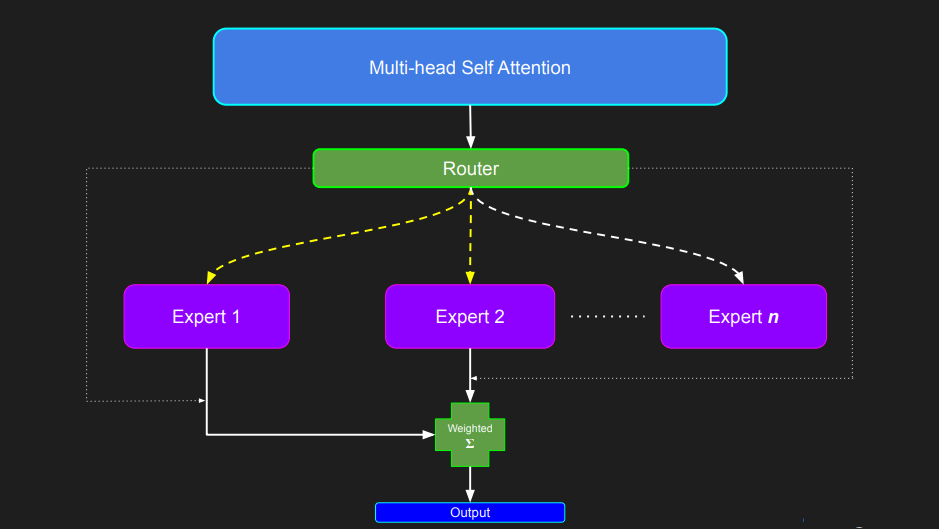
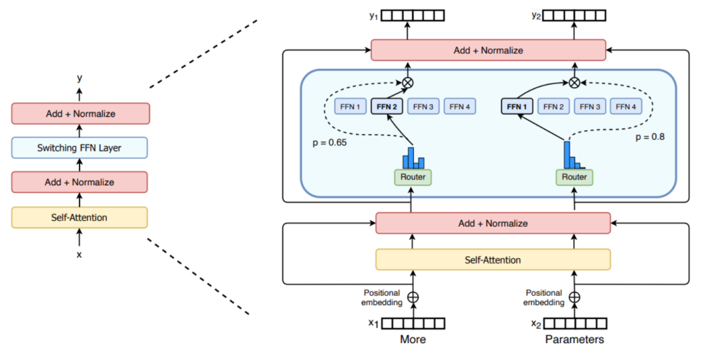
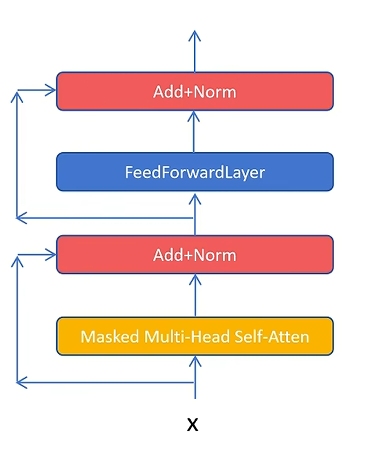
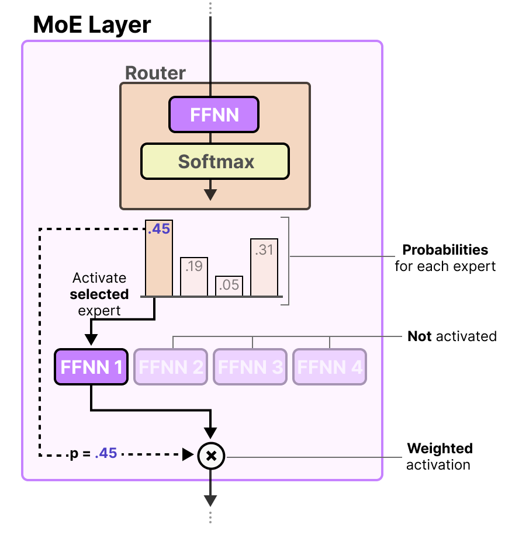
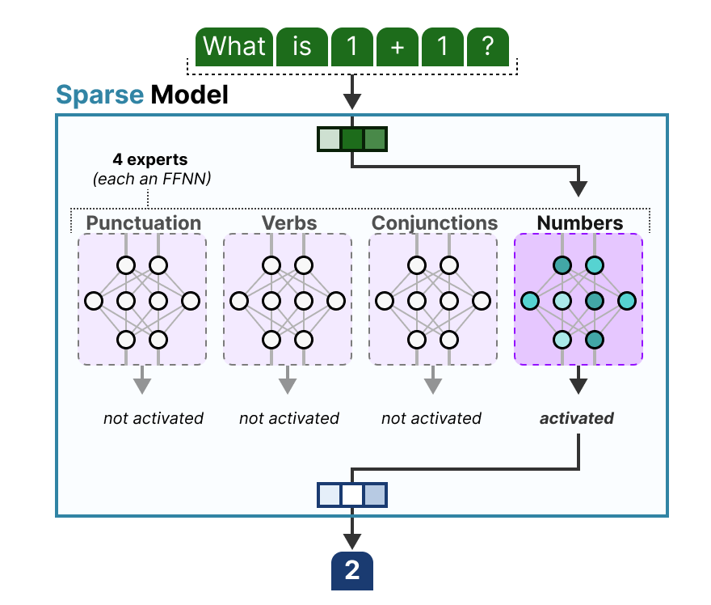
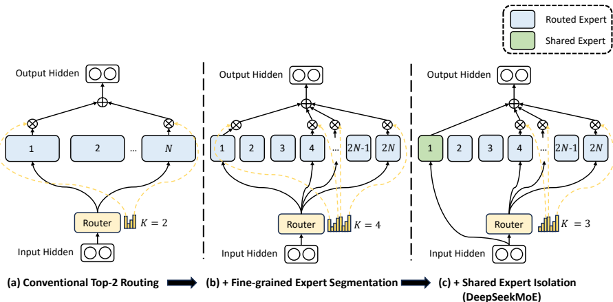
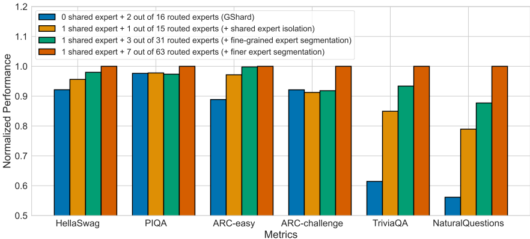

# MoE & DeepSeek MoE

大语言模型（Large Language Model）在自然语言处理领域展现出卓越的能力，并且随着模型参数规模的增大，其在理解和生成复杂文本方面的能力也随之增强。但是，模型参数规模持续增长，在模型的训练和推理部署过程中对计算资源和内存资源的需求也越发巨大。

混合专家模型（Mixture of Experts, 即MoE），旨在扩大模型参数规模的同时，并能够一定程度有效控制计算成本。

混合专家模型的核心思想在于将一个庞大的模型分解为多个更小的、专门化的子网络，这些子网络被称为"专家"。通过一个"门控网络"机制，MoE模型能够根据输入数据的特性，动态地选择激活最相关的专家来处理特定的输入或任务。

这种方法使得模型能够更好地处理复杂和异构的数据，每个专家都可以专注于学习输入空间的不同区域或不同的特征表示，从而提升整体模型的性能。MoE 架构为构建更大规模、更高效的语言模型提供了一种有效的方法。

MoE 的发展：

* MoE模型的概念最早可以追溯到1991年的论文“Adaptive Mixture of Local Experts”，由Michael Jordan和Geoffrey Hinton等人提出。这篇开创性的论文提出了一个系统，在该系统中，单独的网络（专家）在门控网络的指导下处理训练案例的不同子集。

* 2010年至2015年期间，MoE模型的发展取得了重大进展。一方面，MoE 被用于更深层次网络中的组件，将其嵌入到多层神经网络的某个层级中，以实现模型的大规模化和高效率并存；另一方面，引入了条件计算的概念，这种计算方式可以根据输入数据动态激活网络的某些组件，而关闭其他不相关的组件。这种动态的计算机制使得模型能够根据输入数据的特点，灵活地选择和激活最合适的专家进行处理，进一步提高了模型的适应性和效率。

* 2017年，谷歌的研究团队在论文“Outrageously Large Neural Networks: The Sparsely-Gated Mixture-of-Experts Layer”中，将MoE模型与LSTM（长短期记忆网络）相结合，应用于自然语言处理任务。这项工作不仅展示了MoE模型在处理大规模数据和复杂任务方面的潜力，还提出了稀疏门控机制，即在每次前向传播过程中，只激活一小部分专家来进行计算，而不是激活所有的专家。这种稀疏性的引入，使得MoE模型能够在保持较高性能的同时，显著降低计算成本，为后续MoE模型在更大规模的应用中奠定了基础。

* 2020年，谷歌的GShard项目首次将MoE技术引入Transformer架构中，并提供了高效的分布式并行计算架构，使得MoE模型能够在分布式环境中进行大规模的训练和推理。2021年，谷歌的Switch Transformer和GLaM模型进一步挖掘了MoE技术在自然语言处理中的应用潜力，通过优化门控机制和专家设计，实现了更优秀的性能表现。

与经典的MoE不同，在深度学习中，MoE模型对于每个查询通常只涉及少数几个专家的输出，而不是所有专家的加权总和。这种转变的关键目标是降低计算成本。

## 1 MoE 架构的核心算法原理

### 1.1 专家网络的构成

在混合专家模型（MoE）中，专家网络是构成模型基本构建块的子网络。每个专家都设计成专注于处理输入数据的一个特定子集或执行特定的任务。**专家网络本身可以是任何类型的神经网络架构**，这包括但不限于传统的**前馈网络（Feed-Forward Networks, FFNs）**、**卷积神经网络（Convolutional Neural Networks, CNNs）**以及在自然语言处理领域广泛应用的**Transformer模块**。

在大语言模型（LLMs）的背景下，专家网络通常实现为Transformer模块内部的前馈网络（FFN）层。

在 Mistral AI 发布的 Mixtral 8x7B 模型中，每一层都包含 8 个专家，每个专家都是一个拥有 70 亿参数的前馈块。这些专家网络通过在特定的数据子集上进行训练，从而能够专注于学习特定的任务或输入模式。

例如，在一个语言处理任务中，一个专家可能专注于处理语法结构，而另一个专家则可能擅长理解语义信息。这种专门化的训练使得每个专家都能在其特定的领域内表现出色。

专家网络通过选择适合特定类型数据或任务的专家网络，MoE 模型能够展现出极高的通用性。

在 LLMs 中，将 Transformer 架构中的 FFN 层复制并作为专家是一种常见的做法，这表明了**前馈组件在捕获专门知识方面的重要性**。通过复制这些计算密集型且对模型容量至关重要的层，并使它们专门化，MoE模型能够有效地扩展其能力，而无需成比例地增加计算成本。

### 1.2 门控机制

门控网络（也称为路由网络）在混合专家模型（MoE）中主要职责是**根据输入的特性，决定将哪些输入 tokens 发送给哪些专家网络进行处理**。门控网络通常是一个**相对轻量级的神经网络，它接收与专家网络相同的输入**。

门控网络的**输出是一个概率分布或权重向量**，这个向量指示了每个专家应该在多大程度上处理当前的输入。**一种常用的门控函数是Softmax函数**，它可以将门控网络的原始输出转换为一个**归一化的概率分布，表示每个专家被选择的概率**。

门控网络的训练与专家网络是同步进行的，其目标是**学习如何将输入有效地路由到最适合处理该输入的专家**。门控机制是 MoE 模型实现条件计算的关键，它允许模型根据输入数据的特性选择性地激活其容量，从而避免了对每个输入都激活整个模型的计算开销。门控网络和专家网络的联合训练确保了门控能够有效地将输入导向那些能够最好地处理它们的专门化专家。

### 1.3 Token 的路由

在混合专家模型（MoE）中，token 的路由选择是指将输入序列中的每个 token 分配给一个或多个专家网络进行处理的过程。

多种 token 路由策略：

* Top-K 路由：

最直接的方法之一。门控网络为每个专家计算一个亲和力得分，然后**选择得分最高的前 K 个专家，并将当前的输入数据发送给这些选定的专家进行处理**。例如，Mistral AI 的 Mixtral 8x7B 模型就采用了 Top-2 路由策略，意味着对于每个 token，门控网络会选择两个最合适的专家进行处理。Google 的 Switch Transformer 则使用了更为极端的 Top-1 路由，每个 token 只被发送给一个最匹配的专家。

* 专家选择路由：

在这种方法中，路由的方向与 Top-K 路由相反。不是由数据（token）选择专家，而是**由专家主动选择它们认为最适合处理的数据（token）**。每个专家通常具有一定的处理容量，并会选择它认为最相关的 Top-K 个 tokens 进行处理。这种策略的**主要目标是实现更好的负载均衡，并允许每个 token 被不同数量的专家处理**。

* 稀疏路由：

这种方法的核心思想是**对于每个输入数据点（通常是token），只激活网络中的一小部分专家**。这种方法**旨在创建一个稀疏的网络，从而减少计算资源的使用**，与稠密路由（所有专家都为每个数据点激活）相比，稀疏路由在计算效率方面具有显著优势。

* 随机路由：

在某些 Top-K 路由的变体中，例如在 Top-2 的设置中，虽然总是会选择得分最高的专家，但第二个专家可能会以与其权重成比例的概率被随机选择。这种方法可以**在一定程度上增加路由的随机性，有助于探索不同的专家组合，并可能改善模型的泛化能力**。

选择哪种路由策略对于 MoE 模型的性能、效率以及专家之间的负载均衡具有重要的影响。

## 2 MoE 架构中的数学计算

### 2.1 门控网络的计算

门控网络在混合专家模型（MoE）中负责为每个专家生成一个权重，以决定其对当前输入的贡献程度。

#### 2.1.1 直接 softmax 计算

一种常见的实现方式是使用 Softmax 函数来产生专家权重的概率分布。

给定输入 $x$ 和门控网络的权重矩阵 $W_g$，专家权重的概率向量 $G(x)$ 可以表示为：

$$
G(x)=\text{Softmax}(x \cdot W_g)
$$

$x \cdot W_g$ 表示输入与权重矩阵的乘积，Softmax 函数将结果转换为概率分布。

#### 2.1.2 稀疏门控路由（Sparsely-Gated）

在 Sparsely-Gated MoE 中，为了实现稀疏性，通常使用 Noisy Top-K Gating。这个过程**首先计算一个带有噪声的激活值** $H(x)_i$：

$$
H(x)_i = (x \cdot W_g)_i + \text{StandardNormal()} \cdot \text{Softplus}((x \cdot W_{noise})_i)
$$

**然后，使用一个 $KeepTopK$ 函数来保留向量 $H(x)$ 中最大的前 $k$ 个元素，并将其他元素设置为 $-\infty$**：

$$
\text{KeepTopK}(v, k)_i = \begin{cases}
    v_i & \text{if } v_i \text{ is in the top } k \text{ elements of } v, \\
    -\infty & \text{otherwise}.
\end{cases}
$$

**最后，对结果应用 $Softmax$ 函数得到门控网络的输出 $G(x)$**：

$$
G(x) = \text{Softmax}(\text{KeepTopK}(H(x), k))
$$

#### 2.1.3 Top-K 路由

对于Top-K路由，**首先计算选择每个专家的概率 $P$**：

$$
P = \text{Softmax}(W_r \cdot x^T)
$$

其中，$W_r$ 是可学习的参数。**然后，根据概率 $P$ 选择前 $K$ 个专家，并对这些选定专家的概率进行归一化，得到权重 $g_i(x)$**：

$$
g_i(x) = \begin{cases}
    \frac{P_i}{\sum_{j \in \text{TopK}(P)} P_j} & \text{if } i \in \text{TopK}(P), \\
    0 & \text{if } i \notin \text{TopK}(P).
\end{cases}
$$

$Softmax$ 函数在门控机制中的应用使得模型能够以概率的方式选择专家，**这允许不同的专家根据其相关性对输入做出不同程度的贡献**。而 **Noisy Top-K Gating 中噪声的引入有助于在训练过程中进行探索，并可能通过防止门控网络过早地变得过于确定性来改善负载均衡**。

### 2.2 损失函数

混合专家模型（MoE）的训练通常**涉及最小化一个损失函数**，该损失函数旨在**优化专家网络的性能以及门控网络路由输入的有效性**。早期的 MoE 模型有时会使用**均方误差（Mean Squared Error, MSE）损失函数**。如果 $d$ 是期望输出，$o_i$ 是专家 $i$ 的输出，$p_i$ 是门控网络分配给专家 $i$ 的概率，则 MSE 损失可以表示为：

$$
E = \|d - \sum_i p_i o_i \| ^2
$$

在《Adaptive Mixture of Local Experts》这篇论文中，提出了**基于负对数似然的损失函数**。如果 $g_J(x)$ 是门控函数对于专家 $J$ 的输出，$p_J(y;x)$ 是专家 $J$ 对于输入 $x$ 预测输出 $y$ 的概率密度函数，则混合专家的总概率密度函数为：

$$
p(y;x) = \sum_J g_J(x) p_J(y;x)
$$

**训练的目标是最大化训练数据的对数似然函数**。

为了解决 MoE 模型中常见的**负载均衡问题**，通常会**在总损失函数中添加辅助损失函数**。例如，Switch Transformer使用了一个辅助损失函数来**鼓励专家之间的均匀负载**。如果 $s_{ij}$ 是 token $i$ 被路由到专家 $j$ 的分数，$N$ 是 batch 中的 token 数量，$E$ 是专家的数量，则辅助损失可以表示为：

$$
L_{aux} = \frac{1}{N} \sum_{i=1}^N \left( \sum_{j=1}^E s_{ij} \right)^2
$$

损失函数的设计不仅旨在**优化每个专家的性能**，**还要确保门控网络能够有效地路由输入**。专门为负载均衡设计的辅助损失项强调了在 MoE 模型中确保所有专家在训练期间得到有效利用的实际挑战。

### 2.3 其他关键计算

在混合专家模型（MoE）中，**专家网络的输出通常基于门控网络的权重进行加权求和**，以得到最终的 MoE 模型的输出。如果 $y$ 是 MoE 的最终输出，$G(x)_i$ 是门控网络为专家 $i$ 分配的权重，$E_i(x)$ 是专家 $i$ 对于输入 $x$ 的输出，那么 MoE 的输出可以表示为：

$$
y = \sum_{i=1}^n G(x)_i E_i(x)
$$

其中，$n$ 是专家的总数。

这种加权求和的方式使得模型能够利用多个专家的专门知识来处理给定的输入，从而**产生更丰富和更细致的响应**。

另一个关键概念是**专家容量（Capacity Factor）**，**它用于限制每个专家可以处理的tokens数量**，这有助于实现负载均衡。专家容量通常被定义为每个专家可以处理的平均tokens数量乘以一个容量因子。这个容量因子是一个超参数，用于控制每个专家可以接收的最大负载，**防止某些专家过载而其他专家利用不足**。专家容量的概念是管理计算资源和防止单个专家过载的实用方法，尤其是在训练期间。

## 3. MoE 架构的变体

### 3.1 稀疏门控 MoE

稀疏门控混合专家模型（Sparsely-gated Mixture of Experts, MoE）的核心思想是**门控网络对于每个输入的token，只选择激活一小部分最相关的专家进行处理**。这种稀疏性通常通过 Top-K 路由等方法实现，即门控网络为每个专家计算一个得分，然后只计算得分最高的前K个最相关的专家的输出。这种方法显著降低了计算成本，使得训练和推理过程更加高效。Sparsely-Gated MoE Layer 是 Google Brain 提出的一个具体的稀疏门控 MoE 的实现。稀疏门控是现代 MoE 架构的基石，它使得模型能够扩展到前所未有的规模，同时保持计算成本在可控范围内。

### 3.2 Top-K路由

Top-K 路由是一种常用的 token 路由策略，其中**门控网络首先为每个专家计算一个相关性得分，然后选择得分最高的前 K 个专家来处理当前的输入token**。这里的 K 是一个预先设定的超参数，它决定了每个输入 token 将被发送给多少个专家进行处理。虽然 Top-K 路由实现起来相对简单，但**它也可能导致负载不均衡的问题**，即某些专家可能会因为频繁被选中而过载，而其他专家则可能利用不足。

### 3.3 专家选择路由

与 Top-K 路由策略不同，专家选择路由（Expert Choice Routing）是一种让专家主动选择它们最适合处理的输入 tokens 的路由方法。在这种策略中，每个专家通常都具有一定的处理容量，并且会选择它认为最相关的 Top-K 个 tokens 进行处理。专家选择路由的主要优点在于**它能够更好地实现负载均衡，并且允许每个token被不同数量的专家处理**，这取决于专家的选择。

### 3.4 其他变体及其特点和适用场景

除了上述主要的MoE架构变体之外，还有一些其他的变体，它们各自具有独特的特点和适用场景：

* Switch Transformer：

这是一种简化的 MoE 架构，其核心特点是每个输入 token 只被路由到一个专家，即 **K=1 的 Top-K 路由**。**这种方法降低了路由计算和通信成本，但在负载均衡方面可能需要更精细的处理**。

* DeepSeek MoE：

这种架构采用了**细粒度的专家分割技术，将每个专家进一步划分为更小的专家，从而促进更精细的专业化**。此外，DeepSeek MoE **还使用了共享专家隔离的策略，某些专家被指定为"共享专家"并始终处于激活状态，用于捕获跨不同上下文的通用知识**。

* Mixture of Tokens (MoT)：

与传统的 MoE 将 tokens 路由到专家不同，**MoT 首先将来自不同输入示例的 tokens 混合在一起，然后再将它们馈送到专家**。这种方法被认为**可以提高训练的稳定性以及专家资源的利用率**。

* Hierarchical MoE：

这种架构使用多层门控网络，形成一个树状的结构。这种分层结构允许进行更复杂的路由决策，并能够学习到多层次的特征表示。

## 4 MoE 架构在实际应用中可能遇到的问题及解决方案

### 4.1 负载均衡

负载不均衡是混合专家模型（MoE）在实际应用中经常遇到的一个挑战。这种不平衡会**导致被过度使用的专家可能无法充分学习到输入空间的各个方面，而利用不足的专家则无法得到充分的训练，最终影响模型的整体性能**。

为了解决负载均衡的问题，目前存在多种策略：

* 在评分过程中添加随机噪声 (Noisy Top-K Gating)：

这种方法**通过在门控网络为每个专家计算的得分上添加少量随机噪声，来增加专家选择的多样性，从而帮助更均匀地分配负载**。

* 添加辅助负载均衡损失到总损失函数中：

这种策略在训练过程中引入一个额外的损失项，其目的是**鼓励门控网络将输入更均匀地路由到所有专家，从而最小化路由到每个专家的输入比例的差异**。

* 专家选择路由 (Expert Choice Routing)：

这种路由策略允许专家主动选择它们最适合处理的 tokens，从而可以更直接地控制每个专家的负载，实现更好的均衡。

* 为每个专家引入额外的"专家偏差"：

这种方法**在门控网络的输出中为每个专家添加一个可学习的偏差项**。**如果某个专家长时间没有被使用，其偏差会增加，从而提高它在未来被选择的可能性，反之亦然**。

* Loss-Free Balancing策略：

最近的研究提出了一种无需辅助损失的负载均衡策略。**该策略通过在做出 Top-K 路由决策之前，首先对每个专家的路由得分应用一个专家特定的偏差。这个偏差会根据专家最近的负载情况进行动态更新，从而持续地维持专家负载的均衡分布**。

负载均衡是确保 MoE 模型中所有专家都得到有效训练和利用的关键挑战。

### 4.2 通信开销

在分布式训练和推理的场景下，混合专家模型（MoE）可能会引入显著的通信开销。因为当模型的不同部分（包括门控网络和各个专家网络）分布在不同的计算设备（如GPU）上时，需要频繁地在这些设备之间交换激活值和梯度信息。例如，当输入 tokens 被路由到不同的专家时，如果这些专家位于不同的GPU上，就需要进行跨GPU的通信。同样，在反向传播过程中，来自不同专家的梯度也需要聚合以更新模型的参数。

为了缓解这种通信开销，研究人员和工程师们提出了多种有效的通信策略和硬件感知的模型设计方法：

* 优化模型部署和通信调度：

Aurora 是一种旨在通过优化模型在不同计算设备上的部署以及设备之间的通信调度来最小化MoE模型推理时间的方法。它**通过将来自不同模型的专家共同部署在同一设备上，从而避免了同步的全对全通信的限制，提高了GPU的利用率**。

* 引入零计算专家：

MoE++ 架构通过在模型中引入"零计算专家"来降低计算开销，并消除 FFN 专家跨不同 GPU 的通信开销。**这些零计算专家具有可忽略的参数量，可以部署在每个GPU上**，从而避免了 FFN 专家分布在不同GPU上时产生的通信开销和负载不均衡问题。

* 利用 Megatron-Core 的优化策略：

Megatron-Core 是一个用于训练大型 Transformer 模型的框架，它提供了一些减少 MoE 模型通信开销的策略。这些策略包括：
    * **尽可能减小模型并行度**，因为模型并行会带来通信开销并可能损害性能；
    * **确保专家并行（EP）和张量并行（TP）的通信发生在NVLink域内**，因为 EP 和 TP 都是通信密集型的；
    * **在可能的情况下，对于专家层优先使用EP而不是TP**，因为 EP 通常比 TP 具有更好的 GEMM 效率和更低的通信开销。

* 通信与计算重叠：

启用通信与计算的重叠是减少通信开销的有效方法。例如，Megatron-Core 允许在分布式优化器中启用参数收集和梯度减少的重叠，以及在 TP 大于 1 时启用 TP 通信的重叠。

### 4.3 训练稳定性

混合专家模型（MoE）由于其固有的稀疏性和复杂的路由机制，**在训练过程中可能比传统的稠密模型更容易出现不稳定性**，尤其是在对预训练模型进行微调时，更容易发生**过拟合现象**。

**模型的稀疏性意味着在每个训练步骤中只有一部分参数被激活**，这种特性使得模型对训练数据的随机性以及参数的初始化更加敏感，从而可能导致训练过程中的不稳定性。

为了应对MoE模型的训练不稳定性问题，研究人员提出了多种解决方案：

* 简化路由策略：

Switch Transformer是一种MoE架构的变体，它通过将每个输入token仅路由到一个最相关的专家（即Top-1路由）来简化路由策略。这种简化可以在一定程度上**提高训练的稳定性，同时保持模型性能**。

* 引入额外的损失项：

在训练过程中，可以引入额外的损失项来**鼓励专家之间的负载均衡**，并**防止门控网络过早地偏向某些特定的专家**。例如，Switch Transformer就使用了额外的辅助损失来提高训练的稳定性。

* 采用特定的初始化方案：

合适的参数初始化对于训练深度神经网络至关重要，对于MoE模型也不例外。一般来说会设计专门的初始化方案，以帮助稳定MoE模型的训练过程，尤其是在扩展到大量专家的情况下。

* 使用软路由而非硬路由：

传统的MoE实现通常使用硬路由，**即每个token被确定性地分配给一个或几个专家**。**而软路由则允许token以一定的权重激活多个专家，这种更平滑的路由方式可以提高训练的稳定性**。

* 逐步增加专家数量：一些研究表明，在训练初期使用较少的专家，然后在训练过程中逐步增加专家数量，可以帮助模型更稳定地学习和扩展其能力。

### 4.4 推理效率

尽管混合专家模型（MoE）在推理时通常只激活一部分参数，从而降低了计算成本，但一个主要的挑战是**所有专家网络的参数都需要加载到内存中**。这导致 MoE 模型在推理时可能需要比相同激活参数量的稠密模型更高的内存需求。此外，**门控网络的计算以及选择和激活特定专家的过程也会增加推理的开销**。

为了提高MoE模型的推理效率，研究人员正在探索多种策略：

* 专家并行化和负载均衡：

通过**将不同的专家网络分布到多个计算设备上并行执行**，可以显著提高推理的吞吐量。同时，有效的负载均衡策略可以确保所有计算资源得到充分利用，避免某些设备过载而其他设备空闲。

* 模型压缩和量化：

对 MoE 模型进行压缩（例如，通过剪枝不重要的参数或进行知识蒸馏）和量化（例如，将模型参数从高精度浮点数转换为低精度整数）可以显著减小模型大小并加快推理速度。

* 动态专家激活：

研**究人员正在探索更智能的门控机制，这些机制可以**根据输入token的特性更精确地选择需要激活的专家，从而进一步减少不必要的计算。

* 专家缓存和预加载：

对于某些应用场景，可以**将常用的专家网络预加载到内存中，或者在推理过程中缓存已经激活过的专家**，以减少从存储器加载参数的延迟。

* 硬件优化：

针对 MoE 架构特点进行硬件优化，例如设计专门的硬件加速器，可以显著提高MoE模型的推理效率。

## 5. MoE 架构在大语言模型中的最新研究

### 5.1 最近几年的重要研究论文概述

* 2021年，Google提出的Switch Transformers展示了将MoE架构扩展到万亿参数规模的潜力，通过简单的稀疏性实现了高效的模型扩展。

* 在路由策略方面，2022年NeurIPS上提出的"Mixture-of-Experts with Expert Choice Routing"引入了一种新颖的路由算法，该算法允许专家选择tokens而不是tokens选择专家，从而实现了更好的负载均衡和训练效率。

* 2023年，Mistral AI发布了Mixtral 8x7B，这是一款高质量的稀疏MoE模型，在大多数基准测试中都优于Llama 2 70B，并且具有更快的推理速度，引起了广泛关注。

* 2024年，DeepSeek-MoE模型采用了细粒度的专家分割技术和专家选择路由算法，进一步提升了MoE模型的性能。

* 关于扩展MoE语言模型的scaling laws的研究; 关于将稠密LLMs转换为MoE的研究; 关于在资源受限环境下训练300B参数MoE LLM的研究

* MoE LLMs的参数压缩方法，如D2-MoE和MC-MoE，旨在降低模型大小和内存占用。

* 关于MoE LLMs的专家剪枝和跳过技术的研究，以提高推理效率。

* 针对MoE LLMs的unlearning方法（UOE），用于从模型中移除特定知识而不影响其通用能力。

* 将MoE架构应用于多模态LLMs，例如CuMo模型，该模型将MoE融入视觉编码器和LLM中，以提升多模态任务的性能。

* 针对细粒度MoE模型的推理框架（IFMoE），旨在提高推理的延迟和吞吐量

* Loss-Free Balancing作为一种无需辅助损失的负载均衡策略，也被提出以解决MoE模型中常见的负载不均衡问题。

### 5.2 模型规模、训练方法

最新的混合专家模型（MoE）参数量从数千亿到万亿不等。这些模型通常通过联合训练专家网络和门控网络的方式进行训练，并依赖于大规模的数据集来学习丰富的语言表示和专门的知识。

主要 MoE 架构的比较

| 架构名称 | 关键特性 | 路由机制 | 负载均衡策略 | 优点 | 缺点/挑战 | 示例模型 |
|---------|---------|---------|-----------|-----|---------|---------|
| Sparsely-Gated MoE | 稀疏门控 | Noisy Top-K | 辅助损失 | 高容量，低推理成本 | 训练不稳定性 | Switch Transformer, GShard, Mixtral |
| Switch Transformer | Top-1路由 | Top-1 | 辅助损失，容量因子 | 路由计算和通信成本低 | 需要仔细处理负载均衡 | Switch Transformer |
| Mixtral 8x7B | Top-2路由，8个7B专家 | Softmax over Top-2 | 容量因子 | 强大的性能，快速推理 | 内存需求高 | Mixtral 8x7B |
| Expert Choice Routing | 专家选择tokens | 专家选择Top-K | 容量限制 | 更好的负载均衡，每个token可被不同数量专家处理 | | |
| DeepSeek MoE | 细粒度专家分割，共享专家隔离 | 专家选择 | 无辅助损失 | 进一步促进专家专业化，捕获通用知识 | | DeepSeek-MoE |
| Mixture of Tokens (MoT) | 混合tokens后馈送到专家 | 混合tokens | | 提高训练稳定性和专家利用率 | | |
| Hierarchical MoE | 多层门控网络 | 多层路由 | | 更复杂的路由决策，多层次的特征学习 | | Meta AI's NLLB-200 |

## 6 DeepSeek MoE

DeepSeek MoE架构解决了在混合专家模型（MoE）中确保专家专业化的挑战。传统的MoE架构通常面临专家获取重叠知识的问题，这阻碍了它们专注于特定领域的能力。DeepSeek MoE提出了两种主要策略来实现专家的终极专业化：细粒度专家分割和共享专家隔离。

* 细粒度专家分割

通过**拆分前馈神经网络（FFNs）的中间隐藏维度，将专家分成更多数量的、更小更专注的单元**。**通过在保持计算成本不变的情况下激活更多这些细粒度专家，DeepSeek MoE允许对每个token使用更灵活和适应性更强的专家组合**。这种更精细的粒度使得多样化知识能够被单个专家更精确地分解和学习，从而实现更高的专业化程度。例如，与使用 top-2 路由的 16 个专家，共 120 种组合方式（$C_{16} ^2 = 120$）相比，将每个专家分割成4个更小的专家并激活8个，允许超过40亿种组合($C_{64} ^8 = 4426165368$)。

* 共享专家隔离

DeepSeek MoE将一定数量的专家隔离为"共享专家"，这些专家无论路由器的决定如何，都会对每个token始终保持激活状态。这些**共享专家的目的是捕获和整合跨不同上下文的通用知识。通过在这些共享专家中集中通用知识，减轻了其他路由专家之间的冗余，提高了参数效率，并允许路由专家专注于获取更专业化的知识**。

* 负载平衡考虑

为了防止路由崩溃，引入了专家级平衡损失和设备级平衡损失。专家级平衡损失通过以下公式计算：

$$
\mathcal{L}{\text{ExpBal}} = \alpha_1 \sum{i=1}^{N'} f_i P_i
$$

$f_i$ 表示第 i 个专家被选择的概率，$P_i$ 表示第 i 个专家的平均选择概率。

设备级平衡损失则通过以下公式计算：

$$
\mathcal{L}{\text{DevBal}} = \alpha_2 \sum{i=1}^{D} f_i' P_i'
$$

其中，$f_i'$ 表示第 i 个设备上专家的选择概率，$P_i'$ 表示第 i 个设备上专家的平均选择概率。

DeepSeek MoE 采用无辅助损失的负载均衡策略。这种方法避免了传统用于负载均衡的辅助损失函数可能引入的干扰梯度。通过基于最近负载动态调整每个专家的偏置，DeepSeek MoE在不影响模型效率的情况下维持平衡的专家负载。

### 6.1 计算说明

MoE层的输出（$h'_{l,t}$）是共享专家输出和路由专家输出的组合：

$$
h'{l,t} = u{l,t} + \sum_{i=1}^{N_s} \text{FFN}i^{(s)}(u{l,t}) + \sum_{i=1}^{N_r} g_{i,t} \cdot \text{FFN}i^{(r)}(u{l,t})
$$

* $u_{l,t}$ 是 MoE 层的输入。
* $N_s$ 是共享专家的数量。
* $\text{FFN}_i^{(s)}$ 是第 i 个共享专家 FFN。
* $N_r$ 是路由专家的数量。
* $g_{i,t}$ 是 $token _t$ 的第 i 个路由专家的门控值。
* $\text{FFN}_i^{(r)}$ 是第 i 个路由专家 FFN。

门控值 $g_{i,t}$ 基于 top-K 路由计算：

$$
g_{i,t} = \begin{cases} 
    \frac{s_{i,t}}{\sum_{j \in \text{TopK}(\{s_{j,t} | 1 \leq j \leq N_r\}, K_r)} s_{j,t}}, & \text{if } s_{i,t} \in \text{TopK}(\{s_{j,t} | 1 \leq j \leq N_r\}, K_r) \\
    0, & \text{otherwise}
\end{cases}
$$

其中 $s_{i,t}$ 是 $token _t$ 的第 i 个路由专家的路由分数，计算方式为：

$$
s_{i,t} = \text{Sigmoid}(u_{l,t}^T \cdot e_i)
$$

其中 $e_i$ 是第 i 个路由专家的嵌入向量。

DeepSeek-V3 还引入了一个互补的序列级辅助损失，用于负载均衡：

$$
L_{\text{Bal}} = \alpha \sum_{i=1}^{N_r} f_i \cdot P_i
$$

其中：

* $\alpha$ 是平衡因子。
* $f_i$ 是路由到第 i 个专家的 tokens 比例。
* $P_i$ 是选择第 i 个专家的平均概率。

### 6.2 benchmark 结果

从上面的结果可以看出来：

* 启用 shared export 显著优于不启用 shared export
* expert 拆分粒度越细各 benchmark 上的 performance 越好

DeepSeek MoE的主要特点：

* 细粒度专家分割：为改进知识获取，**实现更灵活和专业化的专家组合**。
* 共享专家隔离：通过专门指定特定专家捕获通用知识，**减少路由专家之间的冗余**。
* 专家选择路由：**确保专家之间的最佳负载均衡**，从而实现更高效的训练和推理。
* 无辅助损失负载均衡：在训练期间保持平衡的专家利用率，而**不引入干扰梯度**。
* 多头潜在注意力（MLA）：在 DeepSeek-V3 中引入，这一机制**减少了长上下文的内存使用和计算开销**。
* 多 Token 预测（MTP）：在 DeepSeek-V3 中引入，这一训练目标**提高了训练效率，并通过推测解码实现更快的推理**。

### 6.3 One More Q

#### 6.3.1 细粒度专家分割的实现

细粒度专家分割通过将每个专家的中间隐藏维度减少到原始大小的 $\frac{1}{m}$ 来实现。具体来说，如果原始专家的隐藏维度为 $H$，则分割后的专家隐藏维度为 $\frac{H}{m}$。为了保持计算成本不变，激活的专家数量也增加到 $m$ 倍。这样，细粒度分割使得不同专家可以专注于不同类型的数据，提高了专家的专业化水平。

优势：

* 提高专业化水平：细粒度分割使得不同专家可以专注于不同类型的数据，减少了知识混合，提高了每个专家的专注度和专业化水平。
* 增强灵活性：由于每个专家的参数规模较小，可以更灵活地组合不同的专家，从而实现更精确和有针对性的知识获取。
* 提高计算效率：通过减少每个专家的参数数量和计算复杂度，可以在相同的计算预算下激活更多的专家，从而提高整体计算效率。

#### 6.3.2 共享专家隔离策略如何工作

共享专家隔离策略通过隔离某些专家作为共享专家，**这些专家始终被激活，用于捕捉和整合跨上下文的共同知识**。具体来说，除了细粒度分割外，还隔离了 $K_s$ 个专家作为共享专家，**这些专家在所有路由中都会被激活**。为了保持计算成本不变，其他路由专家的数量会相应减少。

优点：

* 减少冗余：通过共享专家隔离，**可以减少其他路由专家中的冗余知识，避免多个专家学习相同的知识**，从而提高参数效率和模型性能。
* 增强泛化能力：**共享专家可以捕捉到跨上下文的共同知识**，这些知识对于不同任务和场景都有益处，从而增强模型的泛化能力。
* 提高计算效率：由于共享专家的参数被多个路由专家共享，**可以减少每个路由专家的计算负担，从而提高整体计算效率**。

