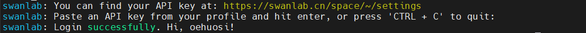

# DeepSeek R1 ZeRO 复现


## 单机多卡复现 DeepSeek R1 Zero

### 1 环境准备

* CUDA > 12.0 （这里使用的是 CUDA 12.2）
* python-3.12
* pytorch-2.5.1-gpu
    使用 `torch.cuda.is_available()` 检查能否正常识别 GPU 设备，如果没问题，会输出 `True`:

    ```bash
    python3 -c "import torch;print(torch.cuda.is_available())"
    
    # True
    ```


### 2 编译安装 flash-attn

编译安装 Flash Attention 包，这步非常消耗 CPU 资源，可以在 `https://github.com/Dao-AILab/flash-attention/releases/` 找到与环境对应的编译好的包。(实际安装貌似也还好)

```bash
pip install packaging
pip install ninja # 用于加速编译

# 编译安装 Flash Attention 包
pip install flash-attn --no-build-isolation

# 注意！如果你的设备CPU核心多，但是运行内存小于 96 GB，请适当设置 MAX_JOBS 的数量，并替换为下面的命令，参考：https://github.com/Dao-AILab/flash-attention#installation-and-features
MAX_JOBS=4 pip install flash-attn --no-build-isolation
```


安装其他库:

```bash
python3 -m pip install -r requirements.txt
```


### 3 下载模型和数据集

本次实验中，使用的数据集为：[Jiayi-Pan/Countdown-Tasks-3to4](https://huggingface.co/datasets/Jiayi-Pan/Countdown-Tasks-3to4)，模型为：[Qwen/Qwen2.5-3B-Instruct](https://huggingface.co/Qwen/Qwen2.5-3B-Instruct)，建议用不小于 3B 的模型（其他社区多次报告，小于 3B 的模型无法学会推理。）　


```bash
# 更换为国内镜像源，这个只用执行一次，每次重新打开终端就要重新执行，或者写入 .bashrc
export HF_ENDPOINT=https://hf-mirror.com 

# 下载数据集，替换整个 <xxx> 为自己的内容
huggingface-cli download --repo-type dataset --resume-download Jiayi-Pan/Countdown-Tasks-3to4 --local-dir <想要存放的路径，比如：dataset>
```

模型下载，二选一(哪个速度快用哪个)：　

```bash
# 方案一，Huggingface 镜像源
# 下载模型，替换整个 <xxx> 为你自己的内容
huggingface-cli download --resume-download Qwen/Qwen2.5-3B-Instruct --local-dir <想要存放的路径，比如：models>


# 方案二，ModelScope 下载
# 新建 model_download.py 文件，填入以下内容，替换整个 <xxx> 为自己的内容,保存后使用 python model_download.py 执行下载。　
from modelscope import snapshot_download
model_dir = snapshot_download('Qwen/Qwen2.5-3B-Instruct', cache_dir='<想要存放的路径，比如：models>', revision='master')
```

*注：这里不是严谨复现的 DeepSeek-R1-Zero，如果需要尽可能贴近原文，请使用 Qwen/Qwen2.5-3B 而不是 Qwen/Qwen2.5-3B-Instruct。但是注意，这可能需要更长的训练步长才能达到理想效果。*


### 4 编写配置文件和训练代码


* **Accelerate 配置文件**

用于分布式训练。新建 `deepspeed_zero3.yaml` 填入以下内容并保存:

```bash
compute_environment: LOCAL_MACHINE
debug: false
deepspeed_config:
  deepspeed_multinode_launcher: standard
  offload_optimizer_device: none
  offload_param_device: none
  zero3_init_flag: true
  zero3_save_16bit_model: true
  zero_stage: 3
distributed_type: DEEPSPEED
downcast_bf16: 'no'
machine_rank: 0
main_training_function: main
mixed_precision: bf16
num_machines: 1
num_processes: 8    # 这里保持常规默认的 8 卡机器，会在后面的启动命令中覆盖新值
rdzv_backend: static
same_network: true
tpu_env: []
tpu_use_cluster: false
tpu_use_sudo: false
use_cpu: false
```

一般来说，这个文件内容不需要修改，如果有定制需求，请不要使用这个文件，运行 `accelerate config` 自行设定。


使用 Swanlab（https://swanlab.cn/）来可视化追踪实验过程，打开：https://swanlab.cn/login ，登录之后点击 Quick Start，或者打开：https://swanlab.cn/space/~/settings ，复制 API Key。　

在终端输入`swanlab login`，粘贴前面复制的 API Key，回车，出现类似如下提示就是登录成功。　



后面会用到，这里配置登录完成即可。


* **TRL 配置文件**

设定训练的超参数。新建 `deepseek-R1-reproduce.yaml` 填入以下内容，并根据实际情况修改，并保存。

```bash
# 模型参数
model_name_or_path: <模型存放的路径，比如：models/Qwen/Qwen2.5-3B-Instruct>
model_revision: main
torch_dtype: bfloat16
attn_implementation: flash_attention_2
bf16: true
tf32: true
output_dir: <想要模型输出的路径，比如 output/deepseek-R1-reproduce>

# 数据集参数
dataset_id_or_path: <数据集存放的路径，比如：dataset>

# Swanlab 训练流程记录参数
swanlab: true # 是否开启 Swanlab 
workspace: <用户名>
project: <项目名，整个复现项目的名称，例如：deepseek-R1-reproduce>
experiment_name: <实验名，某次超参数运行的自定义名称，例如：qwen2.5-3B-lr:5e-7_beta:0.001>

# 训练参数
max_steps: 450 # 最大训练步长
per_device_train_batch_size: 1
gradient_accumulation_steps: 8
gradient_checkpointing: true
gradient_checkpointing_kwargs:
  use_reentrant: false
learning_rate: 5.0e-7 # 学习率
lr_scheduler_type: cosine # 学习率衰减方案
warmup_ratio: 0.03 # 学习率预热比率（对于整个步长）
seed: 2025 # 随机种子，方便实验复现

# GRPO 算法参数
beta: 0.001 # KL 惩罚因子
max_prompt_length: 256 # 输入 prompt 最大长度
max_completion_length: 4096 # 输出回答长度，包含推理思维链，设为 4K 比较合适
num_generations: 8
use_vllm: true # 启用 vllm 来加速推理
vllm_device: <计算卡编号，例如：cuda:1> # 留出一张卡来启用 vllm 推理
vllm_gpu_memory_utilization: 0.5

# Logging arguments
logging_strategy: steps
logging_steps: 1
save_strategy: "steps"
save_steps: 50 # 每隔多少步保存一次
```


说明：

* `learning_rate` 和 `beta` 在 GRPO 的原始论文[《DeepSeekMath: Pushing the Limits of Mathematical Reasoning in Open Language Models》](https://arxiv.org/abs/2402.03300)里分别为 `1e-6` 和 `0.04`。在这里根据[《Unraveling RLHF and Its Variants: Progress and Practical Engineering Insights》](https://hijkzzz.notion.site/unraveling-rlhf-and-its-variants-engineering-insights)将其调整为 `5e-7` 和 `0.001`

* `vllm_device`, 实验需要留出一张卡作为 `vllm` 的推理卡，手上有 2 张卡（编号`cuda: 0`, `cuda: 1`)，需要指定其中一张卡为 vllm 推理卡，这里指定最后一张 `cuda:1`。另外，如果使用了`CUDA_VISIBLE_DEVICES` 情况会有些不一样，比如有 8 张卡（编号 `cuda:0-7`），指定编号为 1、2、3 的卡可见（`CUDA_VISIBLE_DEVICES=1,2,3`)，这时我们想指定最后一张卡为 vllm 推理卡，则是需要设置为 `cuda:2`，因为设置完可见性后，`cuda:1 -> cuda:0`，`cuda:2 -> cuda:1`，`cuda:3 -> cuda:2`，所以原先的 3 号卡变为了新编号的 2 号卡。

* `save_steps`, 在 [mini-r1](https://www.philschmid.de/mini-deepseek-r1) 中是被设为 `25`，但是跑完整个训练后，保存的文件大小达到了 `700+ GB`！因为不仅包含了模型，还包含了其他卡的优化器状态和其他检查点信息，这里改为 50，但仍然要需要设置成合适的大小。

* 由于我这里使用的是Turing架构的卡，不支持 bf16 和 tf32，需要在模型的 `config.json`里面把`torch_dtype`的值改为 `float16`


* **训练代码文件 `train_deepseek-R1-reproduce.py`**

```python
import logging
import os
import random
import re
from dataclasses import dataclass
from datetime import datetime
from typing import List

from datasets import load_dataset
from swanlab.integration.transformers import SwanLabCallback
import torch
from transformers import AutoTokenizer
from transformers.trainer_utils import get_last_checkpoint
from trl import GRPOConfig, GRPOTrainer, ModelConfig, TrlParser

@dataclass
class DatasetArguments:
    """数据集参数的数据类"""

    # 数据集 ID 或路径
    dataset_id_or_path: str = "Jiayi-Pan/Countdown-Tasks-3to4"
    # 数据集拆分
    dataset_splits: str = "train"
    # 分词器名称或路径
    tokenizer_name_or_path: str = None

@dataclass
class SwanlabArguments:
    """SwanLab参数的数据类"""

    # 是否使用 SwanLab
    swanlab: bool
    # SwanLab 用户名
    workspace: str
    # SwanLab 的项目名
    project: str
    # SwanLab 的实验名
    experiment_name: str


# 配置日志记录器
logging.basicConfig(level=logging.INFO)
logger = logging.getLogger(__name__)
logger.setLevel(logging.INFO)
handler = logging.StreamHandler()
handler.setFormatter(
    logging.Formatter("%(asctime)s - %(name)s - %(levelname)s - %(message)s")
)  # 设置日志格式
logger.addHandler(handler)


def format_reward_func(completions, **kwargs):
    """
    格式奖励函数，检查模型输出格式是否匹配: <think>...</think><answer>...</answer>

    参数:
        completions (list[str]): 生成的输出
    返回:
        list[float]: 奖励分数
    """
    # 初始化奖励列表
    rewards = []

    # 遍历生成的输出
    for completion in completions:
        try:
            # 在生成的输出前添加<think>标签，便于后续正则表达式匹配
            completion = "<think>" + completion

            if random.random() < 0.1:  # 10% 的概率将生成输出写入文件
                # 创建生成输出目录
                os.makedirs("completion_samples", exist_ok=True)
                log_file = os.path.join("completion_samples", "completion_samples.txt")
                with open(log_file, "a") as f:
                    f.write(f"\n\n==============\n")
                    f.write(completion)  # 写入生成的输出

            # 定义正则表达式模式，用于匹配 <think> 和 <answer> 标签
            regex = r"^<think>([^<]*(?:<(?!/?think>)[^<]*)*)<\/think>\n<answer>([\s\S]*?)<\/answer>$"
            match = re.search(regex, completion, re.DOTALL)  # 使用正则表达式进行匹配

            if match is None or len(match.groups()) != 2:
                rewards.append(0.0)  # 如果格式不正确，奖励为 0
            else:
                rewards.append(1.0)  # 如果格式正确，奖励为 1
        except Exception:
            rewards.append(0.0)  # 如果发生异常，奖励为 0

    return rewards


def equation_reward_func(completions, target, nums, **kwargs):
    """
    方程奖励函数，检查计算结果是否正确，数字是否符合使用要求（每个数字只用一次，只使用所提供的数字）

    参数:
        completions (list[str]): 生成的输出
        target (list[str]): 预期的答案
        nums (list[str]): 可用的数字

    返回:
        list[float]: 奖励分数
    """
    # 初始化奖励列表
    rewards = []

    # 遍历生成的输出、预期的答案和可用的数字
    for completion, gt, numbers in zip(completions, target, nums):
        try:
            # 在生成的输出前添加 <think> 标签，便于后续正则表达式匹配
            completion = "<think>" + completion

            # 定义正则表达式模式，用于匹配 <answer> 标签
            match = re.search(r"<answer>(.*?)<\/answer>", completion)
            if match is None:
                rewards.append(0.0)  # 如果没有匹配到 <answer> 标签，奖励为 0
                continue
            equation = match.group(1).strip()  # 提取 <answer> 标签中的内容
            # 提取方程中的所有数字
            used_numbers = [int(n) for n in re.findall(r"\d+", equation)]

            # 检查所有数字是否被使用且只使用一次
            if sorted(used_numbers) != sorted(numbers):
                rewards.append(0.0)
                continue

            # 定义允许的字符模式，只允许数字、运算符、括号和空白字符
            allowed_pattern = r"^[\d+\-*/().\s]+$"
            if not re.match(allowed_pattern, equation):
                rewards.append(0.0)  # 如果方程包含不允许的字符，奖励为 0
                continue

            # 计算方程的结果
            result = eval(equation, {"__builtins__": None}, {})
            # 检查方程是否正确且与预期答案匹配（误差小于 1e-5）
            if abs(float(result) - float(gt)) < 1e-5:
                rewards.append(1.0)  # 如果正确，奖励为 1

                # 10% 的概率将成功的样本写入文件
                if random.random() < 0.10:
                    # 创建生成输出目录
                    os.makedirs("completion_samples", exist_ok=True)
                    log_file = os.path.join(
                        "completion_samples", "success_completion_samples.txt"
                    )
                    with open(log_file, "a") as f:
                        f.write(f"\n\n==============\n")
                        f.write(completion)  # 写入生成的输出
            else:
                rewards.append(0.0)  # 如果不正确，奖励为 0
        except Exception:
            rewards.append(0.0)  # 如果评估失败，奖励为 0

    return rewards


def get_checkpoint(training_args: GRPOConfig):
    """
    获取最后一个检查点

    参数:
        training_args (GRPOConfig): 训练参数
    返回:
        str: 最后一个检查点的路径，如果没有检查点，则返回 None
    """
    last_checkpoint = None
    if os.path.isdir(training_args.output_dir):  # 如果输出目录存在
        # 获取最后一个检查点
        last_checkpoint = get_last_checkpoint(training_args.output_dir)
    return last_checkpoint


# 定义 GRPO 训练函数
def grpo_function(
    model_args: ModelConfig,
    dataset_args: DatasetArguments,
    training_args: GRPOConfig,
    callbacks: List,
):
    # 记录模型参数
    logger.info(f"Model parameters {model_args}")
    # 记录训练/评估参数
    logger.info(f"Training/evaluation parameters {training_args}")


    # 加载分词器
    tokenizer = AutoTokenizer.from_pretrained(
        (
            # 如果有指定分词器，则使用指定的分词器，否则使用模型名称
            dataset_args.tokenizer_name_or_path
            if dataset_args.tokenizer_name_or_path
            else model_args.model_name_or_path
        ),
        revision=model_args.model_revision,  # 使用指定的模型版本
        trust_remote_code=model_args.trust_remote_code,  # 允许使用远程代码
    )
    # 如果分词器没有填充标记，则使用结束标记作为填充标记
    if tokenizer.pad_token is None:
        tokenizer.pad_token = tokenizer.eos_token


    # 加载数据集
    dataset = load_dataset(
        dataset_args.dataset_id_or_path, split=dataset_args.dataset_splits
    )
    # 随机选择 50K 个样本，数据集有 478K 个样本
    dataset = dataset.shuffle(seed=training_args.seed).select(range(51200))


    def generate_r1_prompt(numbers, target):
        """
        生成 R1 Countdown 游戏提示词

        参数:
            numbers (list[int]): 数字列表
            target (int): 目标值
        返回:
            dict: 生成的一个数据样本
        """
        # 定义提示词前缀
        r1_prefix = [
            {
                "role": "user",
                "content": f"使用给定的数字 {numbers}，创建一个等于 {target} 的方程。你可以使用基本算术运算（+、-、*、/）一次或多次，但每个数字只能使用一次。在 <think> </think> 标签中展示你的思考过程，并在 <answer> </answer> 标签中返回最终方程，例如 <answer> (1 + 2) / 3 </answer>。在 <think> 标签中逐步思考。",
            },
            {
                "role": "assistant",
                "content": "让我们逐步解决这个问题。\n<think>",  # 结尾使用 `<think>` 促使模型开始思考
            },
        ]

        return {
            "prompt": tokenizer.apply_chat_template(
                r1_prefix, tokenize=False, continue_final_message=True
            ),  # 提示词，continue_final_message=True 表示将提示词中的最后一个消息继续到最终的输出中
            "target": target,
            "nums": numbers,
        }


    # 将数据集转换为 R1 Countdown 游戏提示词
    dataset = dataset.map(lambda x: generate_r1_prompt(x["nums"], x["target"]))
    # 将数据集拆分为训练集和测试集，拆分比例为 9:1
    train_test_split = dataset.train_test_split(test_size=0.1)
    train_dataset = train_test_split["train"]  # 获取训练集
    test_dataset = train_test_split["test"]  # 获取测试集

    # 参考自 huggingface/open-r1, 把 attn_implementation（是否使用 flash_attention）等参数传入模型初始化参数
    logger.info("*** Initializing model kwargs ***")
    torch_dtype = (
        model_args.torch_dtype if model_args.torch_dtype in ["auto", None] else getattr(torch, model_args.torch_dtype)
    )
    model_kwargs = dict(
        revision=model_args.model_revision,
        trust_remote_code=model_args.trust_remote_code,
        attn_implementation=model_args.attn_implementation,
        torch_dtype=torch_dtype,
        use_cache=False if training_args.gradient_checkpointing else True,
    )
    training_args.model_init_kwargs = model_kwargs

    # 由于我这里使用的是Turing架构的卡，不支持 tf32，因此禁用 tf32，使用 fp32 来计算
    training_args.tf32 = False


    # 设置 GRPOTrainer
    trainer = GRPOTrainer(
        model=model_args.model_name_or_path,  # 模型名称或路径
        # 奖励函数列表，用于计算奖励分数
        reward_funcs=[
            format_reward_func,  # 格式奖励函数
            equation_reward_func,  # 方程奖励函数
        ],
        args=training_args,
        train_dataset=train_dataset,
        eval_dataset=test_dataset,
        callbacks=callbacks,
    )

    last_checkpoint = get_checkpoint(training_args)  # 检查最后一个检查点
    # 如果检测到检查点且指定从检查点恢复训练，则记录信息
    if last_checkpoint is not None and training_args.resume_from_checkpoint is None:
        logger.info(f"Checkpoint detected, resuming training at {last_checkpoint}.")

    logger.info(
        f'*** Starting training {datetime.now().strftime("%Y-%m-%d %H:%M:%S")} for {training_args.num_train_epochs} epochs***'
    )


    # 训练模型
    train_result = trainer.train(resume_from_checkpoint=last_checkpoint)

    # 记录和保存指标
    metrics = train_result.metrics
    metrics["train_samples"] = len(train_dataset)
    trainer.log_metrics("train", metrics)
    trainer.save_metrics("train", metrics)
    trainer.save_state()

    logger.info("*** Training complete ***")


    # 保存模型和分词器
    logger.info("*** Save model ***")
    trainer.model.config.use_cache = True
    trainer.save_model(training_args.output_dir)
    logger.info(f"Model saved to {training_args.output_dir}")
    training_args.distributed_state.wait_for_everyone()  # 等待所有进程加载
    tokenizer.save_pretrained(training_args.output_dir)
    logger.info(f"Tokenizer saved to {training_args.output_dir}")

    logger.info("*** Training Actually complete! ***")


def main():
    """主函数，用于执行主训练循环"""
    # 解析命令行参数和配置文件
    parser = TrlParser((ModelConfig, DatasetArguments, GRPOConfig, SwanlabArguments))
    model_args, dataset_args, training_args, swanlab_args = (
        parser.parse_args_and_config()
    )

    # 如果使用 SwanLab，则创建 SwanLab 回调对象，用于训练信息记录
    if swanlab_args.swanlab:
        swanlab_callback = SwanLabCallback(
            workspace=swanlab_args.workspace,
            project=swanlab_args.project,
            experiment_name=swanlab_args.experiment_name,
        )
        callbacks = [swanlab_callback]
    else:
        callbacks = None

    # 运行主训练循环
    grpo_function(model_args, dataset_args, training_args, callbacks=callbacks)

if __name__ == "__main__":
    main()
```


### 5 启动训练

把如下训练命令写在训练启动脚本`train_deepseek-R1-reproduce.sh`：

```bash
# 如果要限制计算卡编号，请在这里设置，例如只使用 cuda:1-3，如果不用限制，就删除下面这行
# export CUDA_VISIBLE_DEVICES=1,2,3

accelerate launch \
    --num_processes 1 \
    --config_file deepspeed_zero3.yaml \
    train_deepseek-R1-reproduce.py \
    --config deepseek-R1-reproduce.yaml \
    --tf32 False

# 由于我这里使用的是Turing架构的卡，不支持 tf32，因此禁用 tf32，使用 fp32 来计算
```

给脚本添加执行权限：

```bash
chmod +x train_deepseek-R1-reproduce.sh
```

直接使用命令 `./train_deepseek-R1-reproduce.sh`来启动训练。

说明：

* `--num_processes` 是由希望使用的计算卡数量决定，之前在配置文件说过，要留一张卡作为 vllm 的推理卡，那么 `--num_processes` 的数值应该是要使用的计算卡数量 `n-1`，例如我有 2 张卡，我的 `--num_processes` 应该为 1。这里的 `--num_processes` 的数值也会把 `deepspeed_zero3.yaml` 的`num_processes` 设置的 8 给覆盖掉。　

* 需要修改 `vllm/attention/backends/xformers.py`代码，这个是由于 vllm-0.7x 的版本存在的 bug：https://github.com/huggingface/open-r1/issues/278

修改如下：

```python
# 原始代码
# No alibi slopes.
# TODO(woosuk): Too many view operations. Let's try to reduce
# them in the future for code readability.
if self.alibi_slopes is None:
    # Add the batch dimension.
    query = query.unsqueeze(0)
    key = key.unsqueeze(0)
    value = value.unsqueeze(0)
    out = xops.memory_efficient_attention_forward(
        query,
        key,
        value,
        attn_bias=attn_bias[0],
        p=0.0,
        scale=self.scale)
    return out.view_as(original_query)

# 修改之后：
# No alibi slopes.
# TODO(woosuk): Too many view operations. Let's try to reduce
# them in the future for code readability.
if self.alibi_slopes is None:
    # Add the batch dimension.
    query = query.unsqueeze(0)
    key = key.unsqueeze(0)
    value = value.unsqueeze(0)
    out = xops.memory_efficient_attention_forward(
        query,
        key,
        value,
        attn_bias=attn_bias[0].to(query.device),
        p=0.0,
        scale=self.scale)
    return out.view_as(original_query)
```


训练


### 6 训练流程说明

训练流程：　

* 将提示词输入到 Qwen 2.5 模型
* Qwen 2.5 输出多个带思考的回答（本实验设置为 8，由 num_generations 参数决定）
* 模型的回答分别传入两个奖励函数（格式奖励函数、方程奖励函数）计算，计算的结果相加
* 将奖励值传入 GRPO 策略中，GRPO 根据奖励值来决定如何调整 Qwen 2.5 模型
* 重复上述流程（本实验重复了 450 次，由 max_steps 参数决定）


#### 6.1 代码说明


* **`parser`**

```python
parser = TrlParser((ModelConfig, DatasetArguments, GRPOConfig, SwanlabArguments))
model_args, dataset_args, training_args, swanlab_args = (
    parser.parse_args_and_config()
)
```

这行代码的作用就是获取我们传入的 `deepseek-R1-reproduce.yaml` 里面的参数。　

* `SwanlabArguments` 类，`TrlParser` 会去寻找 `deepseek-R1-reproduce.yaml` 中跟 `SwanlabArguments` 有关的参数，并把它赋值给 `swanlab_args`，由于每个参数名被要求是唯一的，不能重复，所以 `TrlParser` 能把不同的参数正确赋值给对应变量（根据 `ModelConfig`, `DatasetArguments`, `GRPOConfig`, `SwanlabArguments` 的顺序，赋值给 `model_args`, `dataset_args`, `training_args`, `swanlab_args`）


* **`grpo_function`**

数据集的任务很简单，很像 24 点游戏，给定若干个数字 `nums`，例如 `[44, 19, 35]` ，模型要用四则运算，告诉我们一个方程，它的计算结果正好是 `target`，例如 `98`。

`prompt` 如下，利用 Python 的 `f-strings` 功能来填入具体数值，并且在 `assistant` 的结尾加入了 `\n<think>`，来促使我们的模型开始按要求逐步思考。提示词是用 DeepSeek 翻译的 `mini-r1` 的提示词。　

```python
r1_prefix = [
    {
        "role": "user",
        "content": f"使用给定的数字 {numbers}，创建一个等于 {target} 的方程。你可以使用基本算术运算（+、-、*、/）一次或多次，但每个数字只能使用一次。在 <think> </think> 标签中展示你的思考过程，并在 <answer> </answer> 标签中返回最终方程，例如 <answer> (1 + 2) / 3 </answer>。在 <think> 标签中逐步思考。",
    },
    {
        "role": "assistant",
        "content": "让我们逐步解决这个问题。\n<think>",  # 结尾使用 `<think>` 促使模型开始思考
    },
]
```


把 `prompt` 转换为 Qwen 2.5 的提示词模版，让它以更熟悉的方式来接收提示词，并且我们把 `让我们逐步解决这个问题。\n<think>` 作为模型输出的开头，让它接着续写。用 Python 字典的方式返回样本，这样 `TRL` 会在调用奖励函数的时候，帮我们把键名设为为对应的参数；另外，`TRL` 会把模型的多个输出设为 `completions`。　

```python
return {
    "prompt": tokenizer.apply_chat_template(
        r1_prefix, tokenize=False, continue_final_message=True
    ),  # 提示词，continue_final_message=True 表示将提示词中的最后一个消息继续到最终的输出中
    "target": target,
    "nums": numbers,
}
```

`map` 方法会帮我们把实际的 `nums` 和 `target` 填入到 `prompt` 里，来看一个具体的提示词：　

```python
# 将数据集转换为 R1 Countdown 游戏提示词
dataset = dataset.map(lambda x: generate_r1_prompt(x["nums"], x["target"]))

# 举例
nums = [44, 19, 35]
target = 98
r1_prefix = {
    "role": "user",
    "content": f"使用给定的数字 [44, 19, 35]，创建一个等于 98 的方程。你可以使用基本算术运算（+、-、*、/）一次或多次，但每个数字只能使用一次。在 <think> </think> 标签中展示你的思考过程，并在 <answer> </answer> 标签中返回最终方程，例如 <answer> (1 + 2) / 3 </answer>。在 <think> 标签中逐步思考。",
},
{
    "role": "assistant",
    "content": "让我们逐步解决这个问题。\n<think>",  # 结尾使用 `<think>` 促使模型开始思考
},

# 转换为 Qwen 提示词模版后
prompt = "<|im_start|>system\nYou are Qwen, created by Alibaba Cloud. You are a helpful assistant.<|im_end|>\n<|im_start|>user\n使用给定的数字 [44, 19, 35]，创建一个等于 98 的方程。你可以使用基本算术运算（+、-、*、/）一次或多次，但每个数字只能使用一次。在 <think> </think> 标签中展示你的思考过程，并在 <answer> </answer> 标签中返回最终方程，例如 <answer> (1 + 2) / 3 </answer>。在 <think> 标签中逐步思考。<|im_end|>\n<|im_start|>assistant\n让我们逐步解决这个问题。\n<think>" # 模型将在 \n<think> 后续写
```


* **奖励函数**

TRL 将多个模型输出变成一个列表，叫做 `completions`，并将数据集中的其他内容根据键名传入到对应参数。所以我们需要使用 `for` 循环遍历所有的 `completions`，并对每个输出进行判断打分，最后返回每个输出的得分列表 `reward` 给 `GRPO` 策略（例如：[0.0, 1.0, 0.0]），让其判断下一步如何调整。

```python
def equation_reward_func(completions, target, nums, **kwargs):
    """
    参数:
        completions (list[str]): 生成的输出
        target (list[str]): 预期的答案
        nums (list[str]): 可用的数字

    返回:
        list[float]: 奖励分数
    """
    # 初始化奖励列表
    rewards = []
    # 遍历生成的输出、预期的答案和可用的数字
    for completion, gt, numbers in zip(completions, target, nums):
        ... # 进行一些 rewards.append() 操作
    return rewards
```


## 单卡复现 DeepSeek R1 Zero


单卡复现在于引入 **Unsloth + LoRA**。

Unsloth 的核心优势：

* 强化学习算法优化：集成了多种强化学习（RL）算法，并通过底层代码优化（如优化计算图、减少冗余操作），显著提升了大模型在推理和微调时的性能。
* 最新量化技术：大幅降低显存消耗，使得原本需要多卡的大模型也能在单卡上运行。
* 完整的 LoRA 和 QLoRA 微调支持：即使显存有限，也能通过少量资源复现 R1 Zero。

Unsloth 官方博客提到：仅需 7G VRAM，就能训练 Qwen2.5-1.5B 的模型。　


### 1 环境搭建

环境搭建部分在单机多卡部分已有详细说明，这里只需在原有基础上补充安装 `Unsloth` 及指定版本的 `trl` 库即可。　


为了兼容 Unsloth，需要安装特定版本的 `trl`。具体命令如下：

```bash
# 安装 unsloth 和 vllm
pip install unsloth vllm

# 安装指定版本的 trl（兼容 unsloth）
pip install trl==0.15.0
```


### 2 配置文件修改

大部分配置与之前的 `deepseek-R1-reproduce` 文件保持一致。为了支持单卡复现 R1 Zero，做如下调整：　

* LoRA 参数设置：启用 LoRA 微调，调整 LoRA 秩数（lora_r）为 64（常用的选择有 8、16、32、64、128 等），并设置 lora_alpha 为 32。
* 限制回答长度：将 max_completion_length 设置为 1024，以控制输出长度。
* 优化器调整：优化器设置为 adamw_8bit，以加速训练。

为了更节省内存，这里的 `max_completion_length` 被设置为 1024，但是这可能会影响模型的发挥，如果资源充足，设置更高（4096、8196）可能会获得更好的效果，但是也会加重资源消耗。若内存不足可以调节 `vllm_gpu_memory_utilization`，适当降低。除此之外，如果有更多资源，可以考虑将优化器 `optim` 调整为 `adamw_torch`，这有助于更好地复现模型。　


```bash
# LoRA 参数调整
lora_r: 64        # LoRA 秩数，选择任意大于 0 的数字！建议使用 8, 16, 32, 64, 128
lora_alpha: 32    # LoRA alpha 值

# 训练参数
learning_rate: 1.0e-5 # 学习率，调整为1e-5

# GRPO 算法参数
beta: 0.001       # KL 惩罚因子
optim: adamw_8bit # 使用 8bit 优化器以加速训练
max_prompt_length: 256       # 输入 prompt 的最大长度
max_completion_length: 1024  # 输出回答长度，包含推理思维链
num_generations: 4
use_vllm: true               # 启用 vLLM 加速推理
vllm_gpu_memory_utilization: 0.4  # vLLM 的 GPU 内存利用率（内存紧张时可适当降低）
```


### 3 启动训练

由于只需要单卡，不需要涉及到配置复杂的 Accelerate 库，直接运行以下代码即可运行。

```bash
python3 train_deepseek-R1-reproduce_unsloth.py --config train_deepseek-R1-reproduce_unsloth.yaml
```


### 4 训练代码优化


#### 4.1 打补丁提升训练速度

在执行强化学习训练的代码之前，添加了两行代码，利用 `PatchFastRL` 函数对某些 RL 算法（如 GRPO）进行*打补丁*。这个操作实际上在底层优化了计算图、减少了冗余计算，从而加速训练过程。　

```python
from unsloth import FastLanguageModel, PatchFastRL
PatchFastRL("GRPO", FastLanguageModel)  # 对 GRPO 算法打补丁
```


#### 4.2 GRPO 训练函数的改进


* 模型加载：通过 `FastLanguageModel.from_pretrained` 方法加载预训练模型，并启用 `vLLM` 快速推理，同时支持 4 位加载（或 LoRA 16 位）。

* PEFT 微调：利用 `get_peft_model` 方法对模型应用 LoRA 微调，指定了目标模块、LoRA 参数以及梯度检查点，确保在有限显存条件下依然能有效训练


```python

# 定义 GRPO 训练函数
def grpo_function(
    model_args: ModelConfig,
    dataset_args: DatasetArguments,
    training_args: GRPOConfig,
    callbacks: List,
):
    # 记录模型参数
    logger.info(f"Model parameters {model_args}")
    # 记录训练/评估参数
    logger.info(f"Training/evaluation parameters {training_args}")

    # 从预训练模型加载模型和分词器
    model, tokenizer = FastLanguageModel.from_pretrained(
        model_name=model_args.model_name_or_path,  # 模型名称或路径
        fast_inference=True,  # 启用 vLLM 快速推理
        load_in_4bit=True,  # 是否以 4 位加载模型，False 表示使用 LoRA 16 位
        max_lora_rank=model_args.lora_r,  # 设置 LoRA 的最大秩
        max_seq_length=training_args.max_completion_length,  # 设置最大序列长度
        gpu_memory_utilization=training_args.vllm_gpu_memory_utilization,  # GPU 内存利用率，若内存不足可减少
        attn_implementation=model_args.attn_implementation, # 设置注意力实现方式 flash attention
    )

    # PEFT 模型
    model = FastLanguageModel.get_peft_model(
        model,
        r = model_args.lora_r, 
        target_modules = [
            "q_proj", "k_proj", "v_proj", "o_proj", # 如果 OOM 内存不足，可以移除 QKVO
            "gate_proj", "up_proj", "down_proj",
        ],  
        lora_alpha = model_args.lora_alpha,  # 设置 LoRA 的 alpha 值
        use_gradient_checkpointing = "unsloth",  # 启用 unsloth 的梯度检查
        random_state = training_args.seed,  # 设置随机种子
    )
```

如果遇到 `Out of Memory `显存不足问题，可以移除 `target_modules` 中的 "q_proj", "k_proj", "v_proj", "o_proj"。

