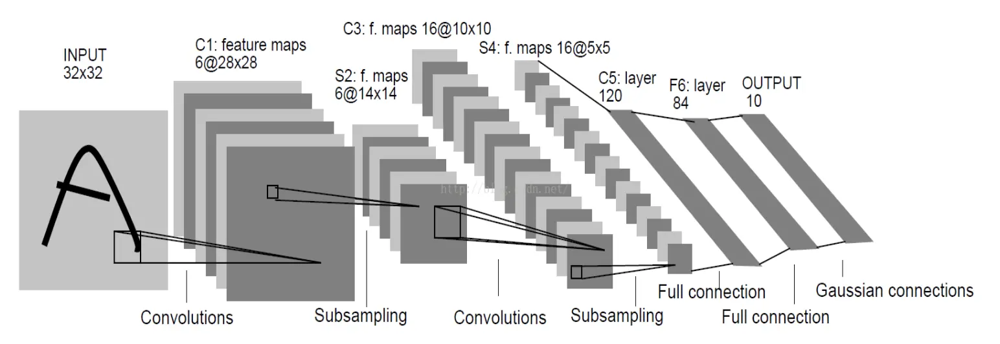
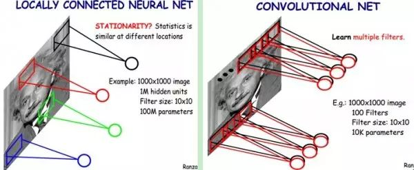
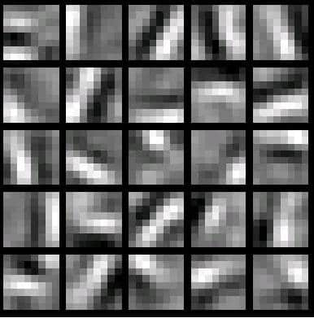

CNN

## 1 卷积神经网络 CNN 原理

卷积神经网络(Convolutional Neural Networks, CNNs)是一种深度学习算法，特别适用于图像处理和分析，适合用于图像特殊提取和分类。

CNN 由若干层不同类型的网络连接构成，如下图

输入图像首先经过一次卷积处理，得到卷积层 C1；然后经过一次下采样（池化）处理得到下采样层 S2；之后经过一次卷积处理得到卷积层 C3；C3 经过下采样处理得到下采样层 S4；最后经过全连接处理得到全连接层 C5。至此卷积处理结束，通过卷积处理提取到的特征信息输入到传统的全链接神经网络进行后续处理。

### 1.1 输入层（Input Layer）

网络的输入层，负责接受原始图像数据。

### 1.2 卷积层（Convilutional Layer）

在卷积层中，一组可学习的滤波器（卷积核）在输入数据上滑动，以生成特征图（Feature Maps）。卷积操作允许网络学习到输入数据的局部特征。此外，**由于滤波器的权重在图像的不同部分是共享的，卷积层可以显著减少模型的参数数量，从而减轻过拟合的风险**。

权重共享？卷积层通过卷积的方式提取特征，由于输入图像各个位置使用的卷积核相同，即**提取特征的方式与位置无关**，也就是图像在每一处统计特征的方式都完全相同。这意味着在图像某一处学习的特征，在图像的其他位置也可以使用。换言之，对于输入图像的所有位置，都可以使用相同的学习特征。

卷积层的运算过程如下图，用一个卷积核扫完整张图片：

卷积的过程可以看做是使用一个过滤器（卷积核）过滤输入图像的各个区域，并从这些区域中提取特征。

在实际使用中，往往有很多个卷积核。一般认为，每个卷积核代表了一种图像模式，如果某个图像块与此卷积核卷积出的值大，则认为此图像块十分接近于此卷积核所能识别的特征。

如果我们设计了6个卷积核，可以理解为我们认为是这个图像上有 6 种深层次的特征模式，我们使用 6 种基础的特征模式来处理输入图像。

如下图，是一个 25 种不同的卷积核的示例：

### 1.3 ReLU 层（Rectified Linear Unit Layer）

ReLU 层，非线性操作层，通常跟在卷积层之后，其作用是通过非线性函数来增加网络的非线性特征。

### 1.4 池化层（Pooling Layer）

池化层， 也称作下采样层，其主要功能是降低特征图的空间尺寸，从而降低模型的计算复杂性，并在一定程度上提供模型的平移不变性。

常见的池化操作有最大池化(Max Pooling)和平均池化(Average Pooling)。

当图像太大时，池化层部分将减少参数的数量。空间池化也称为下采样，可在保留重要信息的同时降低数据维度，常见的池化操作有最大池化(Max Pooling)和平均池化(Average Pooling)，以及加和池化(Sum Pooling)。

最常见的是最大值池化，其将输入的图像划分为若干个矩形区域，对每个子区域输出该区域的最大值。这种机制能够有效的原因在于：在发现一个特征之后，它的精确位置远不及它和其他特征的相对位置的关系重要。**池化层会不断地减小数据的空间大小，能够在一定程度上控制过拟合**。通常来说，CNN 的卷积层之间都会周期性地插入池化层。

### 1.5 全连接层（Fully Connected Layer）

在一系列的卷积层和池化层之后，全连接层被用于**对之前提取的特征进行高级别的推理**。在这一层中，**所有的输入都被连接到每个神经元**，这与传统的神经网络类似。这个部分就是最后一步了，经过卷积层和池化层处理过的数据输入到全连接层，得到最终想要的结果。经过卷积层和池化层降维过的数据，全连接层才能**跑得动**，不然数据量太大，计算成本高，效率低下。

### 1.6 输出层（Output Layer）

输出层通常使用`softmax`激活函数进行**多类分类**，或使用`sigmoid`激活函数进行**二分类**。

## 2 反向传播算法（Backpropagation）

### 2.1 DNN 的反向传播算法

在 DNN 中，首先就算出输出层的 $
\delta^L$：

$$\delta^L = \frac{\partial J(W,b)}{\partial z^L} = \frac{\partial J(W,b)}{\partial a^L}\odot \sigma^{'}(z^L)
$$

利用数学归纳法，使用 $\delta^{l+1}$ 的值逐步向前计算出第 $l$ 层的 $\delta^l$，计算表达式：

$$
\delta^{l} = (\frac{\partial z^{l+1}}{\partial z^{l}})^T\delta^{l+1} = (W^{l+1})^T\delta^{l+1}\odot \sigma^{'}(z^l)
$$

有了 $\delta^l$ 的表达式，从而可以求出 $W,b$ 的梯度表达式：

$$
\frac{\partial J(W,b)}{\partial W^l} = \delta^{l}(a^{l-1})^T
$$

$$
\frac{\partial J(W,b,x,y)}{\partial b^l} = = \delta^{l}
$$

有了 $W,b$ 梯度表达式，就可以用梯度下降法来优化 $W,b$, 求出最终的所有 $W,b$ 的值。

在 CNN 中，存在一些不同的地方，不可以直接使用 DNN 的反向传播算法公式。

### 2.2 CNN 的反向传播算法

相比于 DNN 的反向传播算法，想要借用 DNN 的计算方法，需要考虑：

1) 池化层没有激活函数。可以考虑假定池化层的激活函数为 $\sigma(z) = z$，即激活后还是本身，此时池化层的激活函数的导数恒为 1；
2) 池化层在前向传播的时候，会对输入尺寸进行压缩。在反向传播的时候，需要向前反向推导 $\delta^{l-1}$，这个推导方法和DNN不同；
3) 卷积层通过张量卷积，即若干个矩阵卷积求和得到当前层的输出，这个 DNN 不同。DNN 的全连接层是直接进行矩阵乘法得到当前层的输出。因此，卷积层反向传播的时候，上一层的 $\delta^{l-1}$ 递推计算方法会有所不同；
4) 对于卷积层，由于 $W$ 使用的运算是卷积，那么从 $\delta^l$ 推导出该层的所有卷积核的 $W,b$ 的方式也不同。

另外，在 DNN 中，$a_l,z_l$ 都只是一个向量，而 CNN 中的 $a_l,z_l$ 都是是三维的张量，即由若干个输入的子矩阵组成。

最后，需要注意的是，由于卷积层可以有多个卷积核，各个卷积核的处理方法是完全相同且独立的，为了简化算法公式的复杂度，下面提到的卷积核都是卷积层中若干卷积核中的一个。

#### 2.2.1 已知池化层的 $\delta^l$，推导上一隐藏层的 $\delta^{l-1}$

上面提到的四个问题，第一个问题很好解决，这里先解决第二个问题，在一直池化层的 $\delta^l$ 的时候，推导上一隐藏层的 $\delta^{l-1}$。

在前向传播阶段，池化层一般使用 max_pooling 或者 average_pooling，对输入进行下采样，且池化的窗口尺寸已知。现在需要反过来，从缩小后的误差 $\delta^l$，反推前一次较大区域的误差。

在反向传播的阶段：

    * 首先把 $\delta^l$ 的所有子矩阵矩阵大小还原成池化之前的大小；
    * 然后如果是 max_pooling，则把 $\delta^l$ 的所有子矩阵的各个池化窗口的值放在之前做前向传播算法得到最大值的位置；如果是Average_pooling，则把 $\delta^l$ 的所有子矩阵的各个池化窗口的值取平均后放在还原后的子矩阵位置。这个过程一般叫做upsample。

例如，假设池化的窗口尺寸是 `2x2`，且 stride = 2，$\delta^l$ 的第 $k$ 个子矩阵为：

$$
\delta_k^l = \left( \begin{array}{ccc}
    2& 8 \\
    4& 6
\end{array} \right)
$$

那么 $\delta_k^l$ 还原后变成：

$$
\left( \begin{array}{ccc}
    0&0&0&0 \\
    0&2& 8&0 \\
    0&4&6&0 \\
    0&0&0&0
\end{array} \right)
$$

如果是 max_pooling，假设之前在前向传播时记录的最大值位置分别是左上，右下，右上，左下，则转换后的矩阵为：

$$
\left( \begin{array}{ccc}
    2&0&0&0 \\
    0&0& 0&8 \\
    0&4&0&0 \\
    0&0&6&0
\end{array} \right)
$$

如果是Average_pooling，则进行平均，那么转换后的矩阵为：
$$
\left( \begin{array}{ccc}
    0.5&0.5&2&2 \\
    0.5&0.5&2&2 \\
    1&1&1.5&1.5 \\
    1&1&1.5&1.5
\end{array} \right)
$$

这样我们就得到了上一层 $\frac{\partial J (W, b)}{\partial a_k ^{l-1}}$ 的值，那么得到 $\delta_k^{l-1}$：

$$
\delta_k^{l-1} = (\frac{\partial a_k^{l-1}}{\partial z_k^{l-1}})^T\frac{\partial J(W,b)}{\partial a_k^{l-1}} = upsample(\delta_k^l) \odot \sigma^{'}(z_k^{l-1})
$$

其中，upsample 函数完成了池化误差矩阵放大与误差重新分配的逻辑。

$\rightarrow$ 对于张量 $\delta^{l-1}$，有：

$$
\delta^{l-1} = upsample(\delta^l) \odot \sigma^{'}(z^{l-1})
$$

#### 2.2.2 已知卷积层的 $\delta^l$，推导上一隐藏层的 $\delta^{l-1}$

对于卷积层的反向传播，首先考虑卷积层的前向传播公式：

$$
a^l= \sigma(z^l) = \sigma(a^{l-1}*W^l +b^l)
$$

在 DNN 中，$\delta^{l-1}$ 和 $\delta^{l}$ 的递推关系为：

$$
\delta^{l} = \frac{\partial J(W,b)}{\partial z^l} =(\frac{\partial z^{l+1}}{\partial z^{l}})^T \frac{\partial J(W,b)}{\partial z^{l+1}} =(\frac{\partial z^{l+1}}{\partial z^{l}})^T\delta^{l+1}
$$

$\delta^{l-1}$ 和 $\delta^{l}$ 的递推关系中包含 $\frac{\partial z^{l}}{\partial z^{l-1}}$ 的梯度表达式。

注意到 $z^{l}$ 和 $z^{l-1}$ 的关系为：

$$
z^l = a^{l-1}*W^l +b^l =\sigma(z^{l-1})*W^l +b^l
$$

因此有：

$$
\delta^{l-1} = (\frac{\partial z^{l}}{\partial z^{l-1}})^T\delta^{l} = \delta^{l} * rot180(W^{l}) \odot \sigma^{'}(z^{l-1})
$$

这里的式子和DNN的类似，区别在于对于对含有卷积的式子求导时，卷积核被旋转了180度，即式子中的 $rot180()$。**翻转 180 度的含义是上下翻转一次，接着左右翻转一次**。

在 DNN 中这里是矩阵转置。由于这里都是张量，直接推演参数太多。以一个简单的例子说明为什么这里求导后卷积核要翻转。

假设 $l-1$ 层的输出 $a^{l-1}$ 是一个`3x3`矩阵，第 $l$ 层的卷积核 $W^l$ 是一个`2x2`矩阵，采用 1 像素的步幅(stride=1，且不加 pad)，则输出 $z^{l}$ 是一个 2x2 的矩阵（stride=1，Kernel=2，pad=0）。简化 $b^l$ 都是 0, 则有:

$$
a^{l-1}*W^l = z^{l}
$$

列出 $a,W,z$ 的矩阵表达式如下：

$$
\left( \begin{array}{ccc}
    a_{11}&a_{12}&a_{13} \\
    a_{21}&a_{22}&a_{23}\\
    a_{31}&a_{32}&a_{33}
\end{array} \right) * \left( \begin{array}{ccc}
    w_{11}&w_{12}\\
    w_{21}&w_{22}
\end{array} \right) = \left( \begin{array}{ccc}
    z_{11}&z_{12}\\
    z_{21}&z_{22}
\end{array} \right)
$$

利用卷积的定义，很容易得出：

$$
z_{11} = a_{11}w_{11} + a_{12}w_{12} + a_{21}w_{21} + a_{22}w_{22}
$$

$$
z_{12} = a_{12}w_{11} + a_{13}w_{12} + a_{22}w_{21} + a_{23}w_{22}
$$

$$
z_{21} = a_{21}w_{11} + a_{22}w_{12} + a_{31}w_{21} + a_{32}w_{22}
$$

$$z_{22} = a_{22}w_{11} + a_{23}w_{12} + a_{32}w_{21} + a_{33}w_{22}
$$

接着模拟反向求导：

$$
\nabla a^{l-1} = \frac{\partial J(W,b)}{\partial a^{l-1}} = ( \frac{\partial z^{l}}{\partial a^{l-1}})^T\frac{\partial J(W,b)}{\partial z^{l}} =(\frac{\partial z^{l}}{\partial a^{l-1}})^T \delta^{l}
$$

从上式可以看出，对于 $a^{l-1}$ 的梯度误差 $\nabla a^{l-1}$，等于第 $l$ 层的梯度误差乘以 $\frac{\partial z^{l}}{\partial a^{l-1}}$，而 $\frac{\partial z^{l}}{\partial a^{l-1}}$ 对应上面的例子中相关联的 $w$ 的值。

假设 $z$ 矩阵对应的反向传播误差是 $\delta_{11}, \delta_{12}, \delta_{21}, \delta_{22}$ 组成的`2x2`矩阵，则利用上面梯度的式子和 4 个等式，可以分别写出 $\nabla a^{l-1}$ 的9个标量的梯度。

对于 $a_{11}$ 的梯度，由于在 4 个等式中 $a_{11}$ 只和 $z_{11}$ 有乘积关系，从而有：

$$
\nabla a_{11} = \delta_{11}w_{11}
$$

对于 $a_{12}$ 的梯度，由于在 4 个等式中 $a_{12}$ 和 $z_{12}，z_{11}$ 有乘积关系，从而有：

$$
\nabla a_{12} = \delta_{11}w_{12} + \delta_{12}w_{11}
$$

同理可得：

$$
\nabla a_{13} = \delta_{12}w_{12}
$$

$$
\nabla a_{21} = \delta_{11}w_{21} + \delta_{21}w_{11}
$$

$$
\nabla a_{22} = \delta_{11}w_{22} + \delta_{12}w_{21} + \delta_{21}w_{12} + \delta_{22}w_{11}
$$

$$
\nabla a_{23} = \delta_{12}w_{22} + \delta_{22}w_{12}
$$

$$\nabla a_{31} = \delta_{21}w_{21}
$$

$$\nabla a_{32} = \delta_{21}w_{22} + \delta_{22}w_{21}
$$

$$
\nabla a_{33} = \delta_{22}w_{22}
$$

上面 9 个式子可以用一个矩阵卷积的形式表示，即：

$$
\left( \begin{array}{ccc}
    0&0&0&0 \\
    0&\delta_{11}& \delta_{12}&0 \\
    0&\delta_{21}&\delta_{22}&0 \\
    0&0&0&0
\end{array} \right) * \left( \begin{array}{ccc}
    w_{22}&w_{21}\\
    w_{12}&w_{11}
\end{array} \right) = \left( \begin{array}{ccc}
    \nabla a_{11}&\nabla a_{12}&\nabla a_{13} \\
    \nabla a_{21}&\nabla a_{22}&\nabla a_{23}\\
    \nabla a_{31}&\nabla a_{32}&\nabla a_{33}
\end{array} \right)
$$

为了符合梯度计算，在误差矩阵周围填充了一圈 0，此时将卷积核翻转后和反向传播的梯度误差进行卷积，就得到了前一次的梯度误差。

#### 2.2.3 已知卷积层的 $\delta^l$，推导该层的 $W,b$ 的梯度

对于全连接层，可以按 DNN 的反向传播算法求该层 $W,b$ 的梯度，而池化层没有 $W,b$,不用求 $W,b$ 的梯度。只有卷积层的 $W,b$ 需要求出。

意到卷积层 $z$ 和 $W,b$ 的关系为：

$$
z^l = a^{l-1}*W^l +b
$$

因此有：

$$
\frac{\partial J(W,b)}{\partial W^{l}}=a^{l-1} *\delta^l
$$

注意到此时卷积核没有反转，主要是此时是层内的求导，而不是反向传播到上一层的求导:

一个简化的例子，这里输入是矩阵，那么对于第 $l$ 层，某个个卷积核矩阵 $W$ 的导数可以表示如下：

$$
\frac{\partial J(W,b)}{\partial W_{pq}^{l}} = \sum\limits_i\sum\limits_j(\delta_{ij}^la_{i+p-1,j+q-1}^{l-1})
$$

假设输入 $a$ 是`4x4`的矩阵，卷积核 $W$ 是`3x3`的矩阵，输出 $z$ 是`2x2`的矩阵,那么反向传播的 $z$ 的梯度误差 $\delta$ 也是`2x2`的矩阵。

那么根据上面的式子，有：

$$
\frac{\partial J(W,b)}{\partial W_{11}^{l}} = a_{11}\delta_{11} + a_{12}\delta_{12} + a_{21}\delta_{21} + a_{22}\delta_{22}
$$

$$
\frac{\partial J(W,b)}{\partial W_{12}^{l}} = a_{12}\delta_{11} + a_{13}\delta_{12} + a_{22}\delta_{21} + a_{23}\delta_{22}
$$

$$
\frac{\partial J(W,b)}{\partial W_{13}^{l}} = a_{13}\delta_{11} + a_{14}\delta_{12} + a_{23}\delta_{21} + a_{24}\delta_{22}
$$

$$
\frac{\partial J(W,b)}{\partial W_{21}^{l}} = a_{21}\delta_{11} + a_{22}\delta_{12} + a_{31}\delta_{21} + a_{32}\delta_{22}
$$

最终可以整理出这样的九个式子，整理成矩阵形式后可得：

$$
\frac{\partial J(W,b)}{\partial W^{l}} =\left( \begin{array}{ccc} a_{11}&a_{12}&a_{13}&a_{14} \\ a_{21}&a_{22}&a_{23}&a_{24} \\ a_{31}&a_{32}&a_{33}&a_{34} \\
a_{41}&a_{42}&a_{43}&a_{44} \end{array} \right) * \left( \begin{array}{ccc}
\delta_{11}& \delta_{12} \\ \delta_{21}&\delta_{22} \end{array} \right)
$$

对于 $b$，有些特殊，因为 $\delta^l$ 是高维张量，而 $b$ 是一个向量，不能像 DNN 那样直接和 $\delta^l$ 相等。通常的做法是将 $\delta^l$ 的各个子矩阵的项分别求和，得到一个误差向量，即为 $b$ 的梯度：

$$
\frac{\partial J(W,b)}{\partial b^{l}} = \sum\limits_{u,v}(\delta^l)_{u,v}
$$

