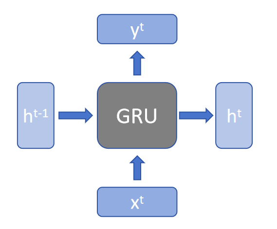
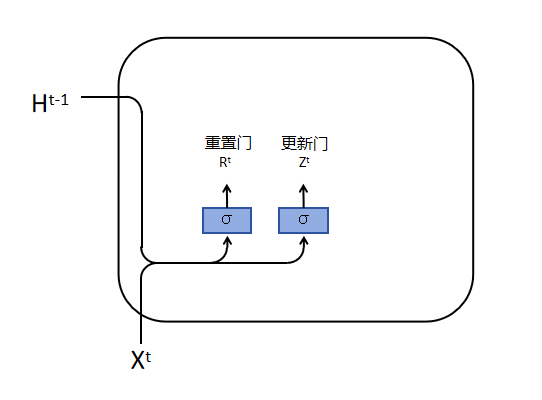
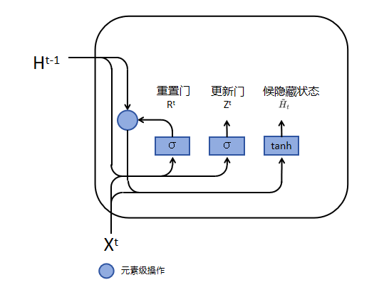
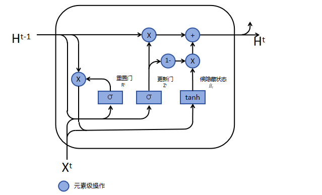

GRU

## 1 GRU——门控循环单元

传统的循环神经网络（RNN）在处理长序列数据时常常遇到梯度消失或梯度爆炸的问题，这限制了它们捕捉长期依赖关系的能力。为了解决这些问题，长短期记忆网络（LSTM）被提出，它通过引入门控机制来控制信息的流动，从而有效缓解了梯度消失问题。

GRU模型则是在LSTM的基础上进一步简化和发展的，它由Cho等人在2014年提出，旨在简化LSTM的结构，同时保持类似的性能。

GRU通过合并LSTM中的遗忘门和输入门为更新门，并引入重置门，同时合并单元状态和隐藏状态，使得模型更为简洁，训练速度更快。这种结构上的简化并没有牺牲性能，GRU在很多任务中的表现与LSTM相当，甚至在某些情况下更优。因此，GRU因其高效和简洁的特性，在自然语言处理、语音识别、时间序列预测等多个领域得到了广泛的应用。


### 1.1 GRU 模型结构

模型结构图可以化简成下图所示：



* **$h^{t-1}$**：前一个时间步的隐藏状态（hidden state）。在GRU中，这个隐藏状态会通过更新门、重置门和候选隐藏状态的计算来更新。

* **$h^t$**：在当前时间步`t`的隐藏状态。是由GRU单元根据当前输入和前一时间步的隐藏状态计算得到的。

* **$x^t$**：当前时间步的输入。在GRU中，每个时间步的输入会被用来计算当前时间步的候选隐藏状态和更新门、重置门。

* **$y^t$**：当前时间步的输出，是模型根据当前输入和前一时间步的隐藏状态计算得到的结果。


### 1.2 GRU 的内部结构



如上图所示，GRU定义了两个门：R（重置门）和 Z（更新门），可以把他简单的理解为与隐藏状态相关的向量，计算方式如下：

$$
R^t = \sigma(X^t W^{xr} + H^{t-1} W^{hr} + b^r) \\
Z^t = \sigma(X^t W^{xz} + H^{t-1} W^{hz} + b^z)
$$

其中， $\sigma$ 为激活函数。


* 重置门（Reset Gate）：

    * 重置门是决定网络是否保留或忽略前一个时间步的隐藏状态信息。它通过控制信息的流动来帮助网络忘记不再重要的信息。
    * 重置门的输出是一个介于0和1之间的值，这个值乘以前一个时间步的隐藏状态。如果重置门的输出接近0，那么前一个时间步的隐藏状态将被忽略；如果输出接近1，则保留前一个时间步的隐藏状态。

* 更新门（Update Gate）:

    * 更新门的主要作用是决定网络是否更新当前时间步的隐藏状态。它控制新信息的加入和旧信息的保留，帮助网络决定哪些信息应该被保留，哪些应该被更新。
    * 更新门的输出也是一个介于0和1之间的值，这个值决定了前一个时间步的隐藏状态有多少应该被保留，以及新信息有多少应该被加入到当前的隐藏状态中。




如图，重置门产生的值 $R^t$ ，经过公式：

$$
\tilde{H}^{t}=\tanh\left(X^{t} W^{x h}+\left(R^{t}\odot H^{t-1}\right) W^{h h}+b^{h}\right)
$$

得到候选隐藏状态 $\tilde{H}^{t}$ 。

候选隐藏状态并不是最终的隐藏状态，而是用于生成真正隐藏状态的一个参数。

如果我们忽略 $R^t$ （即假设 $R^t$ 全部为1），那么这个公式就简化为 RNN 中计算隐藏状态的公式。

在这个公式中， $R^t$ 是一个与 $H^{t-1}$ 长度相同的向量。在 $R^t$ 和 $H^{t-1}$ 进行逐元素相乘的过程中， $R^t$ 的值介于0到1之间。如果  $R^t$ 中的值接近0，那么与 $H^{t-1}$ 对应元素相乘的结果也会接近0，这意味着几乎完全忽略前面的信息，当前时间步的候选隐藏状态主要来自 $X^t$ 。相反，如果 $R^t$ 中的值接近1，那么意味着不选择遗忘前一时间步的隐藏状态，当前时间步的候选隐藏状态将同时来源于 $X^t$ 和 $H^{t-1}$ 。

在实际中， $R^t$ 是一个可学习参数，它会根据前面的信息去学习哪些该去遗忘，哪些需要遗留。


真正的隐藏状态：



如图所示，真正的隐藏状态 $H^t$ 是**由候选隐藏状态、更新门和前一时间步隐藏状态所决定的**。具体公式如下：

$$
H^{t} = Z^{t} \odot H^{t-1} + (1 - Z^{t}) \odot \tilde{H}^{t}
$$

与 $R^t$ 类似， $Z^t$ 也是一个介于0到1之间的控制单元。同样的，倘若 $Z_t$ 都等于1， $H^t$ 就直接等于 $H^{t-1}$ ，也就是不使用 $X^t$ 来更新当前的隐藏状态；倘若 $Z_t$ 都等于0， $H^t$ 主要是由 $X^t$ 进行更新，但并不意味着不通过前一时间步的隐藏状态更新，因为 $\tilde{H}^{t}$ 的公式中含有 $H^{t-1}$ 。


GRU引入两个额外的门（重置门R 和更新门Z），这两个门都是输入0到1之间值的控制单元。重置门是在计算候选隐藏状态时控制前一时间步隐藏状态信息的多少，而更新门是在计算真正隐藏状态时控制当前时间步输入X信息的多少。

极端状态：

* Z 里面全为 0、R 里面全为 1 时，就会回到 RNN 的结构；
* Z 里面全为 0、R 里面全为 0 时， $H^t$ 就只会看到 $X^t$ 的信息；
* Z 里面全为 1 时， $H^t$ 就只会看到 $H^{t-1}$ 的信息，而忽略 $X^t$ 的信息。


### 1.3 GRU 与 LSTM 的对比

GRU 在 LSTM 的基础上主要做出了两点改变：

* 门的数量减少了：在LSTM中，有三个门来控制信息的流动：一个决定哪些信息应该被遗忘（遗忘门），一个决定哪些新信息应该被添加（输入门），还有一个决定哪些信息应该输出（输出门）。GRU简化了这个过程，它**把遗忘门和输入门合并成了一个叫做更新门的东西**。更新门的作用是决定我们应该保留多少旧信息以及添加多少新信息。


* 记忆单元的处理方式变了：在LSTM中，有一个特殊的部分叫做记忆单元，它负责长期存储信息。LSTM通过一系列复杂的门控机制来更新这个记忆单元。GRU没有专门的记忆单元，它**直接在隐藏状态中处理信息**。GRU使用另一个门，叫做重置门，来决定我们应该忽略多少旧信息，以便为新信息腾出空间。

GRU 是一个更简洁的 LSTM，通过减少门的数量和简化信息处理的方式来尝试做到和 LSTM 一样的事情，用更少的计算资源。这样，GRU在某些情况下可以更快地学习，并且可能更容易训练。不过，这也意味着在需要处理非常长的依赖关系时，GRU 可能不如 LSTM 那么强大。


## 2  GRU 实现


GRU主要包括四个部分

* 重置门（Reset Gate）：重置门控制着上一时间步的信息在多大程度上影响当前时间步的候选隐藏状态。其计算公式为：

$$
R^t = \sigma(X^t W^{xr} + H^{t-1} W^{hr} + b^r)、
$$

* 更新门（Update Gate）：更新门决定了上一时间步的隐藏状态在当前时间步的保留程度。其计算公式为：

$$
Z^t = \sigma(X^t W^{xz} + H^{t-1} W^{hz} + b^z)
$$

* 候选隐藏状态（Candidate Hidden State）：候选隐藏状态结合了当前输入和上一时间步的信息，计算公式为：

$$
\tilde{H}^{t}=\tanh\left(X^{t} W^{x h}+\left(R^{t}\odot H^{t-1}\right) W^{h h}+b^{h}\right)
$$

* 隐藏状态更新：最终的隐藏状态是上一时间步的隐藏状态和候选隐藏状态的加权和，计算公式为：

$$
H^{t} = Z^{t} \odot H^{t-1} + (1 - Z^{t}) \odot \tilde{H}^{t}
$$


### 2.1 自定义 GRU 层

```python
class CustomGRU_layer(nn.Module):
    def __init__(self, input_size, hidden_size):
        super(CustomGRU_layer, self).__init__()
        # 初始化参数
        self.W_xz = nn.Parameter(torch.randn(input_size, hidden_size))  # 更新门的输入到隐藏层的权重
        self.W_hz = nn.Parameter(torch.randn(hidden_size, hidden_size))  # 更新门的隐藏层到隐藏层的权重

        self.W_xr = nn.Parameter(torch.randn(input_size, hidden_size))  # 重置门的输入到隐藏层的权重
        self.W_hr = nn.Parameter(torch.randn(hidden_size, hidden_size))  # 重置门的隐藏层到隐藏层的权重

        self.W_xh = nn.Parameter(torch.randn(input_size, hidden_size))  # 候选隐藏状态的输入到隐藏层的权重
        self.W_hh = nn.Parameter(torch.randn(hidden_size, hidden_size))  # 候选隐藏状态的隐藏层到隐藏层的权重

        self.hb_z = nn.Parameter(torch.zeros(hidden_size))  # 更新门的偏置
        self.hb_r = nn.Parameter(torch.zeros(hidden_size))  # 重置门的偏置
        self.hb_h = nn.Parameter(torch.zeros(hidden_size))  # 候选隐藏状态的偏置
        
        self.xb_z = nn.Parameter(torch.zeros(hidden_size))
        self.xb_r = nn.Parameter(torch.zeros(hidden_size))
        self.xb_h = nn.Parameter(torch.zeros(hidden_size))

    def forward(self, x, h):
        # 前向传播
        z = torch.sigmoid((torch.matmul(x, self.W_xz) + self.xb_z) + (torch.matmul(h, self.W_hz) + self.hb_z))  # 更新门
        r = torch.sigmoid((torch.matmul(x, self.W_xr) + self.xb_r) + (torch.matmul(h, self.W_hr) + self.hb_r))  # 重置门
        h_tilda = torch.tanh((torch.matmul(x, self.W_xh) + self.xb_h) + r * (torch.matmul(h, self.W_hh) + self.hb_h))  # 候选隐藏状态
        h = z * h + (1 - z) * h_tilda  # 更新隐藏状态
        return h
```


### 2.2 自定义 GRU 模型

```python
class CustomGRU(nn.Module):
    def __init__(self, input_size, hidden_size):
        super(CustomGRU, self).__init__()
        self.input_size = input_size  # 输入特征的维度
        self.hidden_size = hidden_size  # 隐藏层的维度

        # 初始化自定义的GRU层
        self.gru = CustomGRU_layer(self.input_size, self.hidden_size)

    def forward(self, X, h0 = None):
        # x.shape = (seq_length, batch_size, input_size)
        # h0.shape = (1, batch_size, hidden_size)
        # output.shape = (seq_length, batch_size, hidden_size)

        # 获取批次大小
        batch_size = X.shape[1]
        # 获取序列长度
        self.seq_length = X.shape[0]

        # 如果没有提供初始隐藏状态，则初始化为零张量
        if h0 is None:
            prev_h = torch.zeros([batch_size, self.hidden_size]).to(device)
        else:
            prev_h = torch.squeeze(h0, 0)

        # 初始化输出张量
        output = torch.zeros([self.seq_length, batch_size, self.hidden_size]).to(device)

        # 循环处理序列中的每个时间步
        for i in range(self.seq_length):
            # 通过GRU层处理当前时间步的数据，并更新隐藏状态
            prev_h = self.gru(X[i], prev_h)
            # 将当前时间步的输出存储在输出张量中
            output[i] = prev_h

        # 返回最终的输出和隐藏状态
        return output, torch.unsqueeze(prev_h, 0)
```


### 2.3 对比自定义的 GRU 和 torch 的 GRU

```python
# 将nn.GRU中的4个随机初始化的可学习参数进行保存，并用来替换CustomGRU中CustomGRU_layer随机初始化的可学习参数，并通过torch.allclose判断输出是否相等，若相等则证明MyGRU的实现与官方的nn.GRU是一致的

# 初始化nn.GRU
gru = nn.GRU(input_size=input_size, hidden_size=hidden_size).to(device)
weight_ih_l0 = gru.weight_ih_l0.T
weight_hh_l0 = gru.weight_hh_l0.T
bias_ih_l0 = gru.bias_ih_l0
bias_hh_l0 = gru.bias_hh_l0

# 初始化CustomGRU
custom_gru = CustomGRU(input_size=input_size, hidden_size=hidden_size).to(device)

# 替换CustomGRU中的参数
custom_gru.gru.W_xr = nn.Parameter(weight_ih_l0[:, :custom_gru.gru.W_xr.size(1)])  # 更新门的输入权重
custom_gru.gru.W_hr = nn.Parameter(weight_hh_l0[:, :custom_gru.gru.W_hr.size(1)])  # 更新门的隐藏权重

custom_gru.gru.W_xz = nn.Parameter(weight_ih_l0[:, custom_gru.gru.W_xr.size(1):custom_gru.gru.W_xr.size(1) + custom_gru.gru.W_xz.size(1)])  # 重置门的输入权重
custom_gru.gru.W_hz = nn.Parameter(weight_hh_l0[:, custom_gru.gru.W_hr.size(1):custom_gru.gru.W_hr.size(1) + custom_gru.gru.W_hz.size(1)])  # 重置门的隐藏权重

custom_gru.gru.W_xh = nn.Parameter(weight_ih_l0[:, custom_gru.gru.W_xr.size(1) + custom_gru.gru.W_xz.size(1):])  # 候选隐藏状态的输入权重
custom_gru.gru.W_hh = nn.Parameter(weight_hh_l0[:, custom_gru.gru.W_hr.size(1) + custom_gru.gru.W_hz.size(1):])  # 候选隐藏状态的隐藏权重

custom_gru.gru.hb_r = nn.Parameter(bias_hh_l0[:custom_gru.gru.hb_r.size(0)])  # 更新门的偏置
custom_gru.gru.hb_z = nn.Parameter(bias_hh_l0[custom_gru.gru.hb_r.size(0):custom_gru.gru.hb_z.size(0) + custom_gru.gru.hb_r.size(0)])  # 重置门的偏置
custom_gru.gru.hb_h = nn.Parameter(bias_hh_l0[custom_gru.gru.hb_z.size(0) + custom_gru.gru.hb_r.size(0):])  # 候选隐藏状态的偏置

custom_gru.gru.xb_r = nn.Parameter(bias_ih_l0[:custom_gru.gru.xb_r.size(0)])
custom_gru.gru.xb_z = nn.Parameter(bias_ih_l0[custom_gru.gru.xb_r.size(0):custom_gru.gru.xb_z.size(0) + custom_gru.gru.xb_r.size(0)])
custom_gru.gru.xb_h = nn.Parameter(bias_ih_l0[custom_gru.gru.xb_z.size(0) + custom_gru.gru.xb_r.size(0):])

# 初始化输入数据
x = torch.rand(seq_length, batch_size, input_size).to(device)

# 获取CustomGRU和nn.GRU的输出
output1, h1 = custom_gru(x)
output2, h2 = gru(x)

# 使用torch.allclose比较输出是否相等
print("output1 == output2 ? {}".format(torch.allclose(output1.to('cpu'), output2.to('cpu'), atol=1e-6)))
print("h1 == h2 ? {}".format(torch.allclose(h1.to('cpu'), h2.to('cpu'), atol=1e-6)))
```

### 2.4 使用自定义 GRU 处理中文命名实体识别任务

中文命名实体识别（Chinese Named Entity Recognition，简称NER）是自然语言处理（Natural Language Processing，简称NLP）中的一个任务，它的目标是从文本中识别出具有特定意义的实体，并将它们分类为预定义的类别。这些实体通常是名词短语，可以是人名、地名、组织名、时间表达式、数量表达式、专有名词等。

中文NER中的实体类别可能包括但不限于：人名（PER） 地名（LOC） 组织名（ORG） 时间表达式（TIME） 数量表达式（QUANTITY） 专有名词（如产品名、事件名等）

一个简单的中文NER示例可能是这样的：

```bash
原文：李雷和韩梅梅计划下周去北京旅游。

识别结果：

李雷（人名） 韩梅梅（人名） 下周（时间表达式） 北京（地名） 旅游（事件）
```


#### 2.4.1 处理训练数据集


* 文本数据集读取

```python
# 读取文本文件
with open('data/msra_train_bio.txt', 'r', encoding='utf-8') as file:
    lines = file.readlines()

# 用于存储最终的实体和标签
texts = []

text = []
for line in lines:
    if line == '\n':
        texts.append(text)

        text = []
        label = []
    else:
        parts = line.split('\t')
        text.append(parts[0])

print(len(texts))
# print(texts)
```


* 数据集信息统计

```python
# 统计词频
# 展平二维列表
all_tokens = [token for sublist in texts for token in sublist]

# 统计词频
token_counts = Counter(all_tokens)

print(len(token_counts))

# 创建一个字典，将每个字符映射到一个唯一的整数
char_to_idx = {char: i + 1 for i, char in enumerate(set(''.join(all_tokens)).union({'<PAD>'}))}
```

* 定义数据集

```python
class MyDataset(Dataset):
    def __init__(self, file):
        super(MyDataset, self).__init__()
        # 读取文本文件
        with open(file, 'r', encoding='utf-8') as file:
            lines = file.readlines()

        # 用于存储最终的实体和标签
        texts = []
        labels = []

        text = []
        label = []
        for line in lines:
            if line == '\n':
                # 将每个字符转换为整数
                encoded_texts = [char_to_idx[char] if char in char_to_idx else 0 for char in text]
                texts.append(encoded_texts)
                try:
                    labels.append([label_dict[num] if num != '' else 0 for num in label])
                except:
                    pass
                text = []
                label = []
            else:
                parts = line.split('\t')
                text.append(parts[0])
                label.append(parts[-1].strip() if parts[-1].strip() == 'O' else parts[-1].strip()[2:])

        self.texts = texts
        self.labels = labels

    def __len__(self):
        return len(self.texts)

    def __getitem__(self, item):
        return self.texts[item], self.labels[item]
```

* 数据集可视化

```python

# 收集所有文本长度
lengths = [len(text) for text, label in dataset]

# 计算最大长度
max_length = max(lengths)
print("最大文本长度:", max_length)

# 绘制直方图
plt.hist(lengths, bins=100, edgecolor='black')
plt.title('文本长度分布')
plt.xlabel('文本长度')
plt.ylabel('频数')
plt.grid(True)
plt.show()
```


#### 2.4.2 模型定义

```python
# 自定义 GRU 层和自定义 GRU 模型直接使用前文的定义
# class CustomGRU_layer
# classCustomGRU


# 定义模型
class Model(nn.Module):
    def __init__(self, input_size, num_class, hidden_size=768):
        super(Model, self).__init__()
        self.embedding = nn.Embedding(input_size, hidden_size)
        self.gru = CustomGRU(input_size, hidden_size)
        # self.gru = nn.GRU(hidden_size, hidden_size)
        self.fc1 = nn.Linear(hidden_size, 256)
        self.fc2 = nn.Linear(256, num_class)
        self.relu = nn.ReLU()

    def forward(self, x):
        embed = self.embedding(x)
        x = self.relu(embed)
        out, _ = self.gru(x)
        out = self.relu(out)
        fc1 = self.fc1(out)
        fc1 = self.relu(fc1)
        out = self.fc2(fc1)
        return out


def collate_fn(data, max_length=seq_length):
    tokens = [i[0] for i in data]  # 提取所有文本
    labels = [i[1] for i in data]  # 提取所有标签
    
    # 处理文本
    new_tokens = []
    for token in tokens:
        # 截断或填充标签以匹配最大序列长度
        new_token = token[:max_length] + [input_size - 1] * (max_length - len(token[:max_length]))
        new_tokens.append(new_token)

    # 将标签列表转换为LongTensor
    tokens_tensor = torch.LongTensor(new_tokens)

    # 处理标签
    new_labels = []
    for label in labels:
        # 截断或填充标签以匹配最大序列长度
        new_label = label[:max_length] + [num_class - 1] * (max_length - len(label[:max_length]))
        new_labels.append(new_label)

    # 将标签列表转换为LongTensor
    labels_tensor = torch.LongTensor(new_labels)

    return tokens_tensor, labels_tensor

def get_correct_and_total_count(labels, outs):
    outs = outs.argmax(dim=2)                   # 获取概率最高的类别作为预测结果
    correct = (outs == labels).sum().item()     # 计算总的正确预测数量
    total = labels.size(0) * labels.size(1)     # 计算总的标签数量

    # 计算除了补充元素以外的正确率
    select = labels != num_class - 1                  # 选择非补充的标签

    labels_non_supplementary = labels[select]                     # 选择非补充的真实标签
    outs_non_supplementary = outs[select]                         # 选择非补充的预测结果

    # 计算F1分数
    # F1分数是衡量分类模型精确度的一种指标，它是精确率和召回率的调和平均数，用于在模型的精确性和完整性之间取得平衡。
    f1 = f1_score(labels_non_supplementary.cpu().numpy(), outs_non_supplementary.cpu().numpy(), average='macro')

    # 由于labels和outs在过滤后可能不再是二维的，需要调整它们的形状
    labels_non_supplementary = labels_non_supplementary.view(-1)  # 展平为一维
    outs_non_supplementary = outs_non_supplementary.view(-1)  # 展平为一维
    correct_content = (outs_non_supplementary == labels_non_supplementary).sum().item()      # 计算非补充部分的正确预测数量
    total_content = len(labels_non_supplementary)                 # 计算非补充部分的标签数量

    return correct, total, correct_content, total_content, f1
```


#### 2.4.3 训练

```python
def train(dataloader, model, criterion, optimizer, device, scheduler):
    size = len(dataloader.dataset)
    avg_loss = 0
    correct, total, correct_content, total_content = 0, 0, 0, 0

    model.train()
    # for batch, (inputs, labels) in enumerate(tqdm(dataloader, desc="Processing")):
    for batch, (inputs, labels) in enumerate(dataloader):
        # 将数据存到 device
        inputs, labels = inputs.to(device), labels.to(device)

        # 得到预测的结果
        outs = model(inputs)
        loss = criterion(outs.view(-1, num_class) , labels.view(-1))
        avg_loss += loss

        # 反向传播，更新模型参数
        optimizer.zero_grad()
        loss.backward()
        optimizer.step()

        counts = get_correct_and_total_count(labels, outs)

        correct += counts[0]
        total += counts[1]
        correct_content += counts[2]
        total_content += counts[3]

    # 更新学习率
    scheduler.step()

    # 当一个epoch完了后返回平均 loss
    avg_loss /= size
    avg_loss = avg_loss.detach().cpu().numpy()
    accuracy = correct / total
    accuracy_content = correct_content / total_content

    print(f"train: correct = {100 * accuracy:.3f}%, Accuracy: {(100 * accuracy_content):>0.3f}%, Avg loss: {avg_loss:>8f}, f1_score: {counts[4]:>5f}")
    return accuracy_content, avg_loss


def validate(dataloader, model, loss_fn, device):
    size = len(dataloader.dataset)

    # 将模型转为验证模式
    model.eval()

    # 初始化test_loss 和 correct， 用来统计每次的误差
    test_loss = 0
    correct, total, correct_content, total_content = 0, 0, 0, 0

    # 测试时模型参数不用更新，no_gard()
    with torch.no_grad():
        # 加载数据加载器，得到里面的X（图片数据）和y(真实标签）
        for batch, (inputs, labels) in enumerate(dataloader):
            # 将数据存到 device
            inputs, labels = inputs.to(device), labels.to(device)

            # 得到预测的结果
            outs = model(inputs)
            loss = loss_fn(outs.view(-1, num_class) , labels.view(-1))
            test_loss += loss

            counts = get_correct_and_total_count(labels, outs)

            correct += counts[0]
            total += counts[1]
            correct_content += counts[2]
            total_content += counts[3]

    test_loss /= size
    test_loss = test_loss.detach().cpu().numpy()
    accuracy = correct / total
    accuracy_content = correct_content / total_content
    print(f"valid: correct = {100 * accuracy:.3f}%, Accuracy: {(100 * accuracy_content):>0.3f}%, Avg loss: {test_loss:>8f}, f1_score: {counts[4]:>5f}")
    return accuracy_content, test_loss


def predict(tokens, model, device, max_length=seq_length):
    model = model.to(device)

    inputs = []
    for sentence in tokens:
        # 将每个字符转换为整数
        part = [char_to_idx[char] if char in char_to_idx else 0 for char in sentence]
        inputs.append(part)

    # 处理文本
    new_inputs = []
    for token in inputs:
        # 截断或填充标签以匹配最大序列长度
        new_input = token[:max_length] + [input_size - 1] * (max_length - len(token[:max_length]))

        # 将标签列表转换为LongTensor 
        new_input = torch.LongTensor (new_input)
        new_inputs.append(new_input)

    preds = []
    with torch.no_grad():
        for batch, inputs in enumerate(new_inputs):
            # 将数据存到显卡
            inputs = inputs.to(device)
            size = inputs.size(0)

            # 得到预测的结果
            outs = model(inputs)

            # 获取概率最高的类别作为预测结果
            outs = outs.argmax(dim=-1)     
            preds.append(outs)
            # preds = torch.cat(preds, dim=0)

    preds_txt = []
    for index, pred in enumerate(preds):
        pred = pred[:len(tokens[index])]

        # 创建一个从数字索引到标签名称的映射
        idx_to_label = {v: k for k, v in label_dict.items()}

        # 使用映射将数字索引转换为标签名称
        label_strings = [idx_to_label[idx.item()] for idx in pred]
        preds_txt.append(label_strings)
    return pred, preds_txt
```


* 创建数据加载器

```python
# # 给训练集和测试集分别创建一个数据集加载器
train_data = MyDataset('data/msra_train_bio.txt')
valid_data = MyDataset('data/msra_test_bio.txt')

train_dataloader = DataLoader(
    dataset=train_data,
    batch_size=batch_size,
    shuffle=True,
    collate_fn=collate_fn,
    drop_last=True
)
valid_dataloader = DataLoader(
    dataset=valid_data,
    batch_size=batch_size,
    shuffle=False,
    collate_fn=collate_fn,
    drop_last=True
)

# 输出使用设备
print(f"Using {device} device")

# 创建模型
model = Model(input_size, num_class, hidden_size)
model = model.to(device)

# 定义标签损失权重
class_weights = torch.tensor([1, 10, 10, 10, 0.01]).to(device)
loss_fn = nn.CrossEntropyLoss(weight=class_weights)

# 定义优化器
lr = 1e-5
optimizer = torch.optim.Adam(model.parameters(), lr=lr)

# 定义学习率策略（余弦退火）
# scheduler = CosineAnnealingLR(optimizer, T_max=200, eta_min=1e-10)

scheduler = StepLR(optimizer, step_size=5, gamma=0.95)

epochs = 50
loss_ = 100
save_root = "models/"
avg_loss = 0

train_accs = []
train_losses = []
val_accs = []
val_losses = []

for t in range(epochs):
    print(f"\n----------------------Training Epoch {t} ----------------------------")

    train_accuracy, avg_loss = train(train_dataloader, model, loss_fn, optimizer, device, scheduler)
    val_accuracy, val_loss = validate(valid_dataloader, model, loss_fn, device)

    train_accs.append(train_accuracy) 
    train_losses.append(avg_loss)
    val_accs.append(val_accuracy)
    val_losses.append(val_loss)

    if avg_loss < loss_:
        loss_ = avg_loss
        torch.save(model.state_dict(), save_root + "model_best.pth")

    # torch.save(model.state_dict(), save_root + "model_last.pth")
```


* 损失曲线绘制

```python
# 绘制训练损失和验证损失曲线
plt.figure(figsize=(4, 3))
plt.plot(train_losses, label='Train Loss', color='blue')
plt.plot(val_losses, label='Validation Loss', color='red')

plt.title('Training and Validation Loss')
plt.xlabel('Epoch')
plt.ylabel('Loss')
plt.legend()

# 绘制训练损失和验证正确率曲线
plt.figure(figsize=(4, 3))
plt.plot(train_accs, label='Train Accuracy', color='blue')
plt.plot(val_accs, label='Validation Accuracy', color='red')
plt.title('Training and Validation Accuracy')
plt.xlabel('Epoch')
plt.ylabel('Acc')
plt.legend()

# 显示图形
plt.show()
```


* 使用训练好的模型做推理

```python
tokens = [
    '在2024年的春天，张伟、李娜和王强三位科学家在中国科学院的资助下，前往云南的西双版纳热带植物园进行生物多样性研究。他们与当地的傣族村民合作，共同探索了这片土地上丰富的植物资源，希望能找到对抗气候变化的新方法。' ,
    '正当朱镕基当选政府总理后第一次在中外记者招待会上，回答外国记者的提问：中国农村是否实行民主选举制度的时候，一位中国电视编导正携带着她的反映中国农村民主选举村委会领导的电视纪录片《村民的选择》（北京电视台摄制，仝丽编导），出现在法国的真实电影节上。',
    '中共中央致中国致公党十一大的贺词各位代表、各位同志：在中国致公党第十一次全国代表大会隆重召开之际，中国共产党中央委员会谨向大会表示热烈的祝贺，向致公党的同志们致以亲切的问候！'
]

save_root = "models/"
model = Model(input_size, num_class, hidden_size).to(device)
model_state_dict = torch.load(save_root + "model_best.pth")
model.load_state_dict(model_state_dict)

preds, preds_txt = predict(tokens, model, device)
for idx, token in enumerate(tokens):
    for num in range(len(token)):
        print(token[num], preds_txt[idx][num])
    print('\n\n')
```
