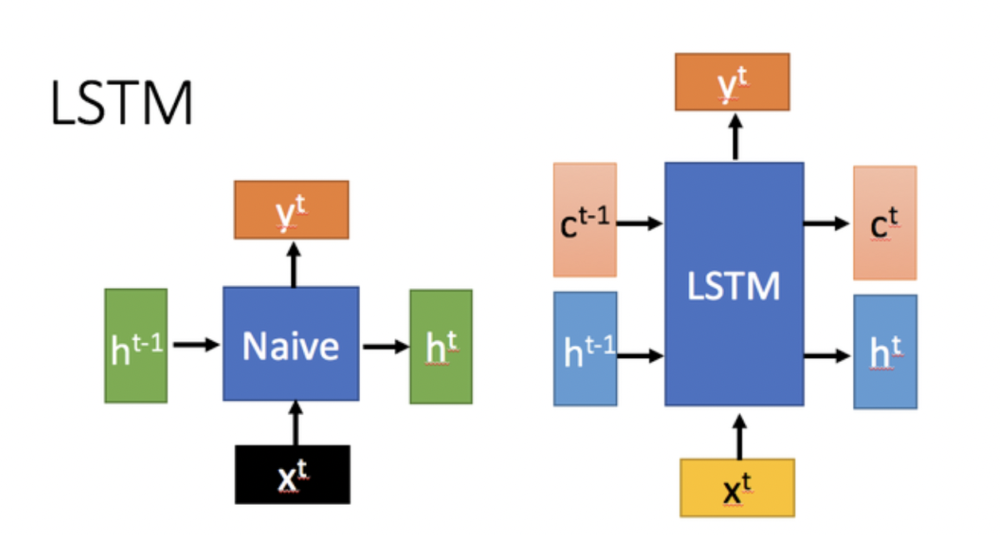
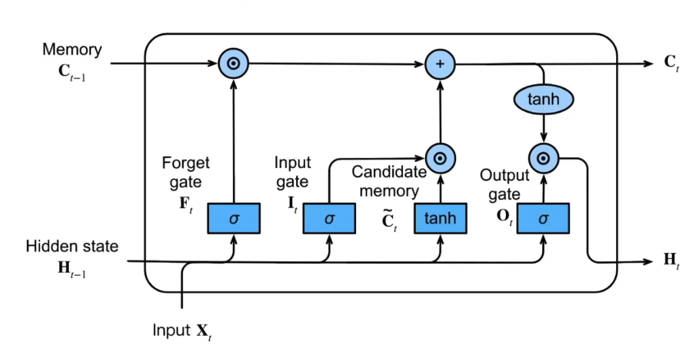

LSTM

## 1 LSTM 原理

长短期记忆网络（Long Short-Term Memory, LSTM）是一种特殊的循环神经网络（RNN），专门用于解决长序列训练中的梯度消失和梯度爆炸问题。

和普通的 RNN 相比，LSTM 引入了门控机制，在处理长序列数据时性能更好。



如上图所示，LSTM 的核心特性在于它有了两种状态：单元状态（Cell State, $C_t$）和隐藏状态（Hidden State, $H_t$）。这种双状态的设计使得 LSTM 能够在更长时间跨度内保留重要信息。单元状态负责存储长期记忆信息，可以让信息几乎无损地从早期时间步传递到后期时间步。相比之下，传统的 RNN 仅依赖单一的隐藏状态 $H_t$ 来传递信息，这在处理长时间序列时常常力不从心。

LSTM 的设计理念可以概括为：如何在当前时间步输入与先前时间步状态之间进行权衡，以更好地处理序列数据。


### 1.1 LSTM 结构

LSTM 由多个 LSTM 单元（Cell） 组成，每个单元包含三个门控机制 + 记忆单元机制 + 隐状态。

#### 1.1.1 遗忘门

**决定哪些信息需要遗忘**。将值朝零减少。

$$
F_t = \sigma(X_t W_{xf} + H_{t-1} W_{hf} + b_f)
$$

* $\sigma$ 是一个带激活函数的全连接层
* $X_t$ 是当前时间步的输入
* $H_{t-1}$ 是上一个时间步的隐藏状态
* $W_{xf}$ 是遗忘门的权重矩阵
* $b_f$ 是遗忘门的偏置向量

下面的其他的状态门的计算方程的含义与上面类似。


#### 1.1.2 输入门

**决定是不是忽略掉当前时间步的输入数据**。

$$
I_t = \sigma(X_t W_{xi} + H_{t-1} W_{hi} + b_i)
$$


#### 1.1.3 输出门

**决定是否使用当前时间步的隐状态(`hidden state`)**。

$$
O_t = \sigma(X_t W_{xo} + H_{t-1} W_{ho} + b_o)
$$


#### 1.1.4 候选记忆单元

$$
\tilde{C}\_t = \tanh(X_t W{xc} + H_{t-1} W_{hc} + b_c)
$$

这个部分的计算和 RNN 中的 `hidden state` 计算是一致的，**由当前时间步的输入与前一个时间步的隐藏状态一起计算得出，不涉及到任何门结构**。


#### 1.1.5 记忆单元

$$
C_t = F_t \odot C_{t-1} + I_t \odot \tilde {C}_t
$$

这是 LSTM 的核心结构，记忆单元的更新包括两个部分，**接入遗忘门的上一个状态的记忆，同时加上接入输入门的当前的信息**。


#### 1.1.6 隐状态

$$
H_t = O_t \odot \tanh(C_t)
$$

记忆单元的计算涉及到两项相加，它的值可能会偏大一些，这里将记忆单元通过一个 $\tanh$，将它的值放缩到`(-1, 1)`之间，然后接入到输出门上，这个输出门可以实现将隐状态重置或者保留。

下面这张图展示了所有的公式和结构:




### 1.2 LSTM 内部运行的生命周期

LSTM 内部主要有三个阶段：

#### 1.2.1 忘记阶段

在这一阶段，LSTM 会选择性地**遗忘**上一时刻传递过来的输入信息，**对输入进行筛选，决定哪些信息需要保留、哪些信息需要舍弃**。

具体来说，通过计算得到的遗忘门控信号 $F_t$，控制上一时刻的状态 $C_{t-1}$ 中哪些信息被保留，哪些被遗忘。这个过程确保模型能够过滤掉不相关的信息，从而提高其长期依赖关系的处理能力。


#### 1.2.2 选择记忆阶段

在这一阶段，LSTM 会对当前输入 $X_t$ 进行选择性**记忆**，**根据重要性来决定哪些新信息需要被添加到当前的记忆中**。输入门控信号 $I_t$ 控制这一选择性记忆的过程。LSTM 使用 $\tilde {C}_t$ 表示潜在的候选记忆，通过输入门来调节新信息的存储。最终，将忘记阶段和选择记忆阶段的结果相加，得到当前时刻的记忆单元状态 $C_t$。


#### 1.2.3 输出阶段

**输出阶段决定当前时刻哪些信息将作为输出传递给下一个单元**。LSTM 通过输出门控信号 $O_t$ 来调节输出内容。与此同时，当前时刻的记忆单元状态 $C_t$ 经过一个 $\tanh$ 激活函数进行非线性变换，以确保输出具有适当的范围。最终，隐藏状态 $H_t$ 是由输出门控信号调节的结果，并可以用于生成最终的输出 $Y_t$，从而维持与普通 RNN 类似的输出机制。


LSTM 网络通过门控机制来实现对信息的筛选与控制，在处理长时间依赖问题时表现出色。它能够选择性地记住有用的信息，遗忘不重要的内容，而不像普通 RNN 那样仅有一种记忆叠加方式。

LSTM 通过引入遗忘门、输入门、输出门和记忆单元，实现了对输入和过往状态的有效权衡。LSTM 对很多需要**长期记忆**的任务来说尤其好用。但同时也因为引入了很多内容，导致参数变多，训练难度也加大了很多。


## 2 PyTorch 内置 LSTM


### 2.1 构建网络

```python
class CustomLSTM(L.LightningModule):
    def __init__(self):
        super().__init__()
        self.lstm = nn.LSTM(input_size = 1, hidden_size = 1)

    def forward(self, input):
        input_trans = input.view(len(input), 1)

        lstm_out, tmp = self.lstm(input_trans)
        prediction = lstm_out[-1]

        return prediction

    def configure_optimizers(self):
        return Adam(self.parameters(), lr = 0.1)

    def training_step(self, batch, batch_index):
        input_i, label_i = batch
        output_i = self.forward(input_i[0])
        loss = (output_i - label_i) ** 2

        self.log("Train Loss", loss)

        if (label_i == 0):
            self.log("Out 0", output_i)
        else:
            self.log("Out 1", output_i)

        return loss
```

*注意：*

在 PyTorch 中，LSTM 的输入格式为 `(batch_size, sequence_length, input_size)`，即样本数量、时间步长、特征数量。

如果实际中的数据格式与此不同，需要手动处理成对应的格式。


PyTorch Lightning 是一个基于 PyTorch 的面向专业人工智能研究人员和机器学习工程师的深度学习框架。官方文档：https://lightning.ai/docs/pytorch/stable/


### 2.2 训练

```python
model = CustomLSTM()

trainer = L.Trainer(max_epochs=300, log_every_n_steps=2)
trainer.fit(model, train_dataloaders=dataloader)
```


## 3 手动搭建 LSTM

### 3.1 构建网路

```python
class CraftLSTM(L.LightningModule):
    def __init__(self):
        super().__init__()
        mean = torch.tensor(0.0)
        std = torch.tensor(1.0)

        # 遗忘门
        self.wlr1 = nn.Parameter(torch.normal(mean = mean, std = std), requires_grad = True)
        self.wlr2 = nn.Parameter(torch.normal(mean = mean, std = std), requires_grad = True)
        self.blr1 = nn.Parameter(torch.tensor(0.0), requires_grad = True)

        # 输入门
        self.wpr1 = nn.Parameter(torch.normal(mean = mean, std = std), requires_grad = True)
        self.wpr2 = nn.Parameter(torch.normal(mean = mean, std = std), requires_grad = True)
        self.bpr1 = nn.Parameter(torch.tensor(0.0), requires_grad = True)
        self.wp1 = nn.Parameter(torch.normal(mean = mean, std = std), requires_grad = True)
        self.wp2 = nn.Parameter(torch.normal(mean = mean, std = std), requires_grad = True)
        self.bp1 = nn.Parameter(torch.tensor(0.0), requires_grad = True)

        # 输出门
        self.wo1 = nn.Parameter(torch.normal(mean = mean, std = std), requires_grad = True)
        self.wo2 = nn.Parameter(torch.normal(mean = mean, std = std), requires_grad = True)
        self.bo1 = nn.Parameter(torch.tensor(0.0), requires_grad = True)

    def lstm_unit(self, input, long_memory, short_memory):
        # 1 遗忘门
        long_remeber_percent = torch.sigmoid((short_memory * self.wlr1) + (input * self.wlr2) + self.blr1)

        # 2 输入门
        potential_remeber_percent = torch.sigmoid((short_memory * self.wpr1) + (input * self.wpr2) + self.bpr1)
        potential_memory = torch.tanh((short_memory * self.wp1) + (input * self.wp2) + self.bp1)
        updated_long_memory = ((long_memory * long_remeber_percent) + (potential_memory * potential_remeber_percent))

        # 3 输出门
        output_percent = torch.sigmoid((short_memory * self.wo1) + (input * self.wo2) + self.bo1)
        updated_short_memory = torch.tanh(updated_long_memory) * output_percent

        # 4 输出
        return ([updated_long_memory, updated_short_memory])

    def forward(self, input):
        long_memory = 0
        short_memory = 0

        for index in input:
            long_memory, short_memory = self.lstm_unit(input[index], long_memory, short_memory)

        return short_memory

    def configure_optimizers(self):
        return Adam(self.parameters())

    def training_step(self, batch, batch_index):
        input_i, label_i = batch
        output_i = self.forward(input_i[0])
        loss = (output_i - label_i) ** 2

        self.log("Train Loss", loss)

        if (label_i == 0):
            self.log("Out 0", output_i)
        else:
            self.log("Out 1", output_i)

        return loss
```

检查网络是否正确搭建:

```python
model = CraftLSTM()

print("\nNow let's compare the observed and predicted values...")
print("Company A: Observed = 0, Predicted = ", model(torch.tensor([0., 0.5, 0.25, 1.])).detach())

print("Company B: Observed = 1, Predicted = ", model(torch.tensor([1., 0.5, 0.25, 1.])).detach())

```


### 3.2 训练


```python
inputs = torch.tensor([[0., 0.5, 0.25, 1.], [1., 0.5, 0.25, 1.]])
labels = torch.tensor([0., 1.])

dataset = TensorDataset(inputs, labels)
dataloader = DataLoader(dataset)

trainer = L.Trainer(max_epochs=2000)
trainer.fit(model, train_dataloaders=dataloader)
```


----------

Reference:

* [hack-rnns](https://github.com/datawhalechina/hack-rnns/blob/main/docs/chapter1/chapter1.ipynb)
* [LSTM 原理及其 PyTorch 实现](https://ziheng5.github.io/2024/12/13/LSTM/)
