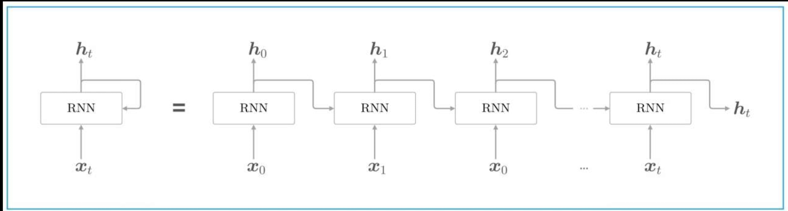
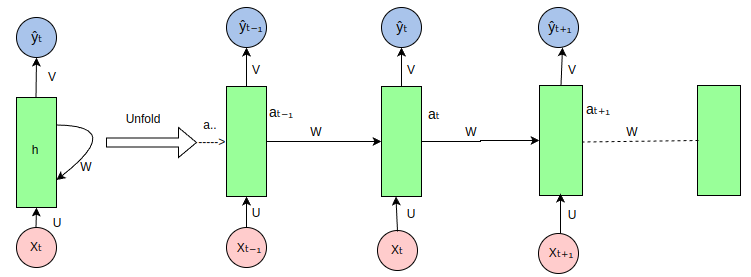

RNN

## 1 循环神经网络模型 RNN

循环神经网络（RNN）是一种神经网络类型，其神经元的输出在下一个时间步会反馈作为输入，使网络具有处理序列数据的能力。

RNN 能够处理变长序列，擅长挖掘数据中的时序信息。但是存在长期以来问题，难以处理长序列中相距较远的信息关联。RNN与普通神经网络的主要区别在于其具有记忆功能，神经元的输出能作为下一步输入，可处理序列数据，且输入和输出长度不固定。

在传统的前馈神经网络（Feedforward Neural Network）中，数据是从输入层流向输出层的，而在 RNN 中，数据不仅沿着网络层级流动，还会在每个时间步骤上传播到当前的隐层状态，从而将之前的信息传递到下一个时间步骤。

**隐状态（hidden state）**：RNN 通过隐状态来记住序列中的信息。隐状态通过上一时间步的隐状态和当前输入共同计算得到。

RNN 在自然语言处理方面，可用于语言模型来预测下一个单词的概率，还能完成机器翻译、文本生成任务；在语音识别领域，能够处理语音这种时间序列信号，提高识别准确率；在时间序列预测中，像股票价格预测、天气预测等，RNN 通过学习历史数据模式预测未来值；在视频分析中，可以处理视频帧序列，进行动作识别等操作。


RNN 网络结构图：




RNN 公式：

$$
[h_t = f (h_{t-1}W_{hh} + x_tW_{xh} + b_h)]
$$

注：

* $h_t$：当前时刻的隐状态
* $h_{t-s}$：前一时刻的隐状态
* $x_t$：当前时刻的输入
* $W_{hh}, W_{xh}$：权重矩阵
* $b$：偏置项
* $f$：激活函数，例如 tanh，ReLU

**输出（Output）**：RNN 的输出不仅依赖当前的输入，还依赖于隐状态的历史信息

公式：

$$
y_t = W_{hy} h_t + b_y
$$

* $y_t$：在时间步 t 的输出向量（可选，取决于具体任务）。
* $W_{hy}$：是隐藏状态到输出的权重矩阵


## 2 RNN 处理序列数据的过程

循环神经网络（RNN）在处理序列数据时的展开（unfold）视图如下：



RNN 是一种处理序列数据的神经网络，通过循环连接来处理序列中的每个元素，并在每个时间步传递信息，以下是图中各部分的说明：

* 输入序列`（Xt, Xt-1, Xt+1, ...）`：图中的粉色圆圈代表输入序列中的各个元素，如`Xt`表示当前时间步的输入，`Xt-1`表示前一个时间步的输入，以此类推。

* 隐藏状态`（ht, ht-1, ht+1, ...）`：绿色矩形代表 RNN 的隐藏状态，它在每个时间步存储有关序列的信息。`ht`是当前时间步的隐藏状态，`ht-1`是前一个时间步的隐藏状态。

* 权重矩阵（U, W, V）：
    * `U`：输入到隐藏状态的权重矩阵，用于将输入`Xt`转换为隐藏状态的一部分。
    * `W`：隐藏状态到隐藏状态的权重矩阵，用于将前一时间步的隐藏状态`ht-1`转换为当前时间步隐藏状态的一部分。
    * `V`：隐藏状态到输出的权重矩阵，用于将隐藏状态`ht`转换为输出`Yt`。

* 输出序列`（Yt, Yt-1, Yt+1, ...）`：蓝色圆圈代表 RNN 在每个时间步的输出，如`Yt`是当前时间步的输出。

* 循环连接：RNN 的特点是隐藏状态的循环连接，这允许网络在处理当前时间步的输入时考虑到之前时间步的信息。

* 展开（Unfold）：图中展示了 RNN 在序列上的展开过程，这有助于理解 RNN 如何在时间上处理序列数据。**在实际的 RNN 实现中，这些步骤是并行处理的**，但在概念上，我们可以将其展开来理解信息是如何流动的。

* 信息流动：信息从输入序列通过权重矩阵`U`传递到隐藏状态，然后通过权重矩阵`W`在时间步之间传递，最后通过权重矩阵`V`从隐藏状态传递到输出序列。


## 3 Pytorch 中的 RNN

在 PyTorch 中，RNN 可以用于构建复杂的序列模型。

PyTorch 提供了几种 RNN 模块，包括：

* `torch.nn.RNN`：基本的 RNN 单元。
* `torch.nn.LSTM`：长短期记忆单元，能够学习长期依赖关系。
* `torch.nn.GRU`：门控循环单元，是 LSTM 的简化版本，但通常更容易训练。

使用 RNN 类时，需要指定输入的维度、隐藏层的维度以及其他一些超参数。

使用 pytorch 的`torch.nn.RNN`来构建 RNN 网络：

```python
class SimpleRNN(nn.Module):
    def __init__(self, input_size, hidden_size, output_size):
        super(SimpleRNN, self).__init__()
        # 定义 RNN 层
        self.rnn = nn.RNN(input_size, hidden_size, batch_first=True)

        # 定义全连接层
        self.fc = nn.Linear(hidden_size, output_size)

    def forward(self, x):
        # x: (batch_size, seq_len, input_size)
        out, _ = self.rnn(x)  # out: (batch_size, seq_len, hidden_size)

        # 取序列最后一个时间步的输出作为模型的输出
        out = out[:, -1, :]  # (batch_size, hidden_size)

        out = self.fc(out)  # 全连接层
        return out
```

