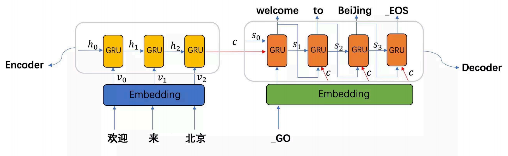
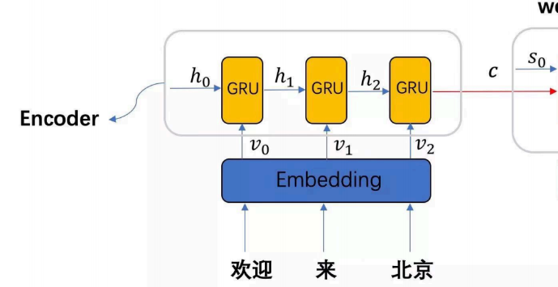
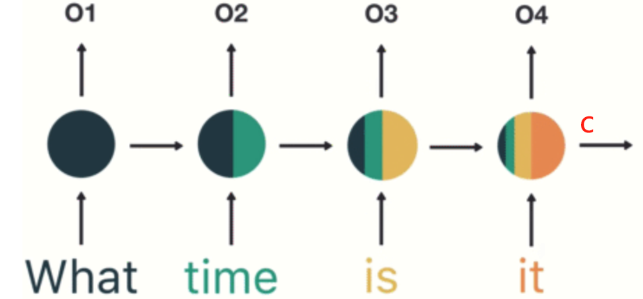
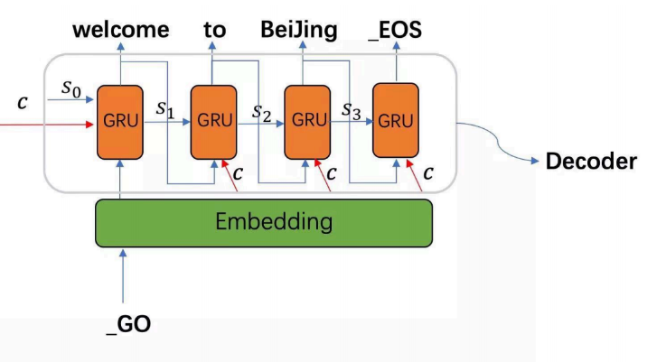
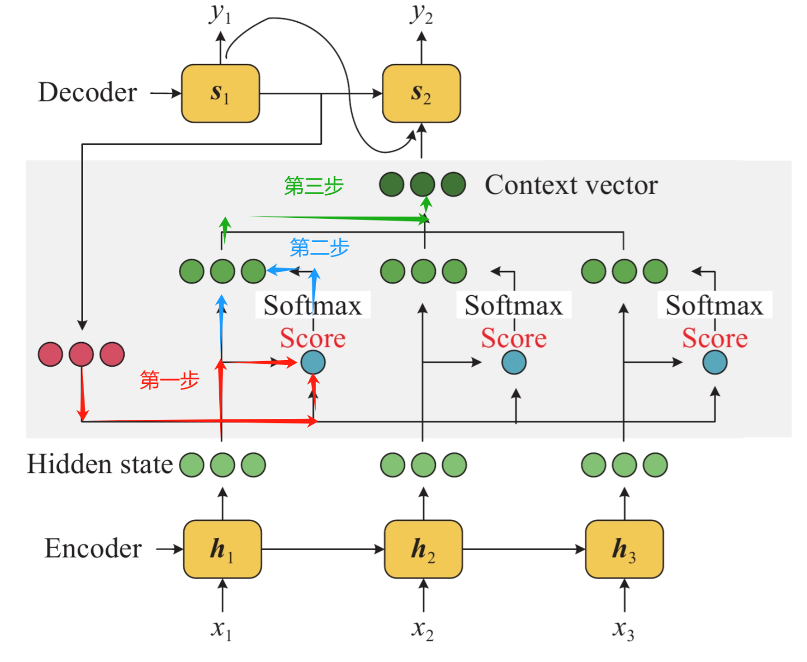

Seq2Seq

## 1 模型分类

根据输入输出的结构来对传统NLP模型进行分类，大致可以分为以下四种类别：

* 1 vs N：单输入，多输出，文本生成(给一字,生成一篇对应主题的文章), 翻译任务(翻译一个词)
* N vs 1：多输入，单输出，分类任务(给一段话,看看这段话输入什么类别)
* N vs N：多输入，多输出，用来做古诗词续写(输入窗前明月光, 让模型输出下一句)
* N vs M：多输入，多输出，长度不同， 可用于文本生成, 翻译, 聊天对话等


## 2 Seq2Seq

Seq2Seq是一种多输入多输出的模型结构，适用于许多实际应用场景，是NLP领域最经典的模型之一。在当前流行的Transformer框架中，依然能看到Seq2Seq的影子。下面是Seq2Seq的结构。



Seq2Seq由两个组件组成:

* Encode层
* Decode层


### 2.1 Encoder 编码器

编码器负责将输入序列（例如，一句话的单词序列）逐步编码成一个固定大小的向量表示。编码器通常由一系列递归神经网络（如RNN,LSTM或GRU）层组成，逐个处理输入序列的元素，并通过隐藏状态来逐步积累上下文信息。最后一个隐藏状态包含了整个输入序列的信息，作为压缩后的输入序列表示，这一向量会传递给解码器。



编码器结构，由嵌入层和循环神经网络组成。它的输入是一句话，输出为一个n维向量，用于表示该句子的语义。整个过程被称为编码，具体步骤如下：

* 对句子进行分词。
* 构建词汇表。
* 将句子中的每个词转化为对应的词汇表序号。
* 通过 Embedding 层将这些序号映射为向量。
* 将向量输入到循环神经网络中进行信息提取。
* 最后，输出一个隐藏状态编码 c，作为句子的语义表示。

假设输入句子为 `what time is it`。

* 分词：将句子分成`what`、`time`、`is`、`it`。
* 构建词汇表：假设词汇表中`what`为 1，`time`为 2，`is`为 3，`it`为 4。
* 转换为序号：句子转化为序号序列 `1,2,3,4`。
* Embedding 映射：通过 Embedding 层，将序号 1,2,3,4 映射为向量序列。
* 循环神经网络：将向量序列输入 RNN/LSTM/GRU 提取信息。
* 生成编码：得到的隐藏状态编码 c, 即为`what time is it`的语义表示。

最后隐藏状态 c 所包含的语义，可以参考下图。最后的 c 就是包含句子 `what time is it` 的语义向量。




### 2.2 Decoder 解码器

解码器的主要作用是根据目标生成我们期望的结果。它通过分析输入信息，逐步生成符合目标要求的输出内容，确保生成的结果与预期保持一致。结构如下:



解码器的输入包括三个部分：

* 编码器最终生成的隐藏语义向量 c
* 开始符号的向量
* 初始化的中间语义

最终输出则是我们想要的目标结果。以图中示例为例，最终输出是句子 `欢迎来北京` 的英语翻译。整个过程称为解码。具体步骤如下：

* 对输入句子进行编码，得到语义向量 c。
* 构建一个输入起始符（例如，`|start|`符号）。
* 对起始符号进行 Embedding 处理。
* 初始化一个中间语义 $s_0$
* 将中间语义和 c 拼接，得到整体的隐含语义输出

在每一步中，GRU 接收上一个时间步的输出、上一个时间步的中间语义，以及 c 拼接后的语义。最终，将每个步骤的输出拼接在一起，形成解码结果。


## 3 注意力机制

注意力机制的计算公式多种多样，常见的有两种:

* 加性注意力机制
* 点积注意力机制


### 3.1 加性注意力机制

在 Transformer 框架出来前,人们大多数用的是加性注意力机制, 这种注意力机制的思想是通过线性层和隐藏单元的线性变化来调整维度, 使得变成一个权重矩阵, 公式如下:

注意力分数计算如下:

$$
score(s_t, h_i) = v_a^T \tanh(W_a s_t + U_a h_i)
$$


注意力权重计算:

$$
\alpha_{ti} = \frac{\exp(score(s_t, h_i))}{\sum_{j=1}^T \exp(score(s_t, h_j))}
$$

上下文计算:

$$
c_t = \sum_{i=1}^T \alpha_{ti} h_i
$$

* $s_t$ 是解码器在时间步 t 的隐状态
* $h_i$ 是编码器输出的隐状态
* $W_a$和 $U_a$是可训练的参数矩阵
* $v_a$ 是可学习的权重向量

上面的注意力公式可以这样理解:

把编码器经过编码后得到的隐藏状态 $h_t$ 和解码器上一个时间步的隐藏状态 $s_t$ 拼接在一起,然后通过一个可训练的参数矩阵来调节这个隐藏状态的形状, 让它变成 $1*N$ 的注意力分数向量, 然后归一化, 变成权重矩阵。最后和 $h_t$ 做加权,得到下一个时间步的隐藏状态单元输入。

在做翻译任务的时候, 将编码器输出的带有整个中文句子信息的隐藏状态 $h_t$ 和解码器上一个时间步的隐藏状态 $s_t$ 给拼接在一起,然后扔给一个参数向量, 这个参数向量就会调节这些信息, 使之变成一个权重向量, 这个权重向量将告诉解码器,下一个时间步中,我们要将多少注意力集中在哪个部分上面。


### 3.2 点积注意力机制

点积注意力是 2017 年论文《Attention Is All You Need》中所提出的注意力计算方式。该公式凭借其强大的并行计算优势，从众多公式中脱颖而出，成为领域内的重要基石。

公式如下:

$$
\text{Attention}(Q, K, V) = \text{Softmax}\left(\frac{Q K^T}{\sqrt{d_k}}\right) V
$$


* **$Q$（Query）**：查询矩阵，用于代表当前单词的特征。
* **$K$（Key）**：键矩阵，代表序列中所有单词的特征。
* **$V$（Value）**：值矩阵，包含需要提取的信息。
* **$d_k$**：键矩阵 $K$ 的维度，用于缩放，避免数值过大导致梯度消失问题。
* **$Softmax$**：用于归一化，将结果转化为概率分布，以便加权求和。

下面的例子说明这个公式的作用:

可以把注意力机制的公式理解为一个**寻找最相关信息的过程**。想象一下，在看一本书，而这本书的每一页上都有很多单词。但在阅读时并不是每个单词都仔细看，而是会自动地把注意力集中在最重要的内容上，来快速理解书的核心思想。这个过程可以用注意力机制来形象地说明。

假设：

* **$Q$（Query）** 是你现在想了解的一个问题，比如`这本书的主要情节是什么？`
* **$K$（Key）** 是这本书每一页的内容摘要，表示书中每一页的信息。
* **$V$（Value）** 是这本书的实际内容。
* **$Softmax$** 就是你的大脑在每一页的摘要中找到与问题（Query）最相关的页面，并把注意力集中在这些页面上。

工作过程如下：

* 你先带着`想知道主要情节`的问题（Query）去看书。
* 你快速扫一眼每一页的摘要（Key），看看哪些摘要最符合你的问题($Q*K^T$)。
* 当你找到最相关的页面时，你的大脑会特别关注这些页面的实际内容（Value）($*V$)。
* Softmax 类似于你的大脑在权衡每一页的相关性，将注意力更多地分配给那些与你的问题高度相关的页面，而忽略不太相关的页面。

这样一来，通过注意力机制，你可以在不通读全书的情况下，快速抓住书中的主要情节。这就是注意力机制的基本工作原理：**在一堆信息中，自动找到和问题最相关的部分，进而加以关注**。


## 4 注意力机制与 Seq2Seq 的结合

以一个翻译场景为例，当我们翻译一段中文文本成英文时，通常只会关注中文句子中与当前翻译词相关的部分。

在翻译"I"时，我们的注意力会集中在"我"这个词上；而当翻译"love"时，我们会关注"我爱..."的部分，以确定"love"的正确时态和语气。如果在翻译"I"时，我们需要查看整句中文，可能会因为信息量过大而无法有效找出关键点，导致翻译不准确。类似地，机器翻译也存在这个问题。当模型在翻译某个词时，注意力机制能够动态调整解码器的关注焦点，确保它只关注与当前输出相关的输入部分。这不仅提升了翻译的准确性，还更好地保留了原句的语义。

在 Seq2Seq 模型中引入加性注意力机制时，我们主要关注三个关键要素：

* **解码器状态**：表示当前翻译进度的向量 $h_t$，它包含了已经翻译出的内容信息
* **编码器状态集合**：源句子中每个词的编码向量集合 ${h_1, h_2, ..., h_n}$
* **对齐关系**：计算当前解码状态与每个编码状态的相关程度

加性注意力的计算过程如下：

* 首先，我们有一个打分函数 $score(h_t, h_s)$ ，用于计算解码器状态 $h_t$ 和编码器状态 $h_s$ 之间的相关性：

$$
score(h_t, h_s) = v_a^T * tanh(W_a * h_t + U_a * h_s)
$$

   其中：
   * $W_a$ 和 $U_a$ 是可学习的权重矩阵
   * $v_a$ 是可学习的权重向量
   * $tanh$ 是激活函数

* 对所有位置的分数进行 $softmax$ 归一化，得到注意力权重：

$$
α_ts = softmax(score(h_t, h_s))
$$

* 最后，将所有编码器状态按注意力权重加权求和，得到上下文向量：

$$
c_t = Σ(α_ts * h_s)
$$

以翻译"我爱你"为例,当解码器要生成"love"时:

* 首先有解码器当前状态(包含了"I"的信息)
* 计算该状态与输入句子(即隐藏状态和 $h_t$ )中每个位置的相关性分数
* 通过 $softmax$ 得到的权重可能是:[0.1, 0.7, 0.2]，表示模型主要关注"爱"这个词
* 根据这些权重对编码器状态进行加权组合，得到上下文向量
* 将上下文向量和当前解码器状态一起用于预测"love"

具体示意图



* 红色箭头第一步是将上一个时间步的隐藏状态单元和Encoder 输出的隐藏向量做点积和缩放
* 蓝色箭头第二步就是对上一步点积的值做 softmax 归一化, 变成权重
* 绿色箭头第三步就是让编码层的隐藏状态单元与权重向量结合,得到带权重的信息,作为 decoder 下一个时间步隐藏状态的输入


## 5 Seq2Seq 网络结构


### 5.1 Encoder

包含 Embedding 和 GRU 层。

输入一个批次的文本,先通过Embedding层将其转化为向量。接着送入GRU神经网络, 最后返回当前时间步GRU的输出和隐藏状态。

```python
class Encoder(nn.Module):
    def __init__(self, input_size, hidden_size, device=None):
        super(Encoder, self).__init__()
        self.hidden_size = hidden_size
        self.device = "cpu" if device is None

        # 词嵌入层
        self.embedding = nn.Embedding(
            input_size, hidden_size, device=self.device
        )
        # GRU层
        self.gru = nn.GRU(
            hidden_size, hidden_size, device=self.device
        )

    def forward(self, input_tensor, hidden):
        embed = self.embedding(input_tensor).view(1, 1, -1) # (1, 1, hidden_size)
        output, hidden = self.gru(
            embedded, hidden
        )  # (1, 1, hidden_size) 和 (1, 1, hidden_size)
        return output, hidden

    def init_hidden(self):
        return torch.zeros(
            1, 1, self.hidden_size, device=self.device
        )  # 初始化隐藏状态 (1, 1, hidden_size)
```


### 5.2 带注意力机制的解码器

公式:

$$
\text{Attention}(Q, K, V) = \text{Softmax}\left(\frac{Q K^T}{\sqrt{d_k}}\right) V
$$

这里的 Attention 类实现了上面的公式, 只需要传入对应的 QKV, 它就会返回一个经过注意力加权后的向量:

```python
class AttentionDecoder(nn.Module):
    def __init__(self, hidden_size, output_size, dropout=0.1, max_length=MAX_LENGTH, device=None):
        super(AttentionDecoder, self).__init__()
        self.hidden_size = hidden_size
        self.output_size = output_size
        self.max_length = max_length
        self.device = "cpu" if device is None

        # 词嵌入层
        self.embedding = nn.Embedding(
            output_size, hidden_size, device=self.device
        )
        # 计算注意力权重
        self.attn = nn.Linear(2 * hidden_size, max_length).to(self.device)
        # 合并嵌入向量和注意力加权值
        self.attn_combine = nn.Linear(2 * hidden_size, hidden_size).to(
            self.device
        )
        # GRU层
        self.gru = nn.GRU(hidden_size, hidden_size).to(self.device)
        # Dropout层
        self.dropout = nn.Dropout(dropout).to(self.device)
        # 输出层
        self.output = nn.Linear(hidden_size, output_size).to(self.device)

    def forward(self, input, hidden, encoder_outputs):
        embed = self.embedding(input).view(1, 1, -1)   # (1, 1, hidden_size)
        dropout = self.dropout(embed)   # (1, 1, hidden_size)

        # 计算注意力权重
        attn_weights = F.softmax(
            self.attn(torch.cat((dropout[0], hidden[0]), dim=1)), dim=1
        )  # (1, max_length)

        # 计算加权后的上下文向量
        attn_applied = torch.bmm(
            attn_weights.unsqueeze(0), encoder_outputs.unsqueeze(0)
        )  # (1, 1, hidden_size)

        # 拼接嵌入向量和上下文向量
        output = torch.cat((embedded[0], attn_applied[0]), 1)  # (1, 2 * hidden_size)
        output = self.attn_combine(output).unsqueeze(0)  # (1, 1, hidden_size)
        output = F.relu(output)  # (1, 1, hidden_size)

        output, hidden = self.gru(
            output, hidden
        )  # (1, 1, hidden_size) 和 (1, 1, hidden_size)
        output = self.output(output[0])  # (1, output_size)
        output = F.log_softmax(output, dim=1)  # (1, output_size)

        return output, hidden, attn_weights
```


### 5.3 Seq2Seq 网络

Encoder + Decoder。

decode终止输出的条件：

* 到达最大预测的长度
* 遇到结束符（上一个 decoder 输出是结束符）

在训练过程中，模型在初期阶段往往表现不佳，其输出结果可能频繁与正确答案不匹配，导致收敛速度较慢。为加速模型收敛，在训练过程中适时地对输出进行合理的纠正，使模型逐步接近正确答案，从而提高训练效果。这就是教师机制。

```python
class Seq2SeqModel(nn.Module):
    def __init__(self, encoder, decoder, device=None):
        super(Seq2Seq, self).__init__()
        self.encoder = encoder
        self.decoder = decoder
        self.device = "cpu" if device is None

    def forward(self, input_tensor, target_tensor, teacher_forcing_ratio=0.5):
        # 输入序列的长度
        input_length = input_tensor.size(0)
        # 目标序列的长度
        target_length = target_tensor.size(0)

        encoder_hidden = self.encoder.init_hidden()  
        encoder_outputs = torch.zeros(
            MAX_LENGTH, self.encoder.hidden_size, device=self.device
        )

        # 编码阶段
        for idnex in range(input_length):
            encoder_output, encoder_hidden = self.encoder(
                input_tensor(index), encoder_hidden
            )  # (1, 1, hidden_size) 和 (1, 1, hidden_size)
            encoder_outputs[index] = encoder_output[
                0, 0
            ]  # 取出每个时间步的输出 (MAX_LENGTH, hidden_size)

        # 初始化解码器输入（开始符号）和隐藏状态
        decoder_input = torch.tensor([[SOS_TOKEN]], device=self.device)  # (1, 1)
        decoder_hidden = encoder_hidden
        all_decoder_outputs = torch.zeros(
            target_length, self.decoder.output_size, device=self.device
        )   # (target_length, output_size)

        use_teacher_force = random.random() < teacher_forcing_ratio  # 是否使用教师强制

        # 解码阶段
        for index in range(target_length):
            # (1, output_size), (1, 1, hidden_size), (1, max_length)
            decoder_output, decoder_hidden, attn_weights = self.decoder(
                decoder_input, decoder_hidden, encoder_outputs
            )
            # 存储每一步的输出 (target_length, output_size)
            all_decoder_outputs[index] = (
                decoder_output
            )

            # 获取最大概率的词索引
            topv, topi = decoder_output.topk(1)
            # 获取下一个时间步的输入 (1)
            decoder_input = topi.squeeze().detach()
            # 使用教师标签作为下一步的输入
            if use_teacher_force:
                decoder_input = target_tensor[index]

        # (target_length, output_size)
        return all_decoder_outputs
```


使用很小的数据规模来把网络先调通：

```python
def debug_model():
    input_size = 10  # 输入大小
    output_size = 10  # 输出大小
    hidden_size = 256  # GRU的隐藏层大小
    batch_size = 1  # 测试时使用单个序列
    max_length = 10  # 输入和输出序列的最大长度
    teacher_forcing_ratio = 0.5  # 教师强制率，控制是否使用真实标签作为下一步的输入，加快网络收敛
    device = "cuda" if torch.cuda.is_available() else "cpu"

    # 输入序列：形状为 (input_length, batch_size)
    input_tensor = torch.randint(
        0, input_size, (max_length, 1), device=device
    )
    # 目标序列：形状为 (target_length, batch_size)
    target_tensor = torch.randint(
        0, output_size, (max_length, 1), device=device
    )

    # 初始化编码器、解码器和Seq2Seq模型
    encoder = Encoder(input_size, hidden_size, device).to(device)
    decoder = AttentionDecoder(hidden_size, output_size, device).to(device)
    seq2seq_model = Seq2Seq(encoder, decoder, device).to(device)

    # 通过Seq2Seq模型进行前向传播
    output = seq2seq_model(
        input_tensor, target_tensor, teacher_forcing_ratio
    )

    print("输出的形状:", output.shape)  
    print("输出结果:", output)
```


----------

Reference:

* [hack-rnns](https://github.com/datawhalechina/hack-rnns/)
