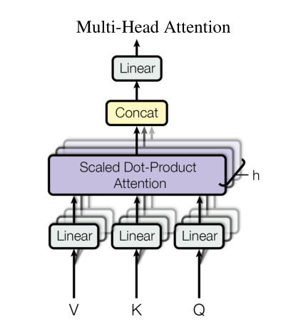
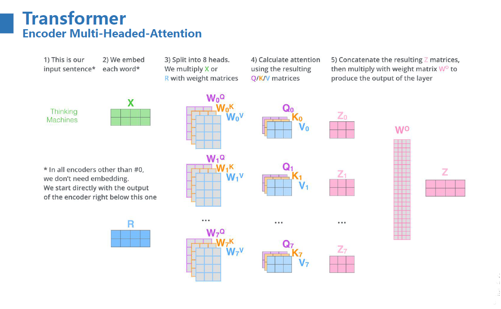
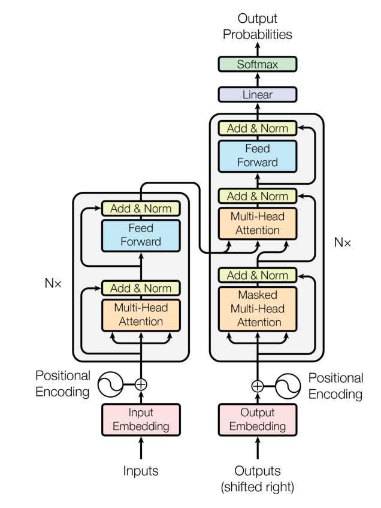
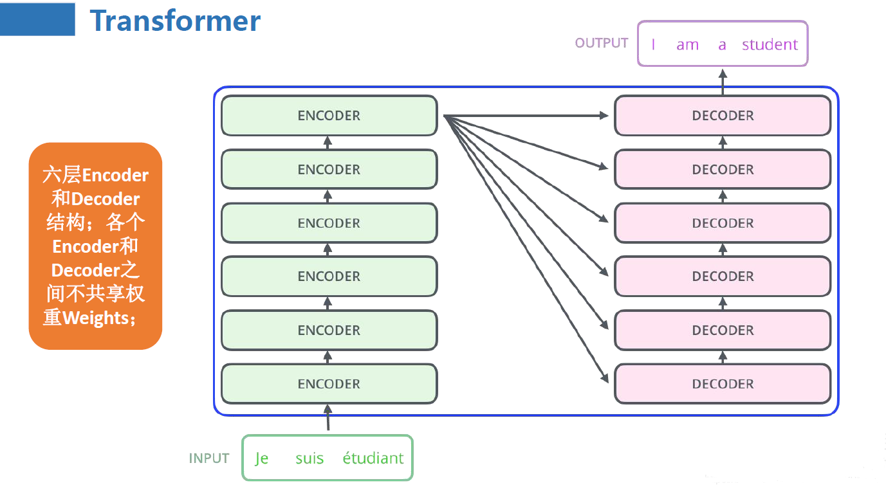

## 从零搭建 Transformer

Reference：
* [tiny-universe](https://github.com/datawhalechina/tiny-universe/)
* [Attention Is All You Need](https://arxiv.org/pdf/1706.03762)
* [NanoGPT](https://github.com/karpathy/nanoGPT)
* [ChineseNMT](https://github.com/hemingkx/ChineseNMT)
* [transformer-translator-pytorch](https://github.com/devjwsong/transformer-translator-pytorch)

在CV领域中，CNN（卷积神经网络）具有统治地位，但是很长一段时间，在自然语言处理领域，RNN（循环神经网络）、LSTM（长短期记忆递归神经网络）占据了主流地位。作为针对序列建模的模型，RNN、LSTM 在以序列为主要呈现形式的 NLP 任务上展现出远超 CNN 的卓越性能。但是RNN、LSTM 也存在明显的缺陷：

* RNN 为单向依序计算，序列需要依次输入、串行计算，限制了计算机的并行计算能力，导致时间成本过高。
* RNN 难以捕捉长期依赖问题，对于极长序列，RNN 难以捕捉远距离输入之间的关系。虽然 LSTM 通过门机制对此进行了一定优化，但 RNN 对长期依赖问题的捕捉能力依旧是不如人意的。

2017年，Vaswani 等人发表了论文[《Attention Is All You Need》](https://arxiv.org/pdf/1706.03762)，抛弃了传统的 CNN、RNN 架构，提出了一种全新的完全基于 attention 机制的模型——Transformer，解决了上述问题。自此，attention 机制进入自然语言处理任务的主流架构，在 Transformer 的基础上，诞生了预训练-微调范式的多种经典模型如 Bert、GPT、T5 等。

ChatGPT 在 Transformer 的基础上，引入了 RLHF 机制、实现了大量参数建模，带领 NLP 进入了全新的大模型时代。


### 1 注意力机制

Attention 机制，是 Transformer 的核心之一。本文将尝试从何为 Attention、self-attention、Casual Attention 和 Multi-Head Attention 四个方面逐步学习 Transformer 中使用的 Attention 机制，并手搓 Transformer 中 Multi-Head Attention 层。


#### 1.1 何为 Attention

Attention 机制最早起源于CV领域，其核心思想是当我们关注一张照片时，往往不需要完全关注图片的全部内容，而只需要将注意力放在重点区域即可。

在自然语言领域，也可以通过将注意力重点集中在一个或者几个 token，来获得更高效的计算结果。

Attention 机制有三个核心的参数：Query（查询值）、Key（键值）和 Value（真值）。不严谨的说，Attention 机制是通过计算 Query 与 Key 的相关性为真值加权求和， 从而拟合序列中每个词同其他词的相关关系。


#### 1.2 注意力机制

注意力机制有三个核心变量：查询值 Query，键值 Key 和 真值 Value。以字典为例，逐步分析注意力机制的计算公式是如何得到的，从而理解注意力机制。 

首先，对于这样一个字典：

```bash
{
    "apple":10,
    "banana":5,
    "chair":2
}
```

字典的键就是注意力机制中的 key，字典的值就是注意力机制的你 value。字典支持进行精确的字符串匹配是，例如，想要查找值 10 ，就是查询值 Query 为 'apple'，那么就可以直接通过将 Query 和 key 做匹配来得到对应的 value。

但是，当我们需要匹配的 Query 是一个包含多个 key 的概念的时候，例如需要查找'fruit'，此时需要将 apple 和 banana 都匹配到，并且不匹配到 chair。最终，将这些匹配到的 key 对应的 value 进行组合得到最终的 value。

例如，当 Query 为 fruit 的时候，可以给所有的 key 赋上不同的权重：

```bash
{
    "apple":0.6,
    "banana":0.4,
    "chair":0
}
```

那么，通过 Query 'fruit'查询到的 value 为：

$$
value = 0.6 * 10 + 0.4 * 5 + 0 * 2 = 8
$$

给不同 Key 所赋予的不同权重，就是我们所说的注意力分数，也就是为了查询到 Query，我们应该赋予给每一个 Key 多少注意力。 

那么针对每一个 Query，如何得到对应的注意力分数呢？从直观上讲，我们可以认为 Key 与 Query 相关性越高，则其所应该赋予的注意力权重就越大。 但是，我们如何能够找到一个合理的、能够计算出正确的注意力分数的方法呢？

此时就需要提到词向量的概念了。通过合理的训练拟合，词向量能够表征语义信息， 从而让语义相近的词在向量空间中距离更近，语义较远的词在向量空间中距离更远。 通常使用欧氏距离来衡量词向量之间的相似性，在数学形式上可以使用点积来进行计算：

$$
v \cdot w = \sum _i v_i w_i
$$

根据词向量的定义，语义相似的两个词对应的词向量的点积应该大于0，而语义不相似的词向量点积应该小于0。因此，可以使用点积来计算词之间的相似度。

假设 Query 为 'fruit'，对应的词向量为 $q$；key 对应的词向量为 $k = [v_{apple}v_{banana}v_{chair}]$，那么就可以计算 Query 和每一个 key 的相似度：

$$
x = qK^T
$$

此处的 $K$ 是将所有的词向量堆叠形成的矩阵。基于矩阵乘法的定义，$x$ 即为 $q$ 与每一个 $k$ 的点积。此时，就得到了能够反映 Query 与每一个 key 的相似度的 x，再通过一个 softmax 层将其转化为和为 1 的权重：

$$
softmax(x)_i = \frac{e^{x_i}}{\sum _i e^{x_i}}
$$

这样，得到的向量就能够反映 Query 和每一个 Key 的相似程度，同时又相加权重为 1，也就是我们的注意力分数了。 最后，我们再将得到的注意力分数和值向量做对应乘积即可。根据上述过程，我们就可以得到注意力机制计算的基本公式：

$$
attention(q, K , v) = softmax(qK^T)v
$$


上面的值还只是一个标量，因为此时只查询了一个 Query。将上面的公式转化为维度为 $d_v$ 的向量，同时一次性查询多个 Query，同样将多个 Query 对应的词向量堆叠在一起形成矩阵 Q，得到公式：

$$
attention(Q, K , V) = softmax(QK^T)V
$$

在上面的公式中，如果如何Q和K对应的维度 $d_v$ 比较大，softmax 放缩时就非常容易受影响，使不同的值之间的差异很大，影响梯度的稳定性。因此，在上面的基础上，对 Q 和 K 乘积的结果进行放缩：

$$
attention(Q, K, V) = softmax(\frac{QK^T}{\sqrt{d_k} })V
$$


#### 1.3 注意力机制实现

```python
# 注意力计算函数

from torch.nn import functional as F
import math

def attention(q, k, v):
    # 此处我们假设 q、k、v 维度都为 (B, T, n_embed)，分别为 batch_size、序列长度、隐藏层维度
    # 计算 QK^T / sqrt(d_k)，维度为 (B, T, n_embed) x (B, n_embed, T) -> (B, T, T)
    attn_out = (q @ k.transpose(-2, -1)) * (1.0 / math.sqrt(k.size(-1)))

    # 计算 softmax，维度为 (B, T, T)
    attn_out = F.softmax(attn_out, dim=-1)

    # V * Score，维度为(B, T, T) x (B, T, n_embed) -> (B, T, n_embed)
    attn_out = attn_out @ v
    return attn_out
```


#### 1.4 Self-Attention

Attention 机制的本质是对两段序列的元素依次进行相似度计算， 寻找出一个序列的每个元素对另一个序列的每个元素的相关度，然后基于相关度进行加权，即分配注意力。 这里的两段序列就是前面计算里面的 Q、K、V。

在实际应用中，往往只需要计算 Query 和 Key 之间的注意力结果，很少存在额外的真值 Value，即只需要拟合两个文本序列。​在经典的 Attention 机制中，Q 往往来自于一个序列，K 与 V 来自于另一个序列，都通过参数矩阵计算得到，从而可以拟合这两个序列之间的关系。 例如在 transformer 的 decoder 结构中，Q来自 Decoder 的输入，K 与 V 来自 Encoder 的输出，从而拟合了编码信息与历史信息之间的关系，综合这两种信息来做预测。

在 Transformer 的 Encoder 结构中，使用的是 self-attention(自注意力)，是Attention机制的变种。

自注意力，就是计算序列中每个元素与本序列中其他每个元素的注意力分布。在计算过程中，Q、K、V都是由同一个输入通过不同的参数矩阵计算得到。在 Encoder 中，Q、K、V 分别是输入对参数矩阵 $W_q$、$W_k$、$W_v$做积得到，进一步拟合输入语句中的每一个 token 对其他所有 token 的关系。

通过自注意力机制，可以找到一段文本中每一个 token 与其他所有 token 的相关关系大小，从而建模文本之间的依赖关系。​在代码中的实现，self-attention 机制其实是通过给 Q、K、V 的输入传入同一个参数实现的：

```python
# attn 是一个注意力计算层
self.attn(x, x, x)
```

上面的代码是 Encoder 的部分实现，self.attn 即是注意力层，传入的三个参数都是 x，分别是 Q、K、V 的计算输入，Q、K、V 都源自同一输入，实现了自注意力的拟合。


#### 1.5 Casual Self Attention

因果自注意力，也叫掩码自注意力（Mask Self Attention），是指使用注意力掩码的自注意力机制。 掩码的作用是遮蔽一些特定位置的 token，模型在学习的过程中，会忽略掉被遮蔽的 token。

使用注意力掩码的核心动机是让模型只能使用历史信息进行预测而不能看到未来信息。 使用注意力机制的 Transformer 模型也是通过类似于 n-gram 的语言模型任务来学习的， 也就是对一个文本序列，不断根据之前的 token 来预测下一个 token，直到将整个文本序列补全。

例如，待学习的文本序列是 `【BOS】I like you【EOS】`，那么，模型会按如下顺序进行预测和学习：

```bash
Step 1：输入 【BOS】，输出 I
Step 2：输入 【BOS】I，输出 like
Step 3：输入 【BOS】I like，输出 you
Step 4：输入 【BOS】I like you，输出 【EOS】
```

只要学习的语料足够多，通过上述的过程，模型可以学会任意一种文本序列的建模方式，也就是可以对任意的文本进行补全。

但是，上面的过程是一个串行的过程，也就是需要先完成 Step 1，才能做 Step 2，接下来逐步完成整个序列的补全。在最开始，说到 Transformer 相对于 RNN 的核心优势之一即在于其可以并行计算，具有更高的计算效率。 如果对于每一个训练语料，模型都需要串行完成上述过程才能完成学习，那么很明显没有做到并行计算，计算效率很低。

针对这个问题，Transformer 就提出了掩码自注意力的方法。掩码自注意力会生成一串掩码，来遮蔽未来信息。 例如，我们待学习的文本序列仍然是 【`BOS】I like you【EOS】`，我们使用的注意力掩码是`【MASK】`，那么模型的输入为：

```bash
<BOS> 【MASK】【MASK】【MASK】【MASK】
<BOS>    I   【MASK】 【MASK】【MASK】
<BOS>    I     like  【MASK】【MASK】
<BOS>    I     like    you  【MASK】
<BoS>    I     like    you   </EOS>
```

在每一行输入中，模型仍然是只看到前面的 token，预测下一个 token。但是，上述输入不再是串行的过程， 而可以一起并行地输入到模型中，模型只需要每一个样本根据未被遮蔽的 token 来预测下一个 token 即可，从而实现了并行的语言模型。

掩码是一个和文本序列等长的上三角矩阵。可以简单地通过创建一个和输入同等长度的上三角矩阵作为注意力掩码，再使用掩码来遮蔽掉输入即可。 也就是说，当输入维度为 `（batch_size, seq_len, hidden_size）`时，我们的 Mask 矩阵维度一般为 `(1, seq_len, seq_len)`（通过广播实现同一个 batch 中不同样本的计算）。

在具体实现中，我们通过以下代码生成 Mask 矩阵：

```python
# 此处使用 register_buffer 注册一个 bias 属性
# bias 是一个上三角矩阵，维度为 1 x block_size x block_size，block_size 为序列最大长度
self.register_buffer("bias", torch.tril(torch.ones(config.block_size, config.block_size))
                                        .view(1, config.block_size, config.block_size))
```


#### 1.6 Multi-Head Attention

​Attention 机制可以实现并行化与长期依赖关系拟合，但一次注意力计算只能拟合一种相关关系，单一的 Attention 机制很难全面拟合语句序列里的相关关系。因此 Transformer 使用了 Multi-Head attention 机制，即同时对一个语料进行多次注意力计算，每次注意力计算都能拟合不同的关系，将最后的多次结果拼接起来作为最后的输出，即可更全面深入地拟合语言信息。



对于不同的注意力头，能够拟合不同层次的相关信息。通过多个注意力头同时计算，能够更全面地拟合语句关系。

​Multi-Head attention 的整体计算流程如下：



多头注意力机制其实就是将原始的输入序列进行多组的自注意力处理；然后再将每一组得到的自注意力结果拼接起来，再通过一个线性层进行处理，得到最终的输出。我们用公式可以表示为：

$$
MultiHead(Q, K, V) = Concat(head_1, \cdots, head_n)W^O = Attention(QW_i^Q, KW_i^K, VW_i^V)
$$

最朴素的实现就是 n 个 head 就有 n 组的 QKV 参数矩阵，即3n 个参数矩阵。每一组进行同样的注意力计算，但由于是不同的参数矩阵从而通过反向传播实现了不同的注意力结果，然后将 n 个结果拼接起来输出即可。

但是这个思路虽然朴素，但是复杂度高。可以通过矩阵运算巧妙地实现并行的多头计算，其核心逻辑在于使用三个组合矩阵来代替了n个参数矩阵的组合。下面的代码手动实现了 MultiHeadAttention 层（注意，加入了 Mask 矩阵和 Dropout 操作）：

```python
import torch.nn as nn
import torch

'''多头注意力计算模块'''
class MultiHeadAttention(nn.Module):

    def __init__(self, config, is_causal=False):
        super().__init__()
        # 隐藏层维度必须是头数的整数倍，因为后面我们会将输入拆成头数个矩阵
        assert config.n_embd % config.n_head == 0

        # Wq, Wk, Wv 参数矩阵，每个参数矩阵为 n_embd x n_embd
        # 这里通过三个组合矩阵来代替了n个参数矩阵的组合，其逻辑在于矩阵内积再拼接其实等同于拼接矩阵再内积，每一个线性层其实相当于n个参数矩阵的拼接,即将n个head的计算合成了一次计算
        self.c_attns = nn.ModuleList([nn.Linear(config.n_embd, config.n_embd, bias=config.bias) for _ in range(3)]) # Q,K,V
    
        # 输出的线性层，维度为 n_embd x n_embd
        self.c_proj = nn.Linear(config.n_embd, config.n_embd, bias=config.bias)

        # 注意力的 dropout
        self.attn_dropout = nn.Dropout(config.dropout)
        # 残差连接的 dropout
        self.resid_dropout = nn.Dropout(config.dropout)
    
        # 头数
        self.n_head = config.n_head
        # 隐藏层维度
        self.n_embd = config.n_embd
        # Dropout 概率
        self.dropout = config.dropout
        # 是否是解码器的 Casual LM
        self.is_causal = is_causal

        # 判断是否使用 Flash Attention，Pytorch 2.0 支持，即判断 torch.nn.functional.scaled_dot_product_attention 是否存在
        self.flash = hasattr(torch.nn.functional, 'scaled_dot_product_attention')

        # 如果不使用 Flash Attention，打印一个警告
        if not self.flash:
            print("WARNING: using slow attention. Flash Attention requires PyTorch >= 2.0")
            # 如果自己实现 MHSA，需要一个 causal mask，确保 attention 只能作用在输入序列的左边
            # 此处使用 register_buffer 注册一个 bias 属性
            # bias 是一个上三角矩阵，维度为 1 x 1 x block_size x block_size，block_size 为序列最大长度
            self.register_buffer("bias", torch.tril(torch.ones(config.block_size, config.block_size))
                                        .view(1, 1, config.block_size, config.block_size))

    def forward(self, query, key, value):
        # 输入为 query、key、value，维度为 (B, T, n_embed)
        B, T, C = query.size() # batch size, sequence length, embedding dimensionality (n_embd)

        # 计算 Q、K、V，输入通过参数矩阵层，维度为 (B, T, n_embed) x (n_embed, n_embed) -> (B, T, n_embed)
        q, k, v  = [self.c_attns[i](x) for i, x in zip(range(3), (query, key, value))]  # Q,K,V解包

        # 将 Q、K、V 拆分成多头，维度为 (B, T, n_head, C // n_head)，然后交换维度，变成 (B, n_head, T, C // n_head)，因为在注意力计算中我们是取后两个维度参与计算
        k = k.view(B, T, self.n_head, C // self.n_head).transpose(1, 2)
        q = q.view(B, T, self.n_head, C // self.n_head).transpose(1, 2)
        v = v.view(B, T, self.n_head, C // self.n_head).transpose(1, 2)

        # 注意力计算 
        if self.flash:
            # 直接使用 Flash Attention
            y = torch.nn.functional.scaled_dot_product_attention(q, k, v, attn_mask=None, dropout_p=self.dropout if self.training else 0, is_causal=self.is_causal)
        else:
            # 手动实现注意力计算
            # 计算 QK^T / sqrt(d_k)，维度为 (B, nh, T, hs) x (B, nh, hs, T) -> (B, nh, T, T)
            att = (q @ k.transpose(-2, -1)) * (1.0 / math.sqrt(k.size(-1)))
            # 如果是解码器的 Casual LM，需要 mask 掉右上角的元素
            if self.is_causal:
                # 这里截取到序列长度，因为有些序列可能比 block_size 短
                att = att.masked_fill(self.bias[:,:,:T,:T] == 0, float('-inf'))

            # 计算 softmax，维度为 (B, nh, T, T)
            att = F.softmax(att, dim=-1)
            # Attention Dropout
            att = self.attn_dropout(att)
            # V * Score，维度为(B, nh, T, T) x (B, nh, T, hs) -> (B, nh, T, hs)
            y = att @ v 

        # 将多头的结果拼接起来, 先交换维度为 (B, T, n_head, C // n_head)，再拼接成 (B, T, n_head * C // n_head)
        # contiguous 函数用于重新开辟一块新内存存储，因为Pytorch设置先transpose再view会报错，因为view直接基于底层存储得到，然而transpose并不会改变底层存储，因此需要额外存储
        y = y.transpose(1, 2).contiguous().view(B, T, C)

        # 经过输出层计算，维度为 (B, T, C)，再经过线性层残差连接
        y = self.resid_dropout(self.c_proj(y))
        return y
```


### 2 Encoder-Decoder

#### 2.1 seq2seq

Seq2Seq，序列转序列，是一种经典 NLP 任务。模型输入是一个自然语言序列 $input = (x_1, x_2, \cdots, x_n)$ ，输出的是一个可能不等长的自然语言序列 $output = (y_1, y_2, \cdots, y_m)$。Seq2Seq 是 NLP 最经典的任务，几乎所有的 NLP 任务都可以视为 Seq2Seq 任务。例如，文本分类任务，可以看做是输出长度为 1 的目标序列；词性标注任务，可以视为输出与输入序列等长的目标序列；机器翻译任务也是一个经典的 Seq2Seq 任务。

Transformer 是一个经典的 Seq2Seq 模型，即模型的输入为文本序列，输出为另一个文本序列。Transformer 的整体模型结构如下图：



​Transformer 整体由一个 Encoder，一个 Decoder 外加一个 Softmax 分类器与两层编码层构成。上图中左侧方框为 Encoder，右侧方框为 Decoder。

在训练时，Transformer 的训练语料为若干个句对，具体子任务可以是机器翻译、阅读理解、机器对话等。以德语到英语的机器翻译任务为例。在训练时，句对会被划分为输入语料和输出语料，输入语料将从左侧通过编码层进入 Encoder，输出语料将从右侧通过编码层进入 Decoder。Encoder 的主要任务是对输入语料进行编码再输出给 Decoder，Decoder 再根据输出语料的历史信息与 Encoder 的输出进行计算，输出结果再经过一个线性层和 Softmax 分类器即可输出预测的结果概率，整体逻辑如下图：




#### 2.2 全连接网络（FNN）

每一个 Encoder 块内部其实是一个多头自注意力层再加一个全连接层，在 Transformer 中，一个全连接网络一般包括两个线性层，线性层之间使用 ReLU 函数作为激活函数。此处实现一个 FNN 层：

```python
'''全连接模块'''
class MLP(nn.Module):

    def __init__(self, config):
        super().__init__()
        # Transformer 的全连接模块有两个线性层，中间加了一个 RELU 激活函数
        # 此处将隐藏层维度设为输出层的四倍，也可以设置成其他维度
        self.c_fc    = nn.Linear(config.n_embd, 4 * config.n_embd, bias=config.bias)
        self.relu    = nn.ReLU()
        self.c_proj  = nn.Linear(4 * config.n_embd, config.n_embd, bias=config.bias)
        self.dropout = nn.Dropout(config.dropout)

    def forward(self, x):
        x = self.c_fc(x)
        x = self.relu(x)
        x = self.c_proj(x)
        x = self.dropout(x)
        return x
```


#### 2.3  Layer Norm

层归一化，也就是 Layer Norm，是深度学习中经典的归一化操作。神经网络主流的归一化一般有两种，批归一化（Batch Norm）和层归一化（Layer Norm）。

归一化的核心目的是让不同层输入的取值范围或者分布能够比较一致。由于深度神经网络中每一层的输入都是上一层的输出，因此多层传递下，对网络中较深的层，之前的所有神经层的参数变化会导致其输入的分布发生较大的改变。那么，随着神经网络参数的更新，各层的输出分布是不相同的，且差异会随着网络深度的增大而增大。但是，需要预测的条件分布始终是相同的，从而也就造成了预测的误差。

因此，在深度神经网络中，往往需要归一化操作，将每一层的输入都归一化成标准正态分布。批归一化是指在一个 mini-batch 上进行归一化，相当于对一个 batch 对样本拆分出来一部分，首先计算样本的均值：

$$
\mu _j = \frac{1}{m} \sum _{i = 1} ^{m} Z_j^i
$$

其中，$Z_j^i$ 是样本 i 在第 j 个维度上的值，m 就是 mini-batch 的大小。

接着计算样本方差：

$$
\sigma ^2  = \frac{1}{m} \sum  _{i=1} ^{m} (Z_j^i - \mu _j) ^2
$$

最后，对每个样本的值减去均值再除以标准差来将这一个 mini-batch 的样本的分布转化为标准正态分布：

$$
\hat{Z_j} = \frac{Z_j - \mu_j}{\sqrt{\sigma ^2 + \epsilon}}
$$

这里加上 $\epsilon$ 这一极小量的目的是避免出现分母为 0 的情况。


以上是批归一化的计算方式，但是批归一化存在一些缺陷：

* 当显存有限，mini-batch 较小只能取较小的值，此时 Batch Norm 取的样本的均值和方差不能反映全局的统计分布信息，从而导致效果变差；
* 对于在时间维度展开的 RNN，不同句子的同一分布大概率不同，所以 Batch Norm 的归一化会失去意义；
* 应用 Batch Norm，每个 step 都需要去保存和计算 batch 统计量，耗时又耗力
* 在训练时，Batch Norm 需要保存每个 step 的统计信息（均值和方差）。在测试时，由于变长句子的特性，测试集可能出现比训练集更长的句子，所以对于后面位置的 step，是没有训练的统计量使用的；


相较于 Batch Norm，层归一化（Layer Norm）在每一层统计所有样本的均值和方差，Layer Norm 在每个样本上计算其所有层的均值和方差，从而使每个样本的分布达到稳定。Layer Norm 的归一化方式和 Batch Norm 完全一样，只是统计统计量的维度不同。

Layer Norm 是 Transformer 的一个重要组成部分，模型在每一层网络计算之前都进行了 Layer Norm 操作。

在论文原图中，是先进行注意力计算和全连接计算再进行 Layer Norm 操作，这样也称为 Post Norm；但是在事实上实现 Transformer 模型时，作者其实将 Layer Norm 放在了注意力计算和全连接计算之前，从而将输入规范化到同一区间，减少模型训练的波动，称为 Pre Norm 操作。目前，Pre Norm 是较为常用的策略。

Pytorch 中自带的 Layer Norm 层必须带有偏置，此处手动实现一个 Layer Norm 层：

```python
'''层规范化模块'''

class LayerNorm(nn.Module):
    # 在 Pytorch 的 LayerNorm 基础上添加了偏置，Pytorch 的 LayerNorm 不支持偏置为 None
    def __init__(self, ndim, bias):
        super().__init__()
        self.weight = nn.Parameter(torch.ones(ndim))
        self.bias = nn.Parameter(torch.zeros(ndim)) if bias else None
    
    def forward(self, input):
        return F.layer_norm(input, self.weight.shape, self.weight, self.bias, 1e-5)
```


#### 2.4 残差连接

由于 Transformer 模型结构较复杂、层数较深，​为了避免模型退化，Transformer 采用了残差连接的思想来连接每一个子层。残差连接，即下一层的输入不仅是上一层的输出，还包括上一层的输入。

在 Encoder 中，在第一个子层，输入进入多头自注意力层的同时会直接传递到该层的输出，然后该层的输出会与原输入相加，再进行标准化。在第二个子层也是一样。即：

$$
\rm x = x + MultiHeadSelfAttention(LayerNorm(x)) \rm output = x + FNN(LayerNorm(x))
$$

在代码实现中，通过在 Encoder Layer 的 forward 计算中加上原值来实现残差连接：

```python
def forward(self, x):
    x = self.ln1(x)
    x = x + self.attn(x, x, x)
    x = x + self.mlp(self.ln2(x))
    return x
```


#### 2.5 Encoder

在实现了前面的各个组件之后，就可以尝试搭建起 transformer 的 Encoder 了。Encoder 由 N 个 Encoder Layer 组成，每一个 Encoder Layer 包括一个注意力层和一个全连接层。首先实现一个 Encoder Layer：

```python
'''Encoder Layer'''

class EncoderLayer(nn.Module):
    def __init__(self, config):
        super().__init__()
        # 一个 Layer 中有两个 LayerNorm，分别在 Attention 之前和 MLP 之前
        self.ln1 = LayerNorm(config.n_embd, bias=config.bias)

        # Encoder 不需要 mask，传入 is_causal=Flase
        self.attn = MultiHeadAttention(config, is_causal=False)
        self.ln2 = LayerNorm(config.n_embd, bias=config.bias)
        self.mlp = MLP(config)
    
    def forward(self, x):
        x = self.ln1(x)
        x = x + self.attn(x, x, x)
        x = x + self.mlp(self.ln2(x))
        return x
```

使用 EncoderLayer 来搭建 Encoder，一个 Encoder，由 N 个 Encoder Layer 组成，在最后会加入一个 Layer Norm 实现规范化：

```python
'''Encoder'''
class Encoder(nn.Module):

    def __init__(self, config):
        super(Encoder, self).__init__() 
        self.layers = nn.ModuleList([EncoderLayer(config) for _ in range(config.n_layer)])
        self.norm = LayerNorm(config.n_embd, bias=config.bias)

    def forward(self, x):
        for layer in self.layers:
            x = layer(x)
        return self.norm(x)
```


#### 2.6 Decoder

类似的，也可以先搭建 Decoder Layer，再将 N 个 Decoder Layer 组装为 Decoder。

但是和 Encoder 不同的是，Decoder 由两个注意力层和一个全连接层组成。第一个注意力层是一个掩码自注意力层，即使用 Mask 的注意力计算，保证每一个 token 只能使用该 token 之前的注意力分数；第二个注意力层是一个多头注意力层，该层将使用第一个注意力层的输出作为 query，使用 Encoder 的输出作为 key 和 value，来计算注意力分数。最后，再经过全连接层：

```python
'''Decoder Layer'''
class DecoderLayer(nn.Module):
    def __init__(self, config):
        super().__init__()
        # 一个 Layer 中有三个 LayerNorm，分别在 Mask Attention 之前、Self Attention 之前和 MLP 之前

        self.ln_1 = LayerNorm(config.n_embd, bias=config.bias)
        # Decoder 的第一个部分是 Mask Attention，传入 is_causal=True
        self.m_attn = MultiHeadAttention(config, is_causal=True)
        self.ln_2 = LayerNorm(config.n_embd, bias=config.bias)
        # Decoder 的第二个部分是 类似于 Encoder 的 Attention，传入 is_causal=False
        self.attn = MultiHeadAttention(config, is_causal=False)
        self.ln_3 = LayerNorm(config.n_embd, bias=config.bias)
        # 第三个部分是 MLP
        self.mlp = MLP(config)

    def forward(self, x, enc_out):
        x = self.ln_1(x)
        # 第一部分是一个 Mask Self Attention，Q、K、V 都是 x
        x = x + self.m_attn(x, x, x)
        x = self.ln_2(x)
        # 第二部分是一个类似于 Encoder 的 Attention，Q 是 x，K、V 是 Encoder 的输出
        x = x + self.attn(x, enc_out, enc_out)
        x = self.ln_3(x)
        x = x + self.mlp(x)
        return x
```


### 3 搭建完整的 Transformer

#### 3.1 Embedding

在 NLP 任务中，往往需要将自然语言的输入转化为机器可以处理的向量。在深度学习中，承担这个任务的组件就是 Embedding 层。

Embedding 层其实是一个存储固定大小的词典的嵌入向量查找表。

在输入神经网络之前，会先让自然语言输入通过分词器 tokenizer，分词器的作用是把自然语言输入切分成 token 并转化成一个固定的 index。例如，如果将词表大小设为 4，输入`我喜欢你`，那么，分词器可以将输入转化成：

```bash
input: 我
output: 0

input: 喜欢
output: 1

input：你
output: 2
```

在实际情况下，tokenizer 的工作会比这更复杂。例如，分词有多种不同的方式，可以切分成词、切分成子词、切分成字符等，而词表大小则往往高达数万数十万。

Embedding 层的输入往往是一个形状为 `（batch_size，seq_len，1）`的矩阵，第一个维度是一次批处理的数量，第二个维度是自然语言序列的长度，第三个维度则是 token 经过 tokenizer 转化成的 index 值。

Embedding 内部是一个可训练的（Vocab_size，embedding_dim）的权重矩阵，词表里的每一个值，都对应一行维度为 embedding_dim 的向量。对于输入的值，会对应到这个词向量，然后拼接成（batch_size，seq_len，embedding_dim）的矩阵输出。

可以直接使用 torch 中的 Embedding 层：

```python
self.tok_embedding = nn.Embedding(config.vocab_size, config.dim)
```


#### 3.2 Position Encoding

Attention 机制可以实现良好的并行计算，但同时，其注意力计算的方式也导致序列中相对位置的丢失。在 RNN、LSTM 中，输入序列会沿着语句本身的顺序被依次递归处理，因此输入序列的顺序提供了极其重要的信息，这也和自然语言的本身特性非常吻合。

在 Attention 机制的计算过程中，对于序列中的每一个 token，其他各个位置对其来说都是平等的，`我喜欢你`和`你喜欢我`在 Attention 机制看来是完全相同的，这是一个巨大问题。为使用序列顺序信息，保留序列中的相对位置信息，Transformer 采用了位置编码机制，该机制也在之后被多种模型沿用。

​位置编码，即根据序列中 token 的相对位置对其进行编码，再将位置编码加入词向量编码中。位置编码的方式有很多，Transformer 使用了正余弦函数来进行位置编码（绝对位置编码Sinusoidal），其编码方式为：

$$
PE(pos, 2i) = \sin(\frac{pos}{10000 ^{\frac{2i}{d_{model}}}}) \\
PE(pos, 2i + 1) = \cos(\frac{pos}{10000 ^{\frac{2i}{d_{model}}}})
$$

其中，pos 为 token 在句子中的位置，2i 和 2i+1 则是指示了 token 是奇数位置还是偶数位置。从上式中我们可以看出对于奇数位置的 token 和偶数位置的 token，Transformer 采用了不同的函数进行编码。

以一个简单的例子来说明位置编码的计算过程：假如我们输入的是一个长度为 4 的句子`I like to code`，我们可以得到词向量矩阵 $\rm x$，其中每一行代表的就是一个词向量，$\rm x_0=[0.1,0.2,0.3,0.4]$ 对应的就是`I`的词向量，它的pos就是为0，以此类推。第二行代表的是`like`的词向量，它的pos就是1。

$$
\rm x = \begin{bmatrix}
    0.1 & 0.2 & 0.3 & 0.4 \\
    0.2 & 0.3 & 0.4 & 0.5 \\
    0.3 & 0.4 & 0.5 & 0.6 \\
    0.4 & 0.5 & 0.6 & 0.7 
\end{bmatrix}
$$

经过位置编码后的词向量为：

$$
\rm x_{PE} = \begin{bmatrix}
    0.1 & 0.2 & 0.3 & 0.4 \\
    0.2 & 0.3 & 0.4 & 0.5 \\
    0.3 & 0.4 & 0.5 & 0.6 \\
    0.4 & 0.5 & 0.6 & 0.7
\end{bmatrix} + \begin{bmatrix}
    \sin(\frac{0}{10000^0}) & \cos(\frac{0}{10000^0}) & \sin(\frac{0}{10000^{2/4}}) & \cos(\frac{0}{10000^{2/4}}) \\
    \sin(\frac{1}{10000^0}) & \cos(\frac{1}{10000^0}) & \sin(\frac{1}{10000^{2/4}}) & \cos(\frac{1}{10000^{2/4}}) \\
    \sin(\frac{2}{10000^0}) & \cos(\frac{2}{10000^0}) & \sin(\frac{2}{10000^{2/4}}) & \cos(\frac{2}{10000^{2/4}}) \\
    \sin(\frac{3}{10000^0}) & \cos(\frac{3}{10000^0}) & \sin(\frac{3}{10000^{2/4}}) & \cos(\frac{3}{10000^{2/4}})
\end{bmatrix} = \begin{bmatrix}
    0.1 & 1.2 & 0.3 & 1.4 \\
    1.041 & 0.84 & 0.41 & 1.49 \\
    1.209 & -0.016 & 0.52 & 1.59 \\
    0.541 & -0.489 & 0.895 & 1.655
\end{bmatrix}
$$


可以使用如下的代码来获取上述例子的位置编码：

```python
import numpy as np
import matplotlib.pyplot as plt

def PositionEncoding(seq_len, d_model, n=10000):
    p = np.zeros(seq_len, d_model)
    for k in range(seq_len):
        for i in range(int(d_model / 2)):
            denominator = np.power(n, 2 * i / d_model)
            P[k, 2*i] = np.sin(k/denominator)
            P[k, 2*i+1] = np.cos(k/denominator)
    return p

p = PositionEncoding(eq_len=4, d_model=4, n=100)
print(p)
```

这样的位置编码主要有两个好处：

* 使 PE 能够适应比训练集里面所有句子更长的句子，假设训练集里面最长的句子是有 20 个单词，推理的时候出现了一个长度为 21 的句子，则使用公式计算的方法可以计算出第 21 位的 Embedding。
* 可以让模型容易地计算出相对位置，对于固定长度的间距 k，`PE(pos+k)` 可以用 `PE(pos)` 计算得到。因为 `Sin(A+B) = Sin(A)Cos(B) + Cos(A)Sin(B)`, `Cos(A+B) = Cos(A)Cos(B) - Sin(A)Sin(B)`(和差化积)。

也可以通过简单的数学推导来说明该编码方式的优越性。原始的 Transformer Embedding 可以表示为：

$$
\tilde{f}(\cdots,\boldsymbol{x}_m,\cdots,\boldsymbol{x}_n,\cdots)=f(\cdots,\boldsymbol{x}_n,\cdots,\boldsymbol{x}_m,\cdots) 
$$

不难看出，上面的函数难以表征相对位置信息。我们期望的是这样的位置编码：

$$
\tilde{f}(\cdots,\boldsymbol{x}_m,\cdots,\boldsymbol{x}_n,\cdots)=f(\cdots,\boldsymbol{x}_n + \boldsymbol{p}_n,\cdots,\boldsymbol{x}_m + \boldsymbol{p}_m,\cdots) 
$$

这里加上的 $p_n$, $p_m$ 就是位置编码。接下来将 $f(\cdots,\boldsymbol{x}_n + \boldsymbol{p}_n,\cdots,\boldsymbol{x}_m + \boldsymbol{p}_m,\cdots)$ 在 $p_n$, $p_m$ 两个位置坐泰勒展开：

$$
\tilde{f}\approx f + \boldsymbol{p}_m^{\top} \frac{\partial f}{\partial \boldsymbol{x}_m} + \boldsymbol{p}_n^{\top} \frac{\partial f}{\partial \boldsymbol{x}_n} + \frac{1}{2}\boldsymbol{p}_m^{\top} \frac{\partial^2 f}{\partial \boldsymbol{x}_m^2}\boldsymbol{p}_m + \frac{1}{2}\boldsymbol{p}_n^{\top} \frac{\partial^2 f}{\partial \boldsymbol{x}_n^2}\boldsymbol{p}_n + \underbrace{\boldsymbol{p}_m^{\top} \frac{\partial^2 f}{\partial \boldsymbol{x}_m \partial \boldsymbol{x}_n}\boldsymbol{p}n}{\boldsymbol{p}_m^{\top} \boldsymbol{\mathcal{H}} \boldsymbol{p}_n}
$$

看到第1项与位置无关，2-5项仅依赖单一位置，第6项（f 分别对 m、n 求偏导）与两个位置有关，所以我们希望第六项（$p_m^THp_n$）表达相对位置信息，即求一个函数 g 使得: 

$$
p_m^THp_n = g(m - n)
$$

假设 $\rm H$ 是一个单位矩阵，那么：

$$
p_m^THp_n = p_m^Tp_n  = <\boldsymbol p_m, \boldsymbol p_n> = g(m - n)
$$

将向量 `[x,y]` 视为复数 `x+yi`，基于复数的运算法则构建方程:

$$
<\boldsymbol p_m, \boldsymbol p_n> = Re [\boldsymbol p_m  \boldsymbol p_n ^ *]
$$

假设存在复数 $q_{m-n}$，使得：

$$
\boldsymbol{p}_m \boldsymbol{p}_n^* = \boldsymbol{q}_{m-n}
$$

使用复数的指数形式求解这个方程，得到二维情形下位置编码的解：

$$
\boldsymbol p_m = e^{im \theta}
$$

-->

$$
\boldsymbol p_m = (\cos m \theta \sin m \theta)
$$

考虑到内积满足线性叠加性，所以更高维的偶数维位置编码，可以表示为多个二维位置编码的组合：

$$
\boldsymbol{p}_m = \begin{pmatrix}
    e^{\text{i}m\theta_0} \\
    e^{\text{i}m\theta_1} \\
    \vdots \\
    e^{\text{i}m\theta{d/2-1}}
\end{pmatrix}
\quad\Leftrightarrow\quad \boldsymbol{p}m=\begin{pmatrix}
    \cos m\theta_0 \\
    \sin m\theta_0 \\
    \cos m\theta_1 \\
    \sin m\theta_1 \\
    \vdots \\
    \cos m\theta{d/2-1} \\
    \sin m\theta_{d/2-1}
\end{pmatrix}
$$

取 $\theta _i = 10000 ^{-2i / d}$ (该形式可以使得随着|m−n|的增大，⟨pm,pn⟩有着趋于零的趋势)，就得到了上文的编码方式。

当 $\rm H$ 不是一个单位矩阵时，因为模型的 Embedding 层所形成的 d 维向量之间任意两个维度的相关性比较小，满足一定的解耦性，我们可以将其视作对角矩阵，那么使用下述编码：

$$
\boldsymbol{p}_m^{\top} \boldsymbol{\mathcal{H}} \boldsymbol{p}_n=\sum_{i=1}^{d/2} \boldsymbol{\mathcal{H}}_{2i,2i} \cos m\theta_i \cos n\theta_i + \boldsymbol{\mathcal{H}}_{2i+1,2i+1} \sin m\theta_i \sin n\theta_i
$$

积化和差：

$$
\sum_{i=1}^{d/2} \frac{1}{2}\left(\boldsymbol{\mathcal{H}}_{2i,2i} + \boldsymbol{\mathcal{H}}_{2i+1,2i+1}\right) \cos (m-n)\theta_i + \frac{1}{2}\left(\boldsymbol{\mathcal{H}}_{2i,2i} - \boldsymbol{\mathcal{H}}_{2i+1,2i+1}\right) \cos (m+n)\theta_i
$$

从上面的表达式不难看出，该编码仍然可以表示相对位置。


基于上述原理，可以实现一个​位置编码层：

```python
'''位置编码模块'''
class PositionalEncoding(nn.Module):
    def __init__(self, config):
        super(PositionalEncoding, self).__init__()
        self.dropout = nn.Dropout(p=config.dropout)
        # block size 是序列的最大长度
        pe = torch.zeros(config.block_size, config.n_embd)
        position = torch.arange(0, config.block_size).unsqueeze(1)
        div_term = torch.exp(
            torch.arange(0, config.n_embd, 2) * -(math.log(10000.0) / config.n_embd)
        )
        pe[:, 0::2] = torch.sin(position * div_term)
        pe[:, 1::2] = torch.cos(position * div_term)
        pe = pe.unsqueeze(0)
        self.register_buffer("pe", pe)

    def forward(self, x):
        x = x + self.pe[:, : x.size(1)].requires_grad_(False)
        return self.dropout(x)
```


#### 3.3 完整 Transformer

在实现上述组件之后，可以根据 Transformer 的模型结构将整个模型搭建起来了。

Transformer 整体包括**一个 Embedding 层**，**一个位置编码层**，**一个 Encoder（包括 N 个 Encoder Layer）**，**一个 Decoder（包括 N 个 Decoder Layer）**，最后还有**一个从隐藏层维度映射到词表大小的线性层**。从最后线性层输出出来再计算 **Softmax**，即能得到该预测结果映射到词表上的概率值。

可以搭建这样一个 Transformer：

```python
import inspect
class Transformer(nn.Module):
    def __init__(self, config):
        super().__init__()
        assert config.vocab_size is not None
        assert config.block_size is not None

        self.config = config
        self.transformer = nn.ModuleDict(
            dict(
                wte = nn.Embedding(config.vocab_size, config.n_embd),
                wpe = PositionalEncoding(config),
                drop = nn.Dropout(config.dropout),
                encoder = Encoder(config),
                decoder = Decoder(config),
            )
        )
        # 最后的线性层，输入是 n_embd，输出是词表大小
        self.lm_head = nn.Linear(config.n_embd, config.vocab_size, bias=False)

        # 初始化所有的权重
        self.apply(self._init_weights)

        # 查看所有参数的数量
        print("number of parameters: %.2fM Parameters" % (self.get_num_params() / 1e6,))

    '''统计所有参数的数量'''
    def get_num_params(self, non_embedding=False):
        n_params = sum(p.numel() for p in self.parameters())

        # non_embedding: 是否统计 embedding 的参数。如果不统计 embedding 的参数，就减去
        if non_embedding:
            n_params -= self.transformer.wpe.weight.numel()
        return n_params

    '''初始化权重'''
    def _init_weights(self, module):
        # 线性层和 Embedding 层初始化为正则分布
        if isinstance(module, nn.Linear):
            torch.nn.init.normal_(module.weight, mean=0.0, std=0.02)
            if module.bias is not None:
                torch.nn.init.zeros_(module.bias)
        elif isinstance(module, nn.Embedding):
            torch.nn.init.normal_(module.weight, mean=0.0, std=0.02)
    
    '''前向计算函数'''
    # 输入为 input，维度为 (batch size, sequence length)；targets 为目标序列，用于计算 loss
    def forward(self, input, targets=None):
        device = input.device
        b, t = input.size()
        assert t <= self.config.block_size, f"不能计算该序列，该序列长度为 {t}, 最大序列长度只有 {self.config.block_size}"
        print("input",input.size())

        # 将输入 input 通过 Embedding 层，期望得到维度为 (batch size, sequence length, n_embd)
        tok_emb = self.transformer.wte(input)
        print("tok_emb",tok_emb.size())
    
        # 通过位置编码
        pos_emb = self.transformer.wpe(tok_emb) 
        # 再进行 Dropout
        x = self.transformer.drop(pos_emb)
        print("x after wpe:",x.size())

        # 通过 Encoder
        enc_out = self.transformer.encoder(x)
        print("enc_out:",enc_out.size())

        # 通过 Decoder
        x = self.transformer.decoder(x, enc_out)
        print("x after decoder:",x.size())

        if targets is not None:
            # 训练阶段，如果给了 targets，就计算 loss
            # 先通过最后的 Linear 层，得到维度为 (batch size, sequence length, vocab size)
            logits = self.lm_head(x)

            # 再跟 targets 计算交叉熵
            loss = F.cross_entropy(logits.view(-1, logits.size(-1)), targets.view(-1), ignore_index=-1)
        else:
            # 推理阶段，只需要 logits，loss 为 None
            # 取 -1 是只取序列中的最后一个作为输出
            logits = self.lm_head(x[:, [-1], :]) # note: using list [-1] to preserve the time dim
            loss = None

        return logits, loss

    '''配置优化器'''
    # weight_decay: 权重衰减系数，learning_rate: 学习率，betas: AdamW 的 betas，device_type: 设备类型
    def configure_optimizers(self, weight_decay, learning_rate, betas, device_type):
        param_dict = {pn: p for pn, p in self.named_parameters()}

        # 过滤掉不需要更新的参数
        param_dict = {pn: p for pn, p in param_dict.items() if p.requires_grad}

        # 参数根据维度分为两组。
        # 维度大于等于2的参数（通常是权重）会应用权重衰减，而维度小于2的参数（通常是偏置和层归一化参数）不会应用权重衰减。
        decay_params = [p for n, p in param_dict.items() if p.dim() >= 2]
        nodecay_params = [p for n, p in param_dict.items() if p.dim() < 2]
        optim_groups = [
            {'params': decay_params, 'weight_decay': weight_decay},
            {'params': nodecay_params, 'weight_decay': 0.0}
        ]

        # 打印一下参数数量
        num_decay_params = sum(p.numel() for p in decay_params)
        num_nodecay_params = sum(p.numel() for p in nodecay_params)
        print(f"应用权重衰减的层数: {len(decay_params)}； 总参数量为：{num_decay_params:,}")
        print(f"不应用权重衰减的层数: {len(nodecay_params)}, 总参数量为：{num_nodecay_params:,}")

        # 检查 torch.optim.AdamW 是否支持融合版本（fused version），这是针对 CUDA 设备优化的版本。如果可用且 device_type 为 'cuda'，则使用融合版本。
        fused_available = 'fused' in inspect.signature(torch.optim.AdamW).parameters
        use_fused = fused_available and device_type == 'cuda'
        extra_args = dict(fused=True) if use_fused else dict()

        # 创建优化器
        optimizer = torch.optim.AdamW(optim_groups, lr=learning_rate, betas=betas, **extra_args)
        print(f"使用 fused AdamW: {use_fused}")

        return optimizer


    '''推理生成'''
    @torch.no_grad()
    def generate(self, input, max_new_tokens, temperature=1.0, top_k=None):
        # 推理阶段，输入为 input，维度为 (batch size, sequence length)，max_new_tokens 为最大生成的 token 数量
        for _ in range(max_new_tokens):
            # 如果输入序列太长，将它截断到 block_size
            input_cond = input if input.size(1) <= self.config.block_size else input[:, -self.config.block_size:]

            # 前向计算，得到 logits，维度为 (batch size, sequence length, vocab size)
            logits, _ = self(input_cond)
            # 使用最后一个 token 的 logits 作为当前输出，除以温度系数控制其多样性
            logits = logits[:, -1, :] / temperature

            # 如果使用 Top K 采样，将 logits 中除了 top_k 个元素的概率置为 0
            if top_k is not None:
                v, _ = torch.topk(logits, min(top_k, logits.size(-1)))
                logits[logits < v[:, [-1]]] = -float('Inf')

            # 对输出结果进行 Softmax
            probs = F.softmax(logits, dim=-1)
            # 对结果概率进行采样
            input_next = torch.multinomial(probs, num_samples=1)

            # 将输出结果拼接到输入序列后面，作为下一次的输入
            input = torch.cat((input, input_next), dim=1)
        return input
```

在上述代码中，主要实现了模型的*构造函数*、*前向计算函数*和*推理阶段的生成函数*。

构造函数根据传入的参数构造模型的每个层，前向计算函数主要根据模型结构依次在各层之间进行传递。前向计算到最后一层，如果同时传入了 label，即训练阶段，那么通过最后一层之后与 label 计算交叉熵损失函数；如果没有 label 即推理阶段，那么直接通过最后一层得到结果即可。推理阶段的生成函数核心在于需要依次生成，因为 Seq2Seq 任务，在生成时以 LM 的形式生成，如果要生成长度为 N 的目标序列，那么会连续推理 N 次，每次将推理得到的结果附加到输入中再进行下一次生成。


### 4 额外说明

当前大模型（如GPT、Llama等）普遍采用​​纯Decoder架构​​（Decoder-only），且Decoder层中仅保留​​单一的自注意力机制​​（Causal Self-Attention），而非Transformer经典Decoder中的两层注意力（Self-Attention + Encoder-Decoder Attention）。这种设计选择主要基于以下原因：


#### 4.1 舍弃 Encoder

相比于 Transformer 的 encoder-Decoder 结构，纯 Decoder 结构具有很多优势：


##### 4.1.1 天然适配生成任务

大模型的核心目标是​​自回归生成​​（逐词预测），Decoder-only结构通过单向注意力（仅关注左侧上下文）直接实现文本生成，无需Encoder对输入编码后再解码。这种设计在文本续写、对话等任务中更高效。


##### 4.1.2 更强的表达能力

* 注意力矩阵满秩性​​：Decoder的因果注意力（Causal Attention）是严格下三角矩阵（含单位对角线），天生满秩，建模能力更强；而Encoder的双向注意力矩阵可能退化到低秩，限制模型容量
* ​​隐式位置编码​​：因果注意力自带位置感知能力，无需显式位置嵌入即可区分词序，提升长文本外推性（如RoPE扩展）


##### 4.1.3 更好的训练与工程效率

* 简化训练流程​​：仅需训练单一Decoder模块，降低计算资源需求（如显存、通信开销）。
* ​​优化技术适配​​：KV Cache机制在Decoder-only架构中更易实现，显著加速生成推理（如vLLM的PagedAttention）。


##### 4.1.4 上下文学习的优势

Prompt信息可直接作用于Decoder所有层，实现对模型参数的“隐式微调”，提升Few-shot/Zero-shot能力。


#### 4.2 Decoder层仅保留单一注意力

经典Transformer Decoder包含两层注意力：

* ​​Masked Self-Attention​​（关注已生成部分）
* ​​Encoder-Decoder Attention​​（关联输入与输出）

当前大模型​​删除了第二层​​（Encoder-Decoder Attention）：

* ​​输入输出统一处理​​
    在纯Decoder架构中，输入（Prompt）和输出（生成内容）被视为​​连续序列​​。通过因果掩码（Causal Mask），模型在生成时自然区分上下文，无需额外模块对齐输入输出。

* ​​参数与计算效率​​
    移除Encoder-Decoder Attention层可减少约15%参数量，降低训练成本，且避免跨模块通信开销。

* ​​大规模数据的表征能力​​
    当模型参数量足够大（如百亿级以上），单层自注意力已能充分捕捉输入输出的语义关联，无需复杂交互机制。

* ​​多模态扩展友好性​​
    现代多模态模型（如GPT-4o、Gemini）直接将图像/音频Token拼接至文本序列，由同一Decoder处理，实现*早融合*设计。


#### 4.3 Decoder-only架构的局限性


|优势|局限性|
|---|---|
|生成任务高效|理解任务（如分类任务）略弱|
|训练/推理资源优化|输入输出需要拼接为长序列|
|上下文学习能力强|长文本小狐狸需要外推技术|
|多模态扩展灵活|依赖大规模数据与算力|

尽管Encoder-Decoder结构（如T5）在机器翻译等任务仍有优势，但大模型的​​核心价值在于生成与泛化能力​​。Decoder-only凭借简洁性、扩展性和工程友好性，已成为LLM的主流选择。


